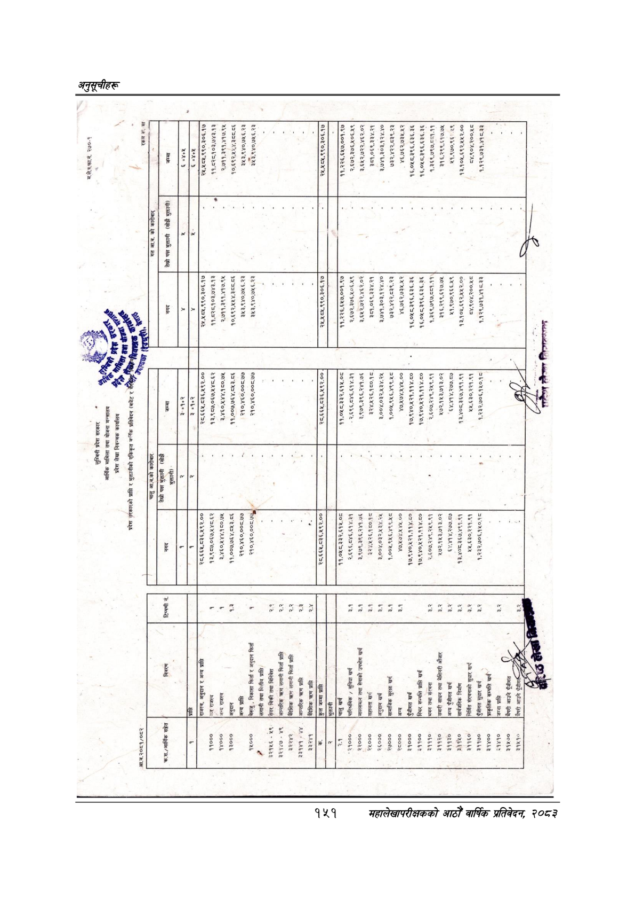

# Page 181 QA

## Rendered page


## Extracted text

```text
नि
अनुदान
र
अन्य
प्राप्ति
११०००
राजस्व
१४०००
अन्य
राजस्व
अनुदान
१३०००
अन्य
प्राप्ति
१५०००
बेरूजु
निकासा
फिर्ता
र
अनुदान
फिर्ता
७
(लगानी
तथा
मित्तीय
प्राप्ति
$२१४५६
४५९
सेवर
बिकी
तथा
विनिवेश
३२१४७-
४९
आन्तरिक
त्रण
लगानी
फिर्ता
प्राप्ति
३२२४२
बैदेशिक
करण
लगानी
फिर्ता
प्राप्ति
३३१४१
४४
३३२४१
आन्तरिक
कण
प्रालि
पारिश्रमिक
सुविधा
खर्च
|मालसमाल
तथा
सेवाको
उपभोग
खर्च
सहायता
खर्च
|भवन
तथा
संरचना
सवारी
साधन
तथा
मेशिनरी
औजार
निर्मित
संरचनाको
सुधार
खर्च
पुँजीगत
सुधार
खर्च
प्राकृतिक
सम्पत्ति
खर्च
जग्गा
प्राप्ति
लुम्बिनी
प्रदेश
सकार
४
आर्थिक
मामिला
तथा
योजना
मन्त्रालय
प्रदेश
लेखा
नियन्त्रक
कार्यालय
प्रदेश
सरकारको
प्राप्ति
र
भुक्तानीको
एकिकृत
वार्षिक
प्रतिवेदन
(बजेट
र
की
नेवा
म.ले.प.फा.नं.
२४७०-९
२८.६६४५,८३६,५९२.००
१३,९८७,०६७,४४८.६२
३,४६०,४४४,१८०.७४५
११,००७,७६४,८४५३.८६
२१०,४६०,००६८.७७
२१०,४६०,००८.७'
रकम
रू.
मा
[ला
उ
कुना
जाको
आ.व.को
कारी
गत
आ.ब.
को
कारी
तेस्रो
पक्ष
भुक्तानी
(सोझै
उ
४
निड,
नन
तेस्रो
पक्ष
भुक्तानी
(सोझै
भुक्तानी)
त्म््
२८.६६४५,८३६,५९२.००
१३,९८७,०६७,५४८.६२
३,४६०,४४४,१८०.७४५
११,००७,७६४,८५३.८६
२१०,४६०,००८.७७
२१०,४६०,००८.७७
२८,.६६५,८३६,५९२.००
२८,६६५,.८३६,५९२.००
११,०४५८,३३२,६१५.०८
२.६९६,८४६,६१४.३१
३,९७९,३९६,२४१.७६
३२४,४५२६,१८०.१८
३,००४,०३२,४३४.२४५
१,००४५.९५६,४९९.५८
४७,४७४,५४४.००
१७,९४०,४२१,११४.८०
१७,९४०,४२१,११४.८०
२-६०७.,२४९,२५९.९१
२५७२.१४५३,७१३.०२
६४,४१४,२७७.८७
१३,४०८,३६७,४९१.९१
४४,६३०,२२१.९१
१,२३२.,७०६,१४५०.१८
११.०४८.३३२,६१५.०८
२,६९६,८४६.६१४.३१
३,.९७९,३९६,२४१.७६
क
३२४.४५२६,१८०.१८
३,००४,०३२,४३४.२५
१,००४५,९४६,४९९.५८
४७,४७४,४४५.००
३
१७,९४०,४२१,११४.८०
१७,९४०,४२१,११४.८०
छ
२,६०७,२४९,२५९.९१
४७२.१४३,७१३.०२
६४,४१४,२७७.८७
१३,४०८,३६७,४९१.९१
४४५,६३०,२२१.९१
१
१,२३२,७०६,१४०.१८
२४५,४५८५,९९०,३०६.१७
११,८६२८,१०३,७४३.१३
२,७११,३९१,४१७.९४५
१०,६९२,४४४,३८८.८६
३५३,९४०,७४५६.२३
३४५३,९४०,७५६.२३
२५,४८४५,९१०,३०६.१७
११,२२६,६५७,००१.९७
२,६७२,३७६,५०६.४५९
३,६४२,७२२,४६२.०२
३८१,०६९,३३४.२१
३,७४१,३०३,१२४.४०
७३२,४२२,८३९.२३
४६,७६२,७३५.५२
१६,०४५८.३९६६,६३६.३६
१६,०४५८.३९६६,६३६.३६
१,३६९,७९७,८८१.११
३१६,२९९,६१७.७४५
२५१,९७०,९६६.४५९
१३,१०५,६९२,४५४५२.००
८४,९०४,२००.५८
१,१२९,७३१,४१८.३३
२४,४०५,९९०,३०६१७
११,८६२८,१०३,७४३.१३
२,७११,३९१,४१७:१४५
१०,६९२,४५४,३८८.८६
३४५३,९४०,७४१६.२३
३४३,९४०,७४६.२३
२५,४५८५,९९०,३०६.१७
११,२२६,६४५७,००१.९७
२,६७२,३७६,४०६.४९
३,६५२,७२२,४६२.०२
३८१,०६९,३३४.२१
३,७४१,३०३,१२४.४०
७३२,४२२,८३९.२३
४६,७६२.७३४.५२
१६,०४८.३९६,६३६.३६
१६,०४५८.३९६,६३६.३६
१,३६९,७९७,८-१.११
३१६,२९९,६१७.७४५
४१,९७०,९६:-.१९
१३,१०५,६९२,४५४२.००
८४,९०४,२००.५८
१,१२९,७३१,४१८.३३
लेजा
२१
हैर०८ २२८८ ४७७ २ ए२४६२०८/८२०/२६
```

## Flags
- None
