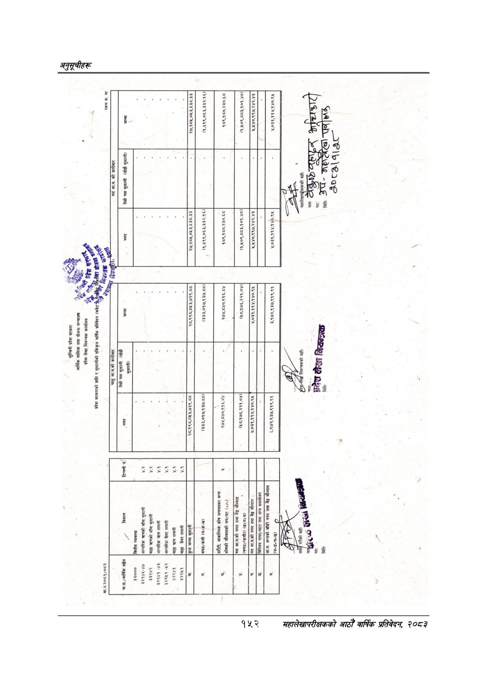

# Page 182 QA

## Rendered page


## Extracted text

```text
कल
प्रदेश
सरकार
आर्थिक
मामिला
तथा
योजना
मन्त्रालय
प्रदेश
लेखा
नियन्त्रक
कार्यालय
प्रदेश
सरकारको
प्राप्ति
र
भुक्तानीको
एकिकृत
वार्षिक
प्रतिवेदन
(बजेट'
क
[न
सा
क
नासा
टन
“शा
तेस्रो
पक्ष
भुक्तानी
(सोझै
आ.व.२०८१/०८२
रकम
रू.
मा
रारा
न
मना
आ.ब.
को
कारी
'क.स./अआर्थिक
सङ्गेत
विवरण
तेस्रो
पक्ष
भुक्तानी
(सोझै
भुक्तानी)
३२०००
[वित्तीय
व्यवस्था
३३१४५-४७
आन्तरिक
त्रहणको
साँवा
भुक्तानी
३३२४२
बाह्य
त्रटणको
साँवा
भुक्तानी
३२१४१-४३
आन्तरिक
क्रण
लगानी
३२१५१-४५२
आन्तरिक
सेयर
लगानी
३२२४१
बाह्य
त्रहण
लगानी
३२२४५१
[बाहा
सेयर
लगानी
२८,९९८,८४३,७२९.८८
२८,९९८,८५३,७२९.८८
२७,२८५,०५३.६३८.३३
'बचत/कमी
(गन्क-ख)
कलाका
३७.८८।
५५५
(३३३,०१७,१३७.८८)|
(१,६९९,०६३,३३२.१६)
(१,६९९,०६३,३३२.१६।|
धरौटी,
आकस्मिक
कोष
लगायतका
अन्य
|कोषको
मौज्दातको
थप/घट
२७४,८४०,९१६.८४
२७४,८४०,९१६.८४
१८९,१६०,२३०.६८
१८९,१८०,२३०.६८
[यस
आ.व.को
नगद
तथा
बैङ्ग
मौज्दात
(बचत/(कमी))
(ङ्नग«घ)
[गत
आ.ब.को
नगद
तथा
बैङ्ग
मोज्दात
।
(४८,१७६,२२१.०४),
(५८,१७६,२२१.०४)|
(१,४०९,८६८३,१०१.४८)|
(१,४०९,८८३,१०१.४८)
या
४,०३१,११४,१४०.९४५
४,०३१,११४,१४०.९४५
२१,५४०,९९७,२४२.४३
३,९७२,९३७,९१९.९१
३.९७२.९३७,९१९.९१
४,०३१,११४,.१४०.९४५
नि
नियन्त्रकको
सहीः
महालेखापदीक्षकको
सही:
नाम"
ठेक्कार
८८८१ग१३७--
८४७०
हैर०८ २२८८ ४७७ २ ए२४६२०८/८२०/२६
```

## Flags
- None
