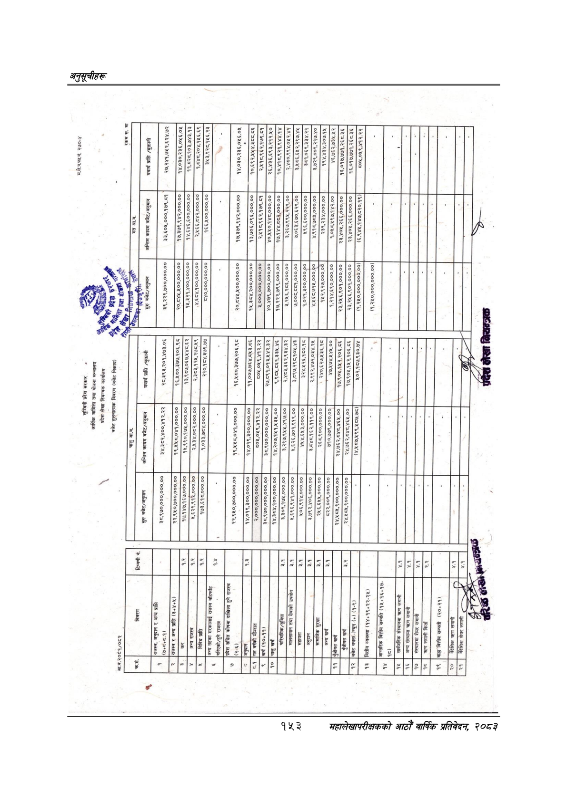

# Page 183 QA

## Rendered page


## Extracted text

```text
६४७०
८२०२ २२६४ ४६७ २४ ए२%७०४०/७७/८८

| रकम रू. मा                                                                                              |                                                                                                                         | २७,२४१,७४२,६२४.७२ १४,०३०,२३६,०५६.०५ ११,८२८,१०३,७४३.१३ २,४५१८,९६२,१७९.८१ २६,४३६,६९३,२१२.५०                                                                                                                                                                    | १,८४८,२०४,१५६.६९ १०,४१८,९२१,९४४.१४ २,४८०,९९४,०४५२.४१ ३,१८६.६५२,२९७.४४५ ३5१,०६९,३३४.२१ ३,७२९,००९,२१७.४०                                             | A                                                                                                 | १४,०३०,२३६,०५६.०४५ . १०,६९२,४५४५४,३८८.८६ १९४,४३४,३०७.१५ ४६,७६२,७३४५.५२ १६,०१७,७७१,२६८.३६ १६,०१७,७७१,२६८.३६ ८०५,०१९,४१२.२२ —   |
|---------------------------------------------------------------------------------------------------------|-------------------------------------------------------------------------------------------------------------------------|--------------------------------------------------------------------------------------------------------------------------------------------------------------------------------------------------------------------------------------------------------------|----------------------------------------------------------------------------------------------------------------------------------------------------|---------------------------------------------------------------------------------------------------|-------------------------------------------------------------------------------------------------------------------------------|
| अन्तिम कायम बजेट/अनुमान                                                                                 | १७,३७९,९४२,०००.०० ३३,६०५,०००,१७९.८१ १४,६४६,६००,०००.००                                                                   | २,५६६,८०४२,०००.०० १७,३७९,९४२,०००.०० १३,७०६,०९६,०००.०० २,४५१८.९६२.१७९.८१ ४०,५४५०,१४८,०००.००                                                                                                                                                                   | १७,१४४,८८३२,०००.०० ३,.२६७,९९५,२२९.०० ७.०६३,६७०,६२९.०० ४९६,६००,०००.०० ४,९१८,७८५,०००.०० २३,४०५,२६६,०००.०० २३,४०५,२६६,०००.०० (६,९४५,१४७,८२०.१९)&#124; | _— पाका सा                                                                                        | २३९,२३४,०००.०० १:०४८.५९७,१४२.०० ——                                                                                            |
| ॥ न i रै क सुरु बजेट/ अनुमान                                                                            | ३९,२२९,७००,०००.०० २०,८४५,५००,०००.०० १४५,३२१,४००,०००.०० ।४,६८४,१००,०००.००                                                | २०,८४४५,४००,०००.०० ३,०००,०००,०००.०० १५,३८४,२००,०००.०० ४०,४७९,७००,०००.०० 4,039,300,000.00 ४,५६८,७१५,०००.९० १,२१४,६९०,०००.०० १४५२,९२७,०००.०० २३,२५६,९०१,०००.०० २३,२५६,९०१,०००.००                                                                               | १७,२२२,७९९,०००.०० ३,२५६,२८६,०००.०० (१,२५०,०००,०००.००) (4,340,000,000,00)                                                                           | नाना                                                                                              |                                                                                                                               |
| मामिला तथा योजना मन्बालय प्रदेश लेखा नियन्त्रक कार्यालय विवरण (बजेट निकाय) कह यथार्थ प्राप्ति /भुक्तानी | २८,३९३,२०१,४७३.०६ १६,४८०,३७७,२०६.९८ १३,१०७०६७४४८६२] ३,९८७,०६७५४८.६२ २.३८३,१२५,.२७८.५९ २१०१०४,३७९.७७&#124; १०,१८४,३७९.७७ | १६,५८०,३७७,२०६.९८ ११,००७,७६४,८५३.८६ 5०५,०४५९,४१२.२२ २७,८९१,०१३,५४२.३२ ९,९८४५,८६१,३३४५.४६ २,४०३,३६२,९३४.३२। २.९३४.३२ ३,८९७,२९८.१०४५.४३ ३२४,४२६,१८०.१८ २,.९९२,४७२,०३४.२५ २४०,६२७४३६,२८] २४०,६२७,/४३६.२८ [&#124; २७२०८२७७.००] ४७,१७४,१४४५.०० १७,९०४५.१५२,२०६.८६ | ४१०२,१८७,९३०.७४ _             
```

## Flags
- table_page
- medium_quality_table
