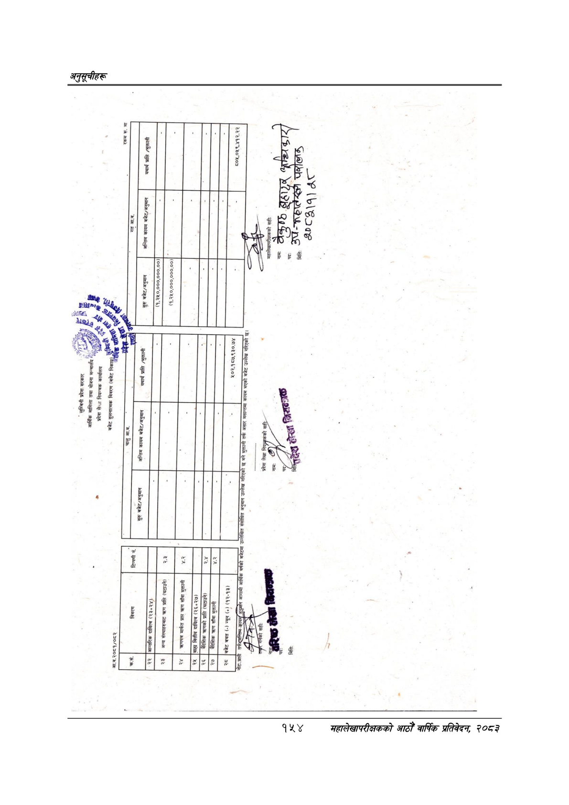

# Page 184 QA

## Rendered page


## Extracted text

```text
लुम्बिनी
प्रदेश
सरकार
आर्थिक
मामिला
तथा
योजना
मन्जालँय
४.
र
प्रदेश
सेथा
नियन्त्रक
कार्यालय
ङ्ै
शर
क
बजेट
तुलनात्मक
विवरण
(बजेट
नरक
सु
आ.ब.२०८१/०८२
छ
न
विवरण
टिप्पणी
नं.
नाममा...
जात
उल”
आ.ब.
सुरु
बजेट/अनुमान
अन्तिम
कायम
बजेट/अनुमान
आन्तरिक
दायित्व
(२३५
२४)
रकम
रू.
मा
न
म
न
निला
क
आ.व.
सुरु
बजेट/अनुमान
अन्तिम
कायम
बजेट/अनुमान
यथार्थ
प्राप्ति
/भुक्तानी
न
(४,३%०,०००,०००.००)]
अन्य
संस्थाहरुबाट
प्राप्ति
(घटाउने)
[र
३
२४
मार्फत
प्राप्त
करण
साँवा
भुक्तानी
[बाहा
वित्तीय
दायित्व
(२६,
२७)
क
त्रहणको
प्राप्ति
(घटाउने)
(१,२५०,०००,०००.००),
%०३,९५८,%३०.०
,०४%,९३.३%
रिएको
छ
भने
भुक्तानी
तर्फ
असार
मसान्तमा
कायम
भएक
महालेखापरीक्षकको
सही:
४०८८)१]
२४४७
८२०२ २८२४ २६०७ [ ए२४२/२००/७२/२
```

## Flags
- None
