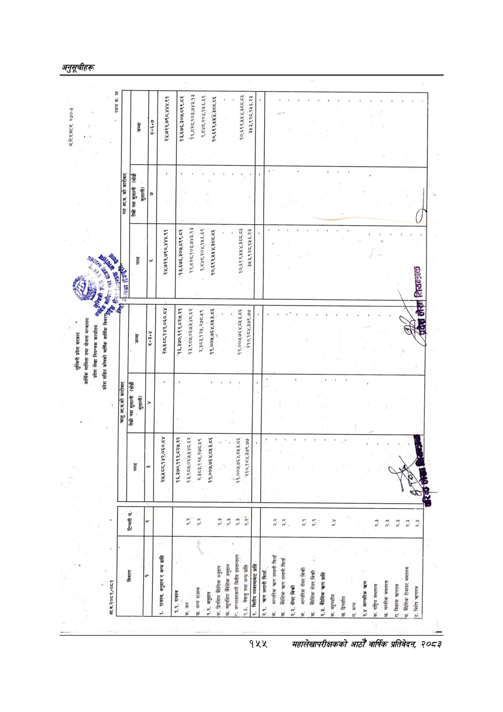

# Page 185 QA

## Rendered page


## Extracted text

```text
आ.व.२०८१/०८२
[ख.
अन्य
राजस्व
१.२.
अनुदान
७.
द्विपक्षिय
बैदेशिक
अनुदान
।ख.
बहुपक्षिय
बैदेशिक
अनुदान
[रा.
अन्तरसरकारी
बितीय
हस्तान्तरण
१.३.
बेर्जु
तथा
अन्य-प्राप्ति
१.३
१.३
१.३
२.
वित्तीय
व्यवस्थाबाट
प्राप्ति
२.१.
लगानी
फिर्ता
क.
आन्तरिक
त्रहण
लगानी
फिर्ता
बैदेशिक
तरण
लगानी
फिर्ता
२.२.
शेयर
बिक्री
क.
आन्तरिक
शेयर
बिक्री
वैदेशिक
शेयर
बिकी
२.३.
बैदेशिक
त्रहण
प्रासि
क.
बहुपक्षीय
'ख.
द्विपक्षीय
७.
अन्य
२.४
आन्तरिक
त्रहण
।क.
राष्ट्रिय
बचतपत्र
।ख.
नागरिक
बचतपत्र
गा.
बिकास
त्रहणपत्र
|घ.
बैदेशिक
रोजगार
बचतपत्र
७.
बिशेष
त्रहणपत्र
२.२
२.१
२.१
२.४
२.३
२०६
२.३
२.३
२.३
१६,३७०,१९२,८२७.२१
१३,९८७,०६७,५४८.६२
२,३८३,१२५,२७८.५९
११,००७,७६४,८५३.८६
११,००७,७६४,८५३.८६
२१०,१८४,३७९.७७
कन
।
[मा
जा
छा
।
लुम्बिनी
प्रदेश
सरकार
आर्थिक
मामिला
तथा
योजना
मन्त्रालय
प्रदेश
लेखा
नियन्त्रक
कार्यालय
प्रदेश
सञ्चित
कोषको
वार्षिक
आर्थिक
८,
केटिको
आ.व.को
क
तेस्रो
पक्ष
भुक्तानी
(सोझै
भुक्तानी)
।
च्न
।
२७,५१८८,१४२,०६०.८४
हाल
७३७७
उ
७
[बे
२४,७२२,७९०,४४४.९१
१६,३७०,१
कडा
१३,९८७,०६७,५४८.६२
२,३८३,१२५,२७८.५९
११,००७,७६४,८५३.८६
११,००७,७६४,८५३.८६
२१०,१८४,३७९.७७
-१३,६७६,३०७,८९९.८२
१९,६३५,९०३,६३.९३
१,८४८,२०४,१५६.६९
१०,६९२,५४५४,३८८.८६
१०,६९२,४५४५४,३८८.८६
३५३,९२८,१५६.२३
म.ले.प.फा.नं.
२७०-४५
तेस्रो
पक्ष
भुक्तानी
(सोझै
भुक्तानी)
।
२४,७२२,७९०,४४४.९१
१३,६७६,३०७,८९९.८२
४१,८२८,१०३,७४३.१३
१,८४८,२०४,१५६.६९
१०,६९२,५४५४,३८८.८६
१०,६९२,५४५४,३८८.८६
२५३,९२८,१५६.२३
४४७
८२०९ २२८८ २७०७ (२ [
```

## Flags
- None
