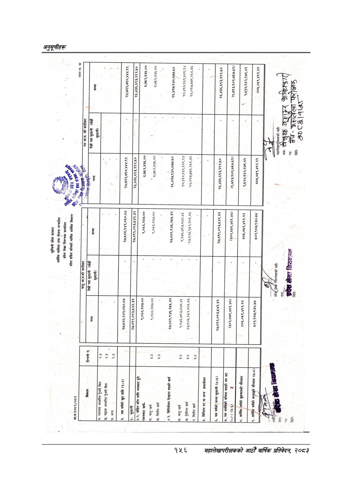

# Page 186 QA

## Rendered page


## Extracted text

```text
छ
प्रदेश
सरकार
आर्थिक
मामिला
तथा
योजना
अदेश
लेखा
नियन्त्रक
कार्यालय
प्रदेश
सञ्चित
कोषको
वार्षिक
आर्थिक
विवरण
आ.व.२०८१/०८२
चालु
आ.व.को
कारोबार
च.
ब्याजमा
आधारित
ट्रेजरी
बिल
छ.
बट्टामा
आधारित
ट्रेजरी
बिल
जज.
अन्य
छि
छाउन
भुक्तानी
४.१.
सञ्चित
कोष
माथि
व्ययभार
हुने
२७,५८८,१४२,०६०.८४
२७,०१,०१३,४४२.३२
७,८९१,०१३,५४२.३२
२४,७२२,७९०,४४४.९१
२४,७२२,७९०,४४४.९१
छाला
२६,४३६,६९३,२१२.५०
नका
ना
२६,४३६,६९३,२१२.५०
९,०६८,२८७.००
९,०६८,२८७.००
८.७५२,३३५.००
पा
८,७५२,३३४५.००
[रकमबाट
खर्च»
७.
चालु
खर्च
९,०६८,२८७.००
९,०६८,२८७.००
८७१२,३३५.००
८,७५२,३३५.००
'ख.
वित्तीय
खर्च
अल
५
[४-२.
विनियोजन
ऐनद्वारा
भएको
खर्च
२७,८८१,९४५,२५५.३२
२७,८८१,९४४५,२५५.३२
२६,४२७,९४०,८७७.५०
२६,४२७,९४०,८७७.१०
७.
चालु
खर्च
९,९७६,७९३,०४८.४६
९,९७६,७९३,०४८.४६
१०,४१०,१६९,६०९.१४
१०,४१०,१६९,६०९.१४
'ख.
पुँजीगत
खर्च
१७,९०५,१५२,२०६.८६
१७,९०४५,१५२,२०६.८६
१६,०१७,७७१,२६८.३६
१६,०१७,७७१,२६८.३६
[गा.
वित्तीय
खर्च
४.
विनिमय
दर
वा
अन्य
समायोजन
(३०२,८७१,४८१.४८)
६.
यस
वर्षको
जम्मा
भुक्तानी
(४५)
(३-६)
न
कद
"ना
हि
२७,८९१,०१३,५४२.३२
२६,४३६,६९३,२१२.५०
(१,७१३,९०२,७६७.५९)
२,४५१८,९६२,१७९.८१
२६,४३६,६९३,२१२.५०
(१,७१३,९०२,७६७.५९)
८०५,०४५९,४१२.२२
अन
त
८०५,०४५९,४१२.२२
२,४५१८,९६२,१७९.८१
१०२,१८७,९३०.७४
५०५,०४५९,४१२.२२
को
सही:
सही:
निराल्ञक्त
फ्
अत.
३%
८२०२ २२८२ [ (
```

## Flags
- None
