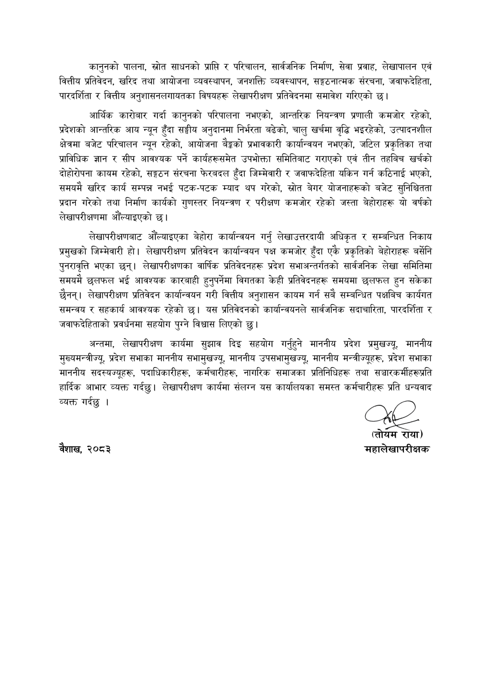

# Page 10 QA

## Rendered page


## Extracted text

```text
कानुनको पालना, स्रोत साधनको प्राप्ति र परिचालन, सार्वजनिक निर्माण, सेवा प्रवाह, लेखापालन एवं वित्तीय प्रतिवेदन, खरिद तथा आयोजना व्यवस्थापन, जनशक्ति व्यवस्थापन, सङ्गठनात्मक संरचना, जवाफदेहिता, पारदर्शिता र वित्तीय अनुशासनलगायतका विषयहरू लेखापरीक्षण प्रतिवेदनमा समावेश गरिएको छ।
आर्थिक कारोबार गर्दा कानुनको परिपालना नभएको, आन्तरिक नियन्त्रण प्रणाली कमजोर रहेको, प्रदेशको आन्तरिक आय न्यून हुँदा सङ्घीय अनुदानमा निर्भरता बढेको, चालु खर्चमा वृद्धि भइरहेको, उत्पादनशील क्षेत्रमा बजेट परिचालन न्यून रहेको, आयोजना बैङ्कको प्रभावकारी कार्यान्वयन नभएको, जटिल प्रकृतिका तथा प्राविधिक ज्ञान र सीप आवश्यक पर्ने कार्यहरूसमेत उपभोक्ता समितिबाट गराएको एवं तीन तहबिच खर्चको दीहोरोपना कायम रहेको, सङ्गठन संरचना फेरबदल हुँदा जिम्मेवारी र जवाफदेहिता यकिन गर्न कठिनाई भएको, समयमै खरिद कार्य सम्पन्न नभई पटक-पटक म्याद थप गरेको, स्रोत बेगर योजनाहरूको बजेट सुनिश्चितता प्रदान गरेको तथा निर्माण कार्यको गुणस्तर नियन्त्रण र परीक्षण कमजोर रहेको जस्ता बेहोराहरू यो वर्षको लेखापरीक्षणमा ओऔंल्याइएको छ।
लेखापरीक्षणबाट औँल्याइएका बेहोरा कार्यान्वयन गर्नु लेखाउत्तरदायी अधिकृत र सम्बन्धित निकाय प्रमुखको जिम्मेवारी हो। लेखापरीक्षण प्रतिवेदन कार्यान्वयन पक्ष कमजोर हुँदा एकै प्रकृतिको वेहोराहरू बर्सेनि पुनरावृत्ति भएका छन्‌। लेखापरीक्षणका वार्षिक प्रतिवेदनहरू प्रदेश सभाअन्तर्गतको सार्वजनिक लेखा समितिमा समयमै छलफल भई आवश्यक कारबाही हुनुपर्नेमा विगतका केही प्रतिवेदनहरू समयमा छलफल हुन सकेका छैनन्‌। लेखापरीक्षण प्रतिवेदन कार्यान्वयन गरी वित्तीय अनुशासन कायम गर्न सबै सम्बन्धित पक्षबिच कार्यगत समन्वय र सहकार्य आवश्यक रहेको छ। यस प्रतिवेदनको कार्यान्वयनले सार्वजनिक सदाचारिता, पारदर्शिता र जवाफदेहिताको प्रवर्धनमा सहयोग पुग्ने विश्वास लिएको छु।
अन्तमा, लेखापरीक्षण कार्यमा सुझाव दिइ सहयोग गर्नुहुने माननीय प्रदेश प्रमुखज्यु, माननीय मुख्यमन्त्रीज्यू, प्रदेश सभाका माननीय सभामुखज्यू, माननीय उपसभामुखज्यू, माननीय मन्त्रीज्यूहरू, प्रदेश सभाका माननीय सदस्यज्यूहरू, पदाधिकारीहरू, कर्मचारीहरू, नागरिक समाजका प्रतिनिधिहरू तथा सञ्चारकर्मीहरूप्रति हार्दिक आभार व्यक्त गर्दछु। लेखापरीक्षण कार्यमा संलरन यस कार्यालयका समस्त कर्मचारीहरू प्रति धन्यवाद व्यक्त गर्दछु।.
वैशाख, २०८३
(तोयम रांया) महालेखापरीक्षक
```

## Flags
- None
