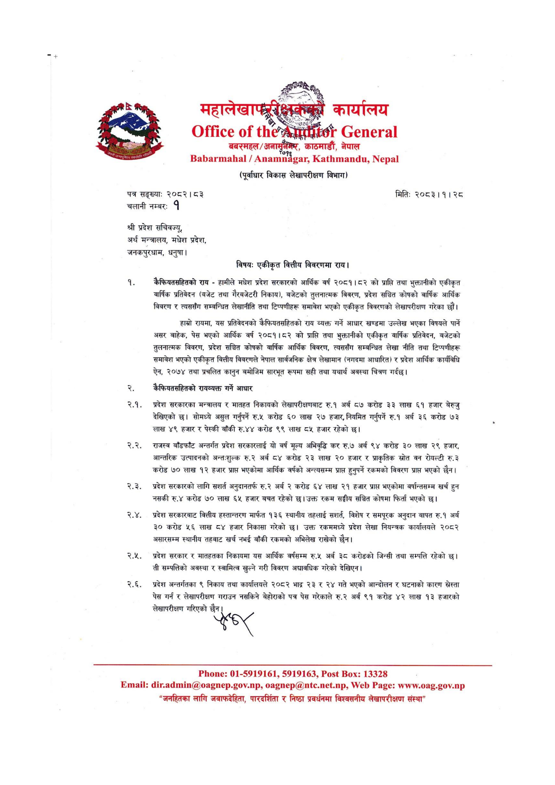

# Page 13 QA

## Rendered page


## Extracted text

```text
बबरमहल/अनासुँमेर,
काठमाडौँ, नेपाल
(पूर्वाधार विकास लेखापरीक्षण विभाग)
पत्र सङ्ख्या:
२०८२। ८३
चलानी नम्बरः
१
श्री प्रदेश सचिवनज्यु, अर्थ मन्त्रालय, मधेश प्रदेश, जनकपुरधाम, धनुषा |
मितिः
२०८३।१। २८
विषय: एकीकृत वित्तीय विवरणमा राय।
कैफियतसहितको राय -हामीले मधेश प्रदेश सरकारको आर्थिक वर्ष २०८१।८२ को प्राप्ति तथा भुक्तानीको एकीकृत वार्षिक प्रतिवेदन (बजेट तथा गैरबजेटरी निकाय), बजेटको तुलनात्मक विवरण, प्रदेश सञ्चित कोषको वार्षिक आर्थिक विवरण र त्यससँग सम्बन्धित लेखानीति तथा टिप्पणीहरू समावेश भएको एकीकृत विवरणको लेखापरीक्षण गरेका छौं।
हाम्रो रायमा, यस प्रतिवेदनको कैफियतसहितको राय व्यक्त गर्ने आधार खण्डमा उल्लेख भएका विषयले पार्ने असर बाहेक, पेस भएको आर्थिक वर्ष २०८१।८२ को प्राप्ति तथा भुक्तानीको एकीकृत वार्षिक प्रतिवेदन, बजेटको तुलनात्मक विवरण, प्रदेश सञ्चित कोषको वार्षिक आर्थिक विवरण, त्यससँग सम्बन्धित लेखा नीति तथा टिप्पणीहरू समावेश भएको एकीकृत वित्तीय विवरणले नेपाल सार्वजनिक क्षेत्र लेखामान (नगदमा आधारित) र प्रदेश आर्थिक कार्यविधि ऐन, २०७४ तथा प्रचलित कानुन बमोजिम सारभूत रूपमा सही तथा यथार्थ अवस्था चित्रण गर्दछु।
कैफियतसहितको रायव्यक्त गर्ने आधार
प्रदेश सरकारका मन्त्रालय र मातहत निकायको लेखापरीक्षणबाट रु.१ अर्ब ८७ करोड २३ लाख ६१ हजार बेरुजु देखिएको छ। सोमध्ये असुल गर्नुपर्ने रु.५ करोड ६० लाख २७ हजार, नियमित गर्नुपर्ने रु.१ अर्ब ३६ करोड ७३ 'लाख ४९ हजार र पेस्की बाँकी रु.४४ करोड ९९ लाख ८५ हजार रहेको
२.२: राजस्व बाँडफाँट अन्तर्गत प्रदेश सरकारलाई यो वर्ष मूल्य अभिवृद्धि कर रु.७ अर्ब ९४ करोड ३० लाख २९ हजार, आन्तरिक उत्पादनको अन्तःशुल्क रु.२ अर्ब ८४ करोड २३ लाख २० हजार र प्राकृतिक स्रोत वन रोयल्टी रु.३ करोड ७० लाख १२ हजार प्राप्त भएकोमा आर्थिक वर्षको अन्त्यसम्म प्राप्त हुनुपर्ने रकमको विवरण प्राप्त भएको छैन।
२.३. प्रदेश सरकारको लागि सशार्त अनुदानतर्फ रु.२ अर्ब २ करोड ६४ लाख २१ हजार प्राप्त भएकोमा वर्षान्तसम्म खर्च हुन नसकी रु.४ करोड ७० लाख ६५ हजार बचत रहेको छ। उक्त रकम सङ्घीय सञ्चित कोषमा फिर्ता भएको छु।
.. प्रदेश सरकारबाट वित्तीय हस्तान्तरण मार्फत १३६ स्थानीय तहलाई सशार्त, विशेष र समपूरक अनुदान बापत रु.१ अर्ब ३० करोड ५६ लाख ८४ हजार निकासा गरेको छ। उक्त रकममध्ये प्रदेश लेखा नियन्त्रक कार्यालयले २०८२ असारसम्म स्थानीय तहबाट खर्च नभई बाँकी रकमको अभिलेख राखेको छैन।
४ प्रदेश सरकार र मातहतका निकायमा यस आर्थिक वर्षसम्म रु.५ अर्ब ३८ करोडको जिन्सी तथा सम्पत्ति रहेको छ। ती सम्पत्तिको अवस्था र स्वामित्व खुल्ने गरी विवरण अद्यावधिक गरेको देखिएन।
२.६. प्रदेश अन्तर्गतका ९ निकाय तथा कार्यालयले २०८२ भाद्र २३ र २४ गते भएको आन्दोलन र घटनाको कारण सस्ता पेस गर्न र लेखापरीक्षण गराउन नसकिने बेहोराको पत्र पेस गरेकाले रु.२ अर्ब ९१ करोड ४२ लाख १३ हजारको लेखापरीक्षण गरिएको छैन।
$६९
: ५९१९१६३,
०१-५९१९१६१, : १३३२८
: ..., .., : ... "ज्नहितका लागि जवाफदेहिता, पारदर्शिता र निष्ठा प्रवर्धनमा विश्वसनीय लेखापरीक्षण संस्था"
```

## Flags
- None
