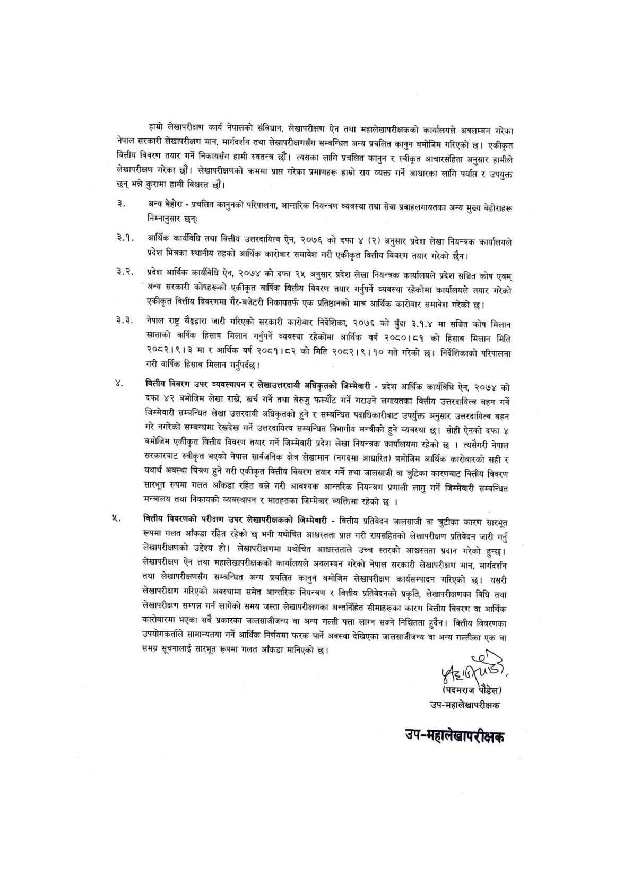

# Page 14 QA

## Rendered page


## Extracted text

```text
हाम्रो लेखापरीक्षण कार्य नेपालको संविधान, लेखापरीक्षण ऐन तथा महालेखापरीक्षकको कार्यालयले अवलम्बन गरेका नेपाल सरकारी लेखापरीक्षण मान, मारग्दिर्शन तथा लेखापरीक्षणसँग सम्बन्धित अन्य प्रचलित कानुन बमोजिम गरिएको छ। एकीकृत वित्तीय विवरण तयार गर्ने निकायसँग हामी स्वतन्त्र छौं। त्यसका लागि प्रचलित कानुन र स्वीकृत आचारसंहिता अनुसार हामीले लेखापरीक्षण गरेका छौं। लेखापरीक्षणको क्रममा प्राप्त गरेका प्रमाणहरू हाम्रो राय व्यक्त गर्ने आधारका लागि पर्यापत र उपयुक्त छन्‌ भन्ने कुरामा हामी विश्वस्त छौं।
अन्य बेहोरा -प्रचलित कानुनको परिपालना, आन्तरिक नियन्त्रण व्यवस्था तथा सेवा प्रवाहलगायतका अन्य मुख्य बेहोराहरू निम्नानुसार छन्‌ः
-आर्थिक कार्यविधि तथा वित्तीय उत्तरदायित्व ऐन, २०७६ को दफा ४ (२) अनुसार प्रदेश लेखा नियन्त्रक कार्यालयले प्रदेश भित्रका स्थानीय तहको आर्थिक कारोबार समावेश गरी एकीकृत वित्तीय बिवरण तयार गरेको छैन।
२.२. प्रदेश आर्थिक कार्यविधि ऐन, २०७४ को दफा २५ अनुसार प्रदेश लेखा नियन्त्रक कार्यालयले प्रदेश सञ्चित कोष एवम्‌ अन्य सरकारी कोषहरूको एकीकृत वार्षिक वित्तीय विवरण तयार गर्नुपर्ने व्यवस्था रहेकोमा कार्यालयले तयार गरेको एकीकृत वित्तीय विवरणमा गैर-बजेटरी निकायतर्फ एक प्रतिष्ठानको मात्र आर्थिक कारोबार समावेश गरेको छ।
रे.३े. नेपाल राष्ट्र बैङ्द्वारा जारी गरिएको सरकारी कारोबार निर्देशिका, २०७६ को बुँदा ३.१.४ मा सञ्चित कोष मिलान खाताको बार्षिक हिसाब मिलान गर्नुपर्ने व्यवस्था रहेकोमा आर्थिक वर्ष २०८०।८१ को हिसाब मिलान मिति २०८२।९। ३ मा र आर्थिक वर्ष २०८१।८२ को मिति २०८२।९।१० गते गरेको छ। निर्देशिकाको परिपालना गरी वार्षिक हिसाव मिलान गर्नुपर्दछु।
वित्तीय विवरण उपर व्यवस्थापन र लेखाउत्तरदायी अधिकृतको जिम्मेवारी -प्रदेश आर्थिक कार्यविधि ऐन, २०७४ को दफा ४२ बमोजिम लेखा राख, खर्च गर्ने तथा बेरुजु फस्यौट गर्ने गराउने लगायतका वित्तीय उत्तरदायित्व बहन गर्ने जिम्मेवारी सम्बन्धित लेखा उत्तरदायी अधिकृतको हुने र सम्बन्धित पदाधिकारीबाट उपर्युक्त अनुसार उत्तरदायित्व बहन गरे नगरेको सम्बन्धमा रेखदेख गर्ने उत्तरदायित्व सम्बन्धित विभागीय मन्त्रीको हुने व्यवस्था | सोही ऐनको दफा ४ बमोजिम एकीकृत वित्तीय विवरण तयार गर्ने जिम्मेवारी प्रदेश लेखा नियन्त्रक कार्यालयमा रहेको छ | त्यसैगरी नेपाल सरकारबाट स्वीकृत भएको नेपाल सार्वजनिक क्षेत्र लेखामान (नगदमा आधारित) बमोजिम आर्थिक कारोबारको सही र यथार्थ अवस्था चित्रण हुने गरी एकीकृत वित्तीय विवरण तयार गर्ने तथा जालसाजी वा च्रुटिका कारणबाट वित्तीय विवरण सारभूत रुपमा गलत आँकडा रहित बन्ने गरी आवश्यक आन्तरिक नियन्त्रण प्रणाली लागु गर्ने जिम्मेवारी सम्बन्धित मन्त्रालय तथा निकायको व्यवस्थापन र मातहतका जिम्मेवार व्यक्तिमा रहेको छ।
वित्तीय विवरणको परीक्षण उपर लेखापरीक्षकको जिम्मेवारी -वित्तीय प्रतिवेदन जालसाजी वा चुटीका कारण सारभूत रूपमा गलत आँकडा रहित रहेको छ भनी यथोचित आध्चस्तता प्राप्त गरी रायसहितको लेखापरीक्षण प्रतिवेदन जारी गर्नु लेखापरीक्षणको उद्देश्य हो। लेखापरीक्षणमा यथोचित आधस्तताले उच्च स्तरको आश्वस्तता प्रदान गरेको हुन्छ। लेखापरीक्षण ऐन तथा महालेखापरीक्षकको कार्यालयले अवलम्बन गरेको नेपाल सरकारी लेखापरीक्षण मान, मार्गदर्शन तथा लेखापरीक्षणसँग सम्बन्धित अन्य प्रचलित कानुन बमोजिम लेखापरीक्षण कार्यसम्पादन गरिएको छ। यसरी लेखापरीक्षण गरिएको अवस्थामा समेत आन्तरिक नियन्त्रण र वित्तीय प्रतिवेदनको प्रकृति, लेखापरीक्षणका विधि तथा लेखापरीक्षण सम्पन्न गर्न लागेको समय जस्ता लेखापरीक्षणका अन्तर्निहित सीमाहरूका कारण वित्तीय विवरण वा आर्थिक कारोबारमा भएका सबै प्रकारका जालसाजीजन्य वा अन्य गल्ती पत्ता लाग्न सक्ने निश्चितता हुदैन। वित्तीय विवरणका उपयोगकर्ताले सामान्यतया गर्ने आर्थिक निर्णयमा फरक पार्ने अवस्था देखिएका जालसाजीजन्य वा अन्य गल्तीका एक वा समग्र सूचनालाई सारभूत रूपमा गलत आँकडा मानिएको | ब२२
(पदमराज पौडेल) उप-महालेखापरीक्षक
उप-महालेखापरीक्षक
```

## Flags
- None
