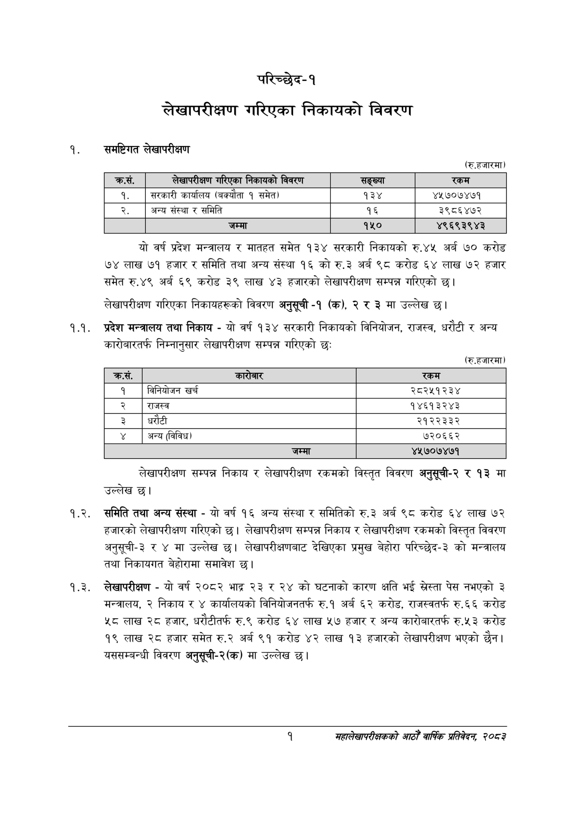

# Page 17 QA

## Rendered page


## Extracted text

```text
परिच्छेद-१
लेखापरीक्षण गरिएका निकायको विवरण
समष्टिगत लेखापरीक्षण
(रु.हजारमा)
यो वर्ष प्रदेश मन्त्रालय र मातहत समेत १३४ सरकारी निकायको रु.४५ अर्ब ७० करोड ७४ लाख ७१ हजार र समिति तथा अन्य संस्था १६ को रु.३ अर्ब ९८ करोड ६४ लाख ७२ हजार समेत रु.४९ अर्ब ६९ करोड ३ लाख ४३ हजारको लेखापरीक्षण सम्पन्न गरिएको छ।
लेखापरीक्षण गरिएका निकायहरूको विवरण अनुसूची -१ (क), २ र ३ मा उल्लेख छ।
१.१. प्रदेश मन्त्रालय तथा निकाय -यो वर्ष १३४ सरकारी निकायको विनियोजन, राजस्व, धरौटी र अन्य कारोबारतर्फ निम्नानुसार लेखापरीक्षण सम्पन्न गरिएको छः
(रु.हजारमा)
लेखापरीक्षण सम्पन्न निकाय र लेखापरीक्षण रकमको विस्तृत विवरण अनुसूची-२ र १३ मा उल्लेख छ।
१.२. समिति तथा अन्य संस्था -यो वर्ष १६ अन्य संस्था र समितिको रु.३ अर्ब ९८ करोड ६४ लाख ७२ हजारको लेखापरीक्षण गरिएको छ। लेखापरीक्षण सम्पन्न निकाय र लेखापरीक्षण रकमको विस्तृत विवरण अनुसूची-३ र ४ मा उल्लेख छ। लेखापरीक्षणबाट देखिएका प्रमुख बेहोरा परिच्छेद-३ को मन्त्रालय तथा निकायगत बेहोरामा समावेश छ।
१.३. लेखापरीक्षण -यो वर्ष २०८२ भाद्र २३ र २४ को घटनाको कारण क्षति भई स्रेस्ता पेस नभएको ३ मन्त्रालय, २ निकाय र ४ कार्यालयको विनियोजनतर्फ रु.१ अर्ब ६२ करोड, राजस्वतर्फ रु.६६ करोड ५८ लाख २८ हजार, धरौटीतर्फ रु.९ करोड ६४ लाख ५७ हजार र अन्य कारोबारतर्फ रु.५३ करोड १९ लाख २८ हजार समेत रु.२ अर्ब ९१ करोड ४२ लाख १३ हजारको लेखापरीक्षण भएको छैन। यससम्बन्धी विवरण अनुसूची-२(क) मा उल्लेख छ।
१
महालेखापरीक्षकको आठौ वाषिकि प्रतिवेदन २०८२

| क्रस. | लेखापरीक्षण गरिएका निकावको विवरण | सङ्ख्या | रकम |
| --- | --- | --- | --- |
| १. | सरकारी कार्यालय (मक्यौता १ समेत) | १३४ | ४५७०७४७१ |
| २. | अन्य संस्था र समिति | १६ | ३९८६४७२ |

| क्रस. | कारेबार | रकम |
| --- | --- | --- |
| १ | विनियोजन खर्च | २८२५१२३४ |
| २ | राजस्व | १४६१३२४३ |
| ३ | धरौटी | २१२२३३२ |
|  | अन्य (विविध) | ७२०६६२ |
|  | जम्मा | ४५७०७४७१ |
```

## Flags
- table_page
- medium_quality_table
