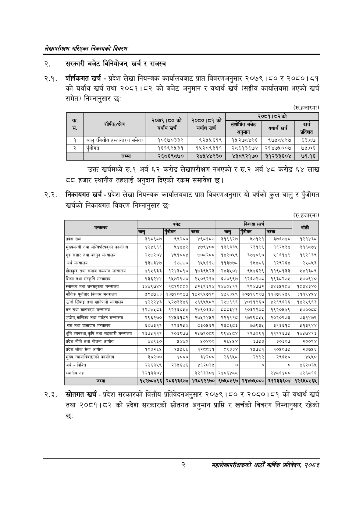

# Page 18 QA

## Rendered page


## Extracted text

```text
लेखापरीक्षण गरिएका निकायको विवरण
सरकारी बजेट विनियोजन, खर्च र राजस्व
शीर्षकगत खर्च -प्रदेश लेखा नियन्त्रक कार्यालयबाट प्राप्त विवरणअनुसार २०७९। ८० र २०८०।८१ को यर्थाथ खर्च तथा २०८१।८२ को बजेट अनुमान र यथार्थ खर्च (सङ्घीय कार्यालयमा भएको खर्च समेत) निम्नानुसार छः
(रु.हजारमा)
उक्त खर्चमध्ये रु.१ अर्ब ६२ करोड लेखापरीक्षण नभएको र रु.२ अर्ब ४८ करोड ६४ लाख ८८ हजार स्थानीय तहलाई अनुदान दिएको रकम समावेश छ।
२.२. निकायगत खर्च -प्रदेश लेखा नियन्त्रक कार्यालयबाट प्राप्त विवरणअनुसार यो वर्षको कुल चालु र पुँजीगत खर्चको निकायगत विवरण निम्नानुसार छः
२.३. स्रोतगत खर्च -प्रदेश सरकारको वित्तीय प्रतिवेदनअनुसार २०७९ १५० र २०८०।८१ को यथार्थ खर्च तथा २०८१।८२ को प्रदेश सरकारको स्रोतगत अनुमान प्राप्ति र खर्चको विवरण निम्नानुसार रहेको छः
(रु.हजारमा)
२
महालेखापरीक्षकको आठौ वाषिकि प्रतिवेदन २०८२

|  |  | २०७९।८०को |  |  | रिटको |  |
| --- | --- | --- | --- | --- | --- | --- |
| क, % |  | यर्थाय खर्च | ३०५०१५९ बर्याय खर्च | संशोधित सँगोधितबनेट अनुमान | अचार्यखर्च | रचे प्रतिशत |
| १ | चालु (वित्तीय ह९।-०९५ समेत) | १०६७०३३९ | ९२५५६१९ | १४५२७८४९६ | ९७५८५९७ | ६३.८७ |
| २ | पुँजीगत | १६१९९५३१ | १४५२८९३११ | २८६१३६७४ | २१४७५००७ | ७५.०६ |
|  | जम्मा | २६८६९८७० | २४५४४९३० | ४३८९२१७० | ३१२३३६०४ | ७१.१६ |

|  |  | बजेट |  |  | 'निकासा /खर्च |  | बाँकी |
| --- | --- | --- | --- | --- | --- | --- | --- |
| मन्त्रालय | चालु | 'रजीगत | जम्मा | चालु | रंजीगत | जम्मा |  |
| प्रदेश सभा | ३९८९८७ | ९९२०० | ४९८१६७ | ३१९६२७ | ७१२१ | ३७६७४८ | १२१४३८ |
| मुख्यमन्त्री तथा भन्जिपरिषद्‌को कार्यालय | ४२४९६६ | भ४४४२ | ४७९४०८ | १३९३३४५ | २३१९९ | १६२५३४ | ३१६८७४ |
| 'गृह सञ्चार तथा कानुन मन्त्रालय | २५७२०४ | ४५१०७४ | छ०्रड | १४२०१९ | ३७४०९० | ११६१४९ | १९२१३९ |
| अर्थ मन्त्रालय | १३७३४७ | १७७७० | ११५११७ | ११३७७८ | ५४८६ | १२९२६४ | र२४५८४५३ |
| 'खेलकुद तथा समाज कल्याण मन्त्रालय | ४९५६३३ | १२४३८९० | १७३९४२३ | २४३४०४ | ९४५४६२९ | ११९८१३३ | १४१३८९ |
| शिक्षा तथा संस्कृति मन्त्रालय | ९३६२४४ | १५७२९७० | २५०९२१४ | ६७०९९७ | १२६७२७८ | १९३८२७५ | २१७०९४० |
| स्वास्थ्य तथा जनसङ्ख्या मन्त्रालय | ३४४९७४४ | १८१९८८० | ५२६९६२४ | २४४०५१२ | ९९४७७२ | ३४३५२८४ | १८३४३४० |
| भौतिक पूर्वाधार विकास मन्त्रालय | ४८४७६३ | १३७१०९४७ | १४२९५७१० | ४४५९३५९ | १०७१६८९७ | १११७६२५६ | ३११९४५४ |
| उर्जा सिँचाइ तथा खानेपानी मन्त्रालय | ४२२२४३ | ५२७३३४६ | ५६९४५४८९ | २४७६६६ | ४०११९६० | ४२६९६२६ | १४२४९६३ |
| तथा वातावरण मन्त्रालय | १२७४५८३ | १२१६०५४ | २४९०६३७ | ५५८३४१ | १०३२२०८ | १९२०५४९ | २७००६८ |
| 'उच्चोग, वाणिज्य तथा पर्यटन मन्चालय | २९६२७० | २४५६१८२ | २७५२४५२ | २२१११८ | १७९९८५५ | २०२०९७३ | ७३१४७९ |
| श्रम तथा यातायात मन्त्रालय | ६०७३१२ | २२३२५० | ८३०५६२ | २३८६८३ | ७७९३५ | ३१६६१८ | ११३९४४ |
| भूमि व्यवस्था, कृषि तथा सहकारी मन्त्रालय | २३७५११२ | २०३९७७ | २५७९०८९ | ९९४४५८४ | १२७०९१ | ११२१६७५ | १४५७४१३ |
| प्रदेश नीति तथा योजना आयोग | ४४९६० | १४४० | १०४०० | २६५१५४ | ३७५३ | ३०३०७ | र२००९४ |
| प्रदेश लोक सेवा आयोग | १०३२६५ | र२५५६६ | १२८८३१ | ५९३३४ | ५७४१ | १०५०७५ | र२३७५६ |
| मुख्य न्वावाधिवक्ताको कार्यालय | ३०२०० | ४००० | ३४२०० | २६६५८ | २९९२ | २९६५० | ४५५० |
| अर्थ - विविध | २२६३५९ | २३५६७६ | ४६२०३५ | ० | ० | ० | ४६२०३५ |
| स्थानीय तह | ३२१३३०४ |  | ३२१३३०४ | २४८६४८८ |  | २४८६४८८ | ७२६८१६ |
| जम्मा | १५२७८४९६ | २८६१३६७४ | ४३८९२१७० | ९७५८५९७ | २१४७४५००७ | ३१२३३६०४ | १२६५८५६४५ |
```

## Flags
- table_page
- medium_quality_table
