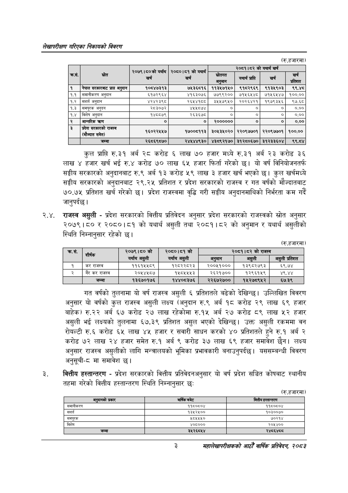

# Page 19 QA

## Rendered page


## Extracted text

```text
लेखापरीक्षण गरिएका निकायको विवरण
(रु.हजारमा)
कुल प्राप्ति रु.३१ अर्ब २८ करोड ६ लाख ७० हजार मध्ये रु.३१ अर्ब २३ करोड ३६ लाख ४ हजार खर्च भई रु.४ करोड ७० लाख ६५ हजार फिर्ता गरेको छ। यो वर्ष विनियोजनतर्फ सङ्घीय सरकारको अनुदानबाट रु.९ अर्ब १३ करोड ५९ लाख ३ हजार खर्च भएको | कुल खर्चमध्ये सङ्घीय सरकारको अनुदानबाट २९,२४५ प्रतिशत र प्रदेश सरकारको राजस्व र गत वर्षको मौज्दातबाट ७०.७१५ प्रतिशत खर्च गरेको छ। प्रदेश राजस्वमा वृद्धि गरी सङ्घीय अनुदानमाथिको निर्भरता कम गर्दै जानुपर्दछ |
२.४. राजस्व असुली -प्रदेश सरकारको वित्तीय प्रतिवेदन अनुसार प्रदेश सरकारको राजस्वको स्रोत अनुसार २०७९।८० र २०८०।८१ को यथार्थ असुली तथा २०८१।८२ को अनुमान र यथार्थ असुलीको स्थिति निम्नानुसार रहेको छ।
(रु.हजारमा)
गत वर्षको तुलनामा यो वर्ष राजस्व असुली ६ प्रतिशतले बढेको देखिन्छ। उल्लिखित विवरण अनुसार यो वर्षको कुल राजस्व असुली लक्ष्य (अनुदान रु.९ अर्ब १८ करोड २९ लाख ६९ हजार बाहेक) रु.२२ अर्ब ६७ करोड २७ लाख रहेकोमा रु.१५ अर्ब २७ करोड ८९ लाख ५२ हजार असुली भई लक्ष्यको तुलनामा ६७.३९ प्रतिशत असुल भएको देखिन्छ। उक्त असुली रकममा वन रोयल्टी रु.६ करोड ६५ लाख ४५ हजार र सवारी साधन करको ४० प्रतिशतले हुने रु.१ अर्ब २ करोड ७२ लाख २४ हजार समेत रु.१ अर्ब ९ करोड ३७ लाख ६९ हजार समावेश छैन। लक्ष्य अनुसार राजस्व असुलीको लागि मन्त्रालयको भूमिका प्रभावकारी बनाउनुपर्दछ। यससम्बन्धी विवरण अनुसूची-८ मा समावेश छ।
वित्तीय हस्तान्तरण -प्रदेश सरकारको वित्तीय प्रतिवेदनअनुसार यो वर्ष प्रदेश सञ्चित कोषबाट स्थानीय तहमा गरेको वित्तीय हस्तान्तरण स्थिति निम्नानुसार छः
(रु.हजारमा)
३
महालेखापरीक्षकको वाषिकि प्रतिवेदन २०८२

|  |  | २०७९।८०को यर्थाथ | को यथार्थ |  |  |  |  |
| --- | --- | --- | --- | --- | --- | --- | --- |
| कस, | स्रोत | खर्च | २०८०।८१ खर्च | 'स्रोतगत अनुमान | प्राप्ति | खर्च | खर्च प्रतिशत |
| १ | नेपाल ९२१८ प्राप्त अनुदान | १०८४७३१३ | ७५३६८१६ | ११३४५७१५० | ९१८२९६९ | ९१३५९०३ | ९९४८ |
| १.१ | लसमानीकरण अनुदान | ६१७२९६४ | ४१६३०७६ | ७७९९२०० | ७१५६५४८ | ७१५६५४७ | १००.०० |
| १.२ | अनुदान | ४२४२३९८ | २६४४१८८ | ३५४५७९५० | २०२६४२१ | १९७९३५६ | ९७.६८ |
| १.३ | समपूरक अनुदन | २८३०७२ | ४५५८७४ | ० | ० | ० | ०.०० |
| १.४ | विशेष अनुदान | १४८८७९ | २६३६७८ | ० | ० | ० | ०.०० |
| २ | अन्तरिक | ० | ० | २०००००० | ० | ० | ०.०० |
| २ |  | १६०२२५४५७ | ९८००५९९३ | ३०४३४५०२० | २२०९७७०१ | २२०९७७०१ | १००.०० |
|  | जम्मा | २६८६९८७० | २४५४४९३० | ४३८९२१७० | ३१२८०६७० | ३१२३३६०४ | ९९.८४ |

| . 9.   | शीर्षक               | २०७९।८० को यर्थाय   | ०्ब०1ब१ यर्थाथ   | २०८१।८२ को राजस्व   | २०८१।८२ को राजस्व   | २०८१।८२ को राजस्व   |
|--------|----------------------|---------------------|------------------|---------------------|---------------------|---------------------|
|        |                      | असुली               | असुली            | अनुमान              | असुली               | असुली प्रतिशत       |
|        | कर राजस्व            | ११६१५५८९            | १२८२२८२३         | २००५१०००            | १३९८२७९३            |                     |
|        | गैर कर राजस्व &#124; | २०५४५८७             | १५८५५५३          | २६२१७००             | १२९६१५९             | ४९.४४               |
|        | जम्मा                | १३६७०१७६            | १४४०८३७६         | २२६७२७००            | १५२७८९४५२           | ६७.३९               |

| अनुदानको प्रकार | (सि बजेट | हस्तान्तरण |
| --- | --- | --- |
| लमानीकरण | ११६०६०४ | ११६०६०४ |
| 'सशर्त | १३४२५०० | १०३००७० |
| समपूरक | ५८५५५० | ७०२१४ |
| विशेष | ४०८००० | २०४५४०० |
| जम्मा | ३५२६८५४ | २४८६४८८ |
```

## Flags
- table_page
- medium_quality_table
