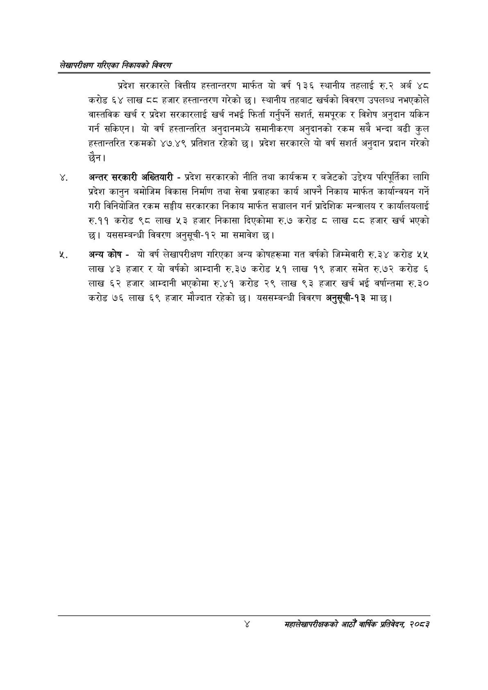

# Page 20 QA

## Rendered page


## Extracted text

```text
लेखापरीक्षण गरिएका निकायको विवरण
प्रदेश सरकारले वित्तीय हस्तान्तरण मार्फत यो वर्ष १३६ स्थानीय तहलाई रु.२ अर्ब ४८ करोड ६४ लाख ८८ हजार हस्तान्तरण गरेको छ। स्थानीय तहबाट खर्चको विवरण उपलब्ध नभएकोले वास्तविक खर्च र प्रदेश सरकारलाई खर्च नभई फिर्ता गर्नुपर्ने सशर्त, समपूरक र विशेष अनुदान यकिन गर्न सकिएन। यो वर्ष हस्तान्तरित अनुदानमध्ये समानीकरण अनुदानको रकम सबै भन्दा बढी कुल हस्तान्तरित रकमको ४७.४९ प्रतिशत रहेको छ। प्रदेश सरकारले यो वर्ष सशर्त अनुदान प्रदान गरेको छैन।
अन्तर सरकारी अख्तियारी -प्रदेश सरकारको नीति तथा कार्यक्रम र बजेटको उद्देश्य परिपूर्तिका लागि प्रदेश कानुन बमोजिम विकास निर्माण तथा सेवा प्रवाहका कार्य आफ्नै निकाय मार्फत कार्यान्वयन गर्ने गरी विनियोजित रकम सङ्घीय सरकारका निकाय मार्फत सञ्चालन गर्न प्रादेशिक मन्त्रालय र कार्यालयलाई रु.११ करोड ९८ लाख ५३ हजार निकासा दिएकोमा रु.७ करोड लाख ६६ हजार खर्च भएको छ। यससम्बन्धी विवरण अनुसूची-१२ मा समावेश छ।
अजअन्यकोषयो वर्ष लेखापरीक्षण गरिएका अन्य कोषहरूमा गत वर्षको जिम्मेवारी रु.३४ करोड ५५ लाख ४३ हजार र यो वर्षको आम्दानी रु.३७ करोड ५१ लाख १९ हजार समेत रु.७२ करोड ६ लाख ६२ हजार आम्दानी भएकोमा रु.४१ करोड २९ लाख ९३ हजार खर्च भई वर्षान्तमा रु.३० करोड ७६ लाख ६९ हजार मौज्दात रहेको छ। यससम्बन्धी विवरण अनुसूची-१३ मा छ।
महालेखापरीक्षकको वाषिकि प्रतिवेदन २०८२
```

## Flags
- None
