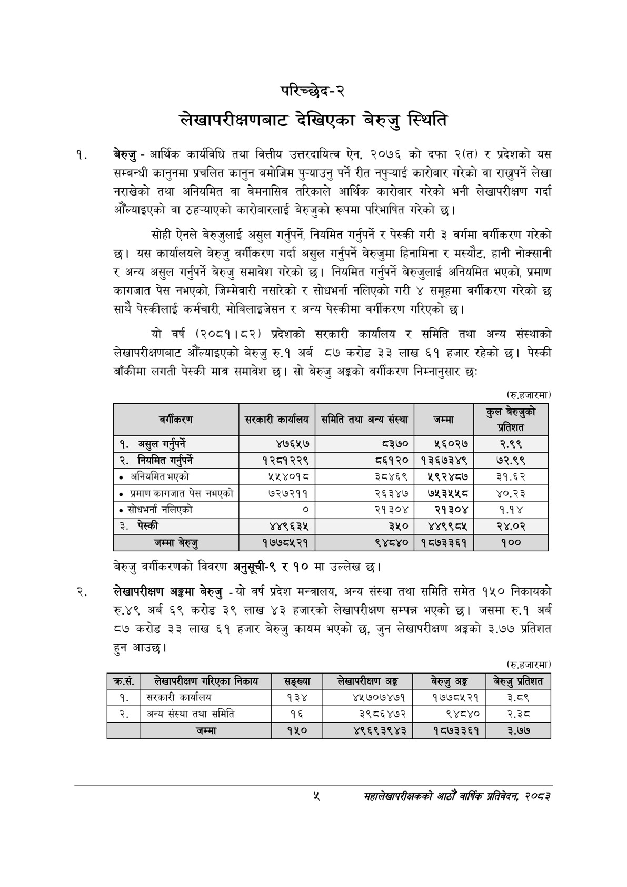

# Page 23 QA

## Rendered page


## Extracted text

```text
परिच्छेद-२
लेखापरीक्षणबाट देखिएका बेरुजु स्थिति
बेरुजु -आर्थिक कार्यविधि तथा वित्तीय उत्तरदायित्व ऐन, २०७६ को दफा २(त) र प्रदेशको यस सम्बन्धी कानुनमा प्रचलित कानुन बमोजिम पुन्याउनु पर्ने रीत नपुन्याई कारोबार गरेको वा राख्नुपर्ने लेखा नराखेको तथा अनियमित वा बेमनासिव तरिकाले आर्थिक कारोबार गरेको भनी लेखापरीक्षण गर्दा औंँल्याइएको वा ठहन्याएको कारोबारलाई बेरुजुको रूपमा परिभाषित गरेको छ।
सोही ऐनले बेरुजुलाई असुल गर्नुपर्ने, नियमित गर्नुपर्ने र पेस्की गरी ३ वर्गमा वर्गीकरण गरेको | यस कार्यालयले बेरुजु वर्गीकरण गर्दा असुल गर्नुपर्ने बेरुजुमा हिनामिना र मस्यौट, हानी नोक्सानी र अन्य असुल गर्नुपर्ने बेरुजु समावेश गरेको छ। नियमित गर्नुपर्ने बेरुजुलाई अनियमित भएको, प्रमाण कागजात पेस नभएको, जिम्मेवारी नसारेको र सोधभर्ना नलिएको गरी ४ समूहमा वर्गीकरण गरेको छ साथै पेस्कीलाई कर्मचारी, मोबिलाइजेसन र अन्य पेस्कीमा वर्गीकरण गरिएको छ।
यो वर्ष (२०८१।८२) प्रदेशको सरकारी कार्यालय र समिति तथा अन्य संस्थाको लेखापरीक्षणबाट औँल्याइएको बेरुजु रु.१ अर्ब ८७ करोड ३३ लाख ६१ हजार रहेको छ। पेस्की बाँकीमा लगती पेस्की मात्र समावेश | सो बेरुजु अङ्गको वर्गीकरण निम्नानुसार छः
(रु.हजारमा)
बेरुजु वर्गीकरणको विवरण अनुसूची-९ र १० मा उल्लेख छ।
लेखापरीक्षण अङ्गमा बेरुजु -यो वर्ष प्रदेश मन्त्रालय, अन्य संस्था तथा समिति समेत १५० निकायको रु.४९ अर्ब ६९ करोड ३९ लाख ४३ हजारको लेखापरीक्षण सम्पन्न भएको छ। जसमा रु.१ अर्ब ८७ करोड ३३ लाख ६१ हजार बेरुजु कायम भएको छ, जुन लेखापरीक्षण अङ्गको ३.७७ प्रतिशत हुन आउछ।
(रु.हजारमा)
महालेखापरीक्षकको आठौँ वाषिकि प्रतिवेदन २०८२

|  | सरकारी कार्षालण | समिति तथा अन्य संस्था | जम्मा | < ता |
| --- | --- | --- | --- | --- |
| १. असुल गर्नपर्ने | ४७६५७ | ८३७० | ५६०२७ | २.९९ |
| २. निषभेत गर्पर्ने | १२८१२२९ | ८६१२० | १३६७३४९ | ७२.९९ |
| ० अनियमित भएको | २५४०१८ | ३८४६९ | ४९२४८७ | ३१.६२ |
| प्रमाण कागजात पेस नभएको | ७२७२११ | २६३४७ | ७५३५५८ | ४०.२३ |
| सोधभर्ना नलिएको | ० | २१३०४ | २१३०४ | १.१४ |
| ३. पेस्की | ४४९६३५ | ३५० | ४४९९८५ | २४.०२ |
| जम्मा बेरुङ | १७७८५२१ | ९४८४० | १८७३३६१ | १०० |

| कस. | लेखापरीक्षण निकाय | सङ्ख्या | लेखापरीक्षण अङ्ग | बेरुउ अङ्क | बेरुउ प्रतेशत |
| --- | --- | --- | --- | --- | --- |
| १. | सरकारी कार्यालय | १३४ | ४५७०७४७१ | १७७८५२१ | ३.८९ |
| २. | अन्य संस्था तथा समिति | १६ | ३९८६४७२ | ९४८४० | २.३ |
|  | जम्मा | १५० | ४९६९३९४३ | १८७३३६१ | ३.७७ |
```

## Flags
- table_page
- medium_quality_table
