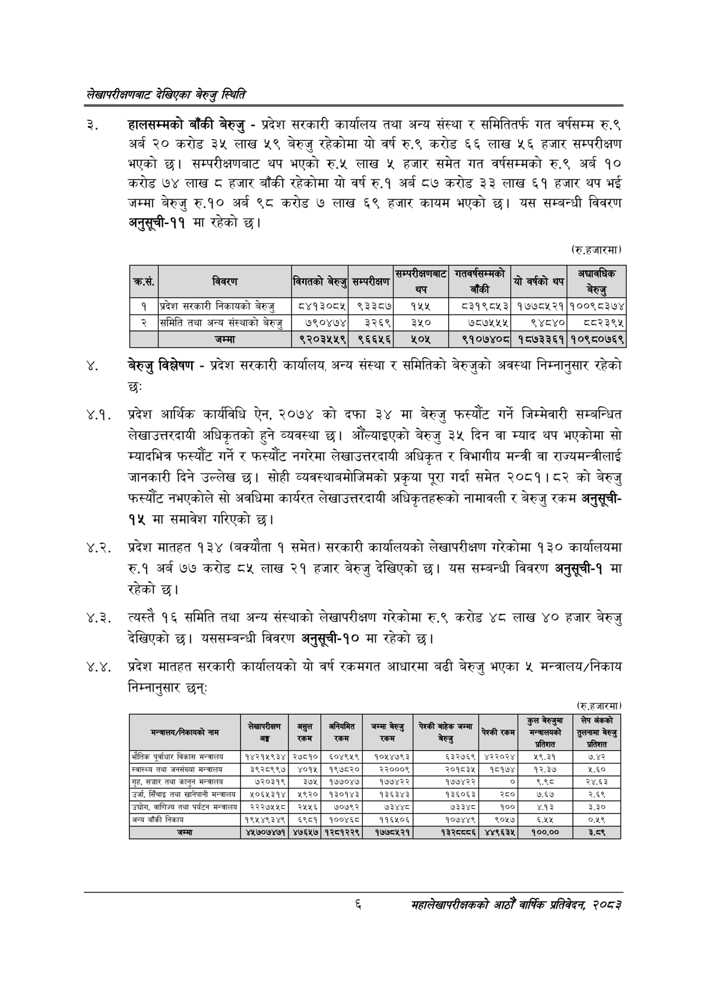

# Page 24 QA

## Rendered page


## Extracted text

```text
लेखापरीक्षणबाट देखिएका बेरुजु स्थिति
हालसम्मको बाँकी बेरुजु -प्रदेश सरकारी कार्यालय तथा अन्य संस्था र समितितर्फ गत वर्षसम्म रु.९ अर्ब २० करोड ३५ लाख ५९ बेरुजु रहेकोमा यो वर्ष रु.९ करोड ६६ लाख ५६ हजार सम्परीक्षण भएको छ। सम्परीक्षणबाट थप भएको रु.५ लाख ५ हजार समेत गत वर्षसम्मको रु.९ अर्ब १० करोड ७४ लाख हजार बाँकी रहेकोमा यो वर्ष रु.१ अर्ब ८७ करोड ३३ लाख ६१ हजार थप भई जम्मा बेरुजु रु.१० अर्ब ९८ करोड ७ लाख ६९ हजार कायम भएको छ। यस सम्बन्धी विवरण अनुसूची-११ मा रहेको छ।
(रु.हजारमा)
बेरुजु विश्लेषण -प्रदेश सरकारी कार्यालय, अन्य संस्था र समितिको बेरुजुको अवस्था निम्नानुसार रहेको छः
४.१. प्रदेश आर्थिक कार्यविधि ऐन, २०७४ को दफा ३४ मा बेरुजु फस्यौट गर्ने जिम्मेवारी सम्बन्धित लेखाउत्तरदायी अधिकृतको हुने व्यवस्था छ। औंल्याइएको बेरुजु ३५ दिन वा म्याद थप भएकोमा सो म्यादभित्र फस्यौट गर्ने र फस्यौट नगरेमा लेखाउत्तरदायी अधिकृत र विभागीय मन्त्री वा राज्यमन्त्रीलाई जानकारी दिने उल्लेख छ। सोही व्यवस्थाबमोजिमको प्रकृया पूरा गर्दा समेत २०८१।८२ को बेरुजु फस्यौट नभएकोले सो अवधिमा कार्यरत लेखाउत्तरदायी अधिकृतहरूको नामावली र बेरुजु रकम अनुसूची१५ मा समावेश गरिएको छ।
४.२. प्रदेश मातहत १३४ (बक्यौता १ समेत) सरकारी कार्यालयको लेखापरीक्षण गरेकोमा १३० कार्यालयमा रु.१ अर्ब ७७ करोड ८५ लाख २१ हजार बेरुजु देखिएको छ। यस सम्बन्धी विवरण अनुसूची-१ मा रहेको छ।
४.३. त्यस्तै १६ समिति तथा अन्य संस्थाको लेखापरीक्षण गरेकोमा रु.९ करोड ४८ लाख ४० हजार बेरुजु देखिएको छ। यससम्बन्धी विवरण अनुसूची-१० मा रहेको छ।
४.४. प्रदेश मातहत सरकारी कार्यालयको यो वर्ष रकमगत आधारमा बढी बेरुजु भएका ५ मन्त्रालय/निकाय निम्नानुसार छन्‌ः
(रु.हजारमा)
६
महालेखापरीक्षकको आठौ वाषिकि प्रतिवेदन २०८२

| का, | विवरण | बिषतको बेरुजु | सम्परिकण | [न | ना | यो वर्षको थप | जल्न |
| --- | --- | --- | --- | --- | --- | --- | --- |
| १ | प्रदेश सरकारी निकाषको बेरुजु | ८४१३०८५ | ९३३८७ | ११५५ | ८३१९८५३ | १७७८५२१ | १००९८३७४ |
| २ | समिति तथा अन्य संस्थाको बेरुजु | ७९०४७४ | ३२६९ | ३५० | ७८७५५५ | ९४८४० | व८२३९४५ |
|  | जम्मा | ९२०३५५९ | ९६६५६ | २०४५ | ९१०७४०८ | १८७३३६१ | १०९८०७६९ |

| 'मन्चरालय/निकायको नाम | २७५, न | सय | नियमित | अम्बा बेसछु | पेट | चेरकी रकम | कुल उन कु प्रतिशत | लेप जंकको तुलनामा बेरुजु प्रतिशत |
| --- | --- | --- | --- | --- | --- | --- | --- | --- |
| भौतिक पूर्वाधार विकास मन्त्रालय | १४२१५९३४ | २७८१० | ६०४९५९ | १०१५४७९३ | ६५३२७६९ | ४२२०२४ | %२.३९ | ७.४२ |
| स्वास्थ्य तथा जनसंख्या | ३९२८९९७ | ४०१५ | १९७८२० | २२०००९ | २०१८३५ | १५१७४ | १२३४ | ४.६० |
| गृह, सञ्चार तथा कानुन मन्त्रालय | ७२०३१९ | ३७५, | १७७०४७\| | १७७४२२ | १७७४२२ | ० | ३९८ | २४.६३ |
| उर्जा, सिँचाइ तथा खानेपानी मन्चालय | ४०६४३१४ | ५९२० | १३०१४३ | १३६३४३ | १३६०६३ | २६० | ७६५ | २६९ |
| उद्योग, वाणिज्य तथा पर्यटन मन्त्रालय | २२२७५५८ | २५५६ | ७०७९२ | ७३४४८ | ७३३४८ | १०० | ४.१३ | ३.३० |
| अन्य बाँकी निकाय | १९५४९३४९ | ६९८१ | १००४६८। | ११६५०६ | १०७४४९ | ९०५७ | ६१५ | ०४९ |
| जम्मा | ४५७०७४७१ | ४७६४७ | १२८१२२९ | १७७८४२१ | ९३ | ४४९६३५ | १००.०० | इ.८९ |
```

## Flags
- table_page
- medium_quality_table
