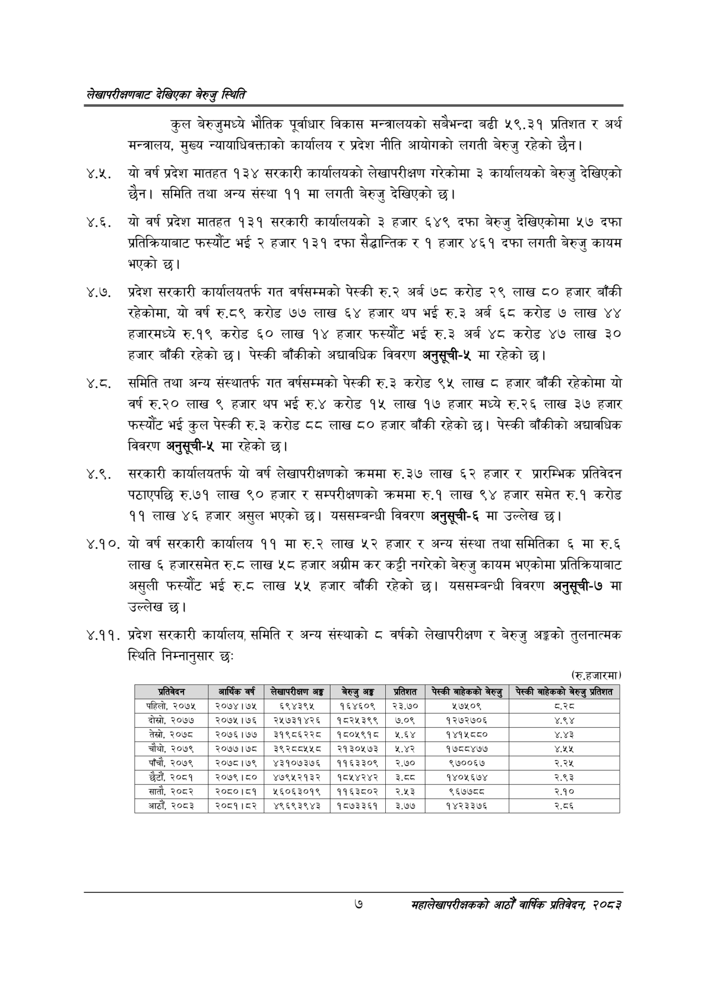

# Page 25 QA

## Rendered page


## Extracted text

```text
लेखापरीक्षणबाट देखिएका बेरुजु स्थिति
कुल बेरुजुमध्ये भौतिक पूर्वाधार विकास मन्त्रालयको सबैभन्दा बढी ५९.३१ प्रतिशत र अर्थ मन्त्रालय, मुख्य न्यायाधिवक्ताको कार्यालय र प्रदेश नीति आयोगको लगती बेरुजु रहेको छैन।
४.२. यो वर्ष प्रदेश मातहत १३४ सरकारी कार्यालयको लेखापरीक्षण गरेकोमा ३ कार्यालयको बेरुजु देखिएको छैन। समिति तथा अन्य संस्था ११ मा लगती बेरुजु देखिएको छ।
४.६. यो वर्ष प्रदेश मातहत १३१ सरकारी कार्यालयको ३ हजार ६४९ दफा बेरुजु देखिएकोमा ५७ दफा प्रतिक्रियाबाट फस्यौट भई २ हजार १३१ दफा सैद्धान्तिक र १ हजार ४६१ दफा लगती बेरुजु कायम भएको छ।
४.७. प्रदेश सरकारी कार्यालयतर्फ गत वर्षसम्मको पेस्की रु.२ अर्ब ७८ करोड २९ लाख ८० हजार बाँकी रहेकोमा, यो वर्ष रु.८९ करोड ७७ लाख ६४ हजार थप भई रु.३ अर्ब ६८ करोड ७ लाख ४४ हजारमध्ये रु.१९ करोड ६० लाख १४ हजार फस्यौट भई रु.३ अर्ब ४८ करोड ४७ लाख ३० हजार बाँकी रहेको | पेस्की बाँकीको अद्यावधिक विवरण अनुसूची-५ मा रहेको |
.. समिति तथा अन्य संस्थातर्फ गत वर्षसम्मको पेस्की रु.३ करोड ९५ लाख हजार बाँकी रहेकोमा यो वर्ष €३० लाख ९ हजार थप भई रु.४ करोड १५ लाख १७ हजार मध्ये रु.२६ लाख ३७ हजार फस्यौट भई कुल पेस्की रु.३ करोड ८८ लाख ८० हजार बाँकी रहेको | पेस्की बाँकीको अद्यावधिक विवरण अनुसूची-५ मा रहेको छ।
४.९, सरकारी कार्यालयतर्फ यो वर्ष लेखापरीक्षणको क्रममा रु.३७ लाख ६२ हजार र प्रारम्भिक प्रतिवेदन पठाएपछि रु.७१ लाख ९० हजार र सम्परीक्षणको क्रममा रु.१ लाख ९४ हजार समेत रु.१ करोड ११ लाख ४६ हजार असुल भएको | यससम्बन्धी विवरण अनुसूची-६ मा उल्लेख |
.०. यो वर्ष सरकारी कार्यालय ११ मा रु.२ लाख ५२ हजार र अन्य संस्था तथा समितिका ६ मा रु.६ लाख हजारसमेत रु.८ लाख ५८ हजार अग्रीम कर कट्टी नगरेको बेरुजु कायम भएकोमा प्रतिक्रियाबाट असुली फस्यौट भई रु.८ लाख ५५ हजार बाँकी रहेको छ। यससम्बन्धी विवरण अनुसूची-७ मा उल्लेख छ।
४.११. प्रदेश सरकारी कार्यालय, समिति र अन्य संस्थाको ८ वर्षको लेखापरीक्षण र बेरुजु अङ्गको तुलनात्मक स्थिति निम्नानुसार छः
(रु.हजारमा)
७
महालेखापरीक्षकको आठौ वाषिकि प्रतिवेदन २०८२

| प्रतिवेदन | आर्थिक वर्ष | सापरकाण अङ्ग | बेरुजु अङ्ग | प्रतिशत | पेस्की बाहेकको बेरुजु | पेस्की बाहेकको बेरुजु प्रतिशत |
| --- | --- | --- | --- | --- | --- | --- |
| पहिलो, २०७५ | २०७४।७५ | ६९४३९५ | १६४६०९ | २३.७० | ५७५०९ | वर्ड |
| दोस्रो, २०७७ | २०७५।७६ | २५७३१४२६ | १८२५३९९ | ७.०९ | १२७२७०६ | ४.९४ |
| तेस्रो, २०७८ | २०७६।७७ | ३१९८६२२८ | १८०१९१८ | १.६४ | १४१५८८० | ४.४३ |
| चौथो, २०७९ | २०७७।७८ | ३९२८८५५८ | २१३०५७३ | १.४२ | १७८८४७७ | डा |
| पाँचौ, २०७९ | २०७८।७९ | ४३१०७३७६ | ११६३३०९ | २.७० | ९७००६७ | २.२५ |
| छैटौं, २०८१ | २०७९।८० | ४७९५२१३२ | १८५४२४२ | ३.८ | १४०१५६७४ | २.९३ |
| सातौ, २०८२ | २०८०।८१ | ४५६०६३०१९ | ११६३८०२ | २.५३ | ९६७७८८ | २.१० |
| आठौं, २०८३ | २०८१।८२ | ४९६९३९४३ | १८७३३६१ | ३.७४७ | १४२३३७६ | २.८६ |
```

## Flags
- table_page
- medium_quality_table
