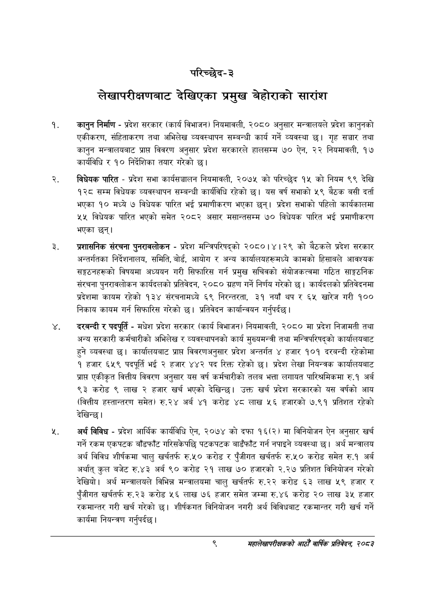

# Page 29 QA

## Rendered page


## Extracted text

```text
परिच्छेद-३
लेखापरीक्षणबाट देखिएका प्रमुख बेहोराको सारांश
कानुन निर्माण -प्रदेश सरकार (कार्य विभाजन) नियमावली, २०८० अनुसार मन्त्रालयले प्रदेश कानुनको एकीकरण, संहिताकरण तथा अभिलेख व्यवस्थापन सम्बन्धी कार्य गर्ने व्यवस्था छ। गृह सञ्चार तथा कानुन मन्त्रालयबाट प्राप्त विवरण अनुसार प्रदेश सरकारले हालसम्म ७० ऐन, २२ नियमावली, १७ कार्यविधि र १० निर्देशिका तयार गरेको छ।
विधेयक पारित -प्रदेश सभा कार्यसञ्चालन नियमावली, २०७५ को परिच्छेद १५ को नियम ९९ देखि १२८ सम्म विधेयक व्यवस्थापन सम्बन्धी कार्यविधि रहेको छ। यस वर्ष सभाको ५९ बेठक बसी दर्ता भएका १० मध्ये ७ विधेयक पारित भई प्रमाणीकरण भएका छन्‌। प्रदेश सभाको पहिलो कार्यकालमा ४५ विधेयक पारित भएको समेत २०८२ असार मसान्तसम्म ७० विधेयक पारित भई प्रमाणीकरण भएका छन्‌।
प्रशासनिक संरचना पुनरावलोकन -प्रदेश मन्त्रिपरिषद्को २०८०।४।२९ को बैठकले प्रदेश सरकार अन्तर्गतका निर्देशनालय, समिति, बोर्ड, आयोग र अन्य कार्यालयहरूमध्ये कामको हिसाबले आवश्यक सङ्गठनहरूको विषयमा अध्ययन गरी सिफारिस गर्न प्रमुख सचिवको संयोजकत्वमा गठित साङ्गठनिक संरचना पुनरावलोकन कार्यदलको प्रतिवेदन, २०८० ग्रहण गर्ने निर्णय गरेको छ। कार्यदलको प्रतिवेदनमा प्रदेशमा कायम रहेको १३४ संरचनामध्ये ६९ निरन्तरता, ३१ नयाँ थप र ६५ खारेज गरी १०० निकाय कायम गर्न सिफारिस गरेको छ। प्रतिवेदन कार्यान्वयन गर्नुपर्दछ |
दरबन्दी र पदपूर्ति -मधेश प्रदेश सरकार (कार्य विभाजन) नियमावली, २०८० मा प्रदेश निजामती तथा अन्य सरकारी कर्मचारीको अभिलेख र व्यवस्थापनको कार्य मुख्यमन्त्री तथा मन्त्रिपरिषद्को कार्यालयबाट हुने व्यवस्था छ। कार्यालयबाट प्राप्त विवरणअनुसार प्रदेश अन्तर्गत ४ हजार १०१ दरबन्दी रहेकोमा १ हजार ६५९ पदपूर्ति २ हजार ४४२ पद रिक्त रहेको छ। प्रदेश लेखा नियन्त्रक कार्यालयबाट प्राप्त एकीकृत वित्तीय विवरण अनुसार यस वर्ष कर्मचारीको तलब भत्ता लगायत पारिश्रमिकमा रु.१ अर्ब ९३ करोड ९ लाख २ हजार खर्च भएको देखिन्छ। उक्त खर्च प्रदेश सरकारको यस वर्षको आय (वित्तीय हस्तान्तरण समेत) रु.२४ अर्ब ४१ करोड ४८ लाख ५६ हजारको ७.९१ प्रतिशत रहेको देखिन्छ।
अर्थ विविध -प्रदेश आर्थिक कार्यविधि ऐन, २०७४ को दफा १६(२) मा विनियोजन ऐन अनुसार खर्च गर्ने रकम एकपटक बाँडफाँट गरिसकेपछि पटकपटक बाडँफाँट गर्न नपाइने व्यवस्था छ। अर्थ मन्त्रालय अर्थ विविध शीर्षकमा चालु खर्चतर्फ रु.५० करोड र पुँजीगत खर्चतर्फ रु.५० करोड समेत रु.१ अर्ब अर्थात्‌ कुल बजेट रु.४३ अर्ब ९० करोड २१ लाख ७० हजारको २.२७ प्रतिशत विनियोजन गरेको देखियो। अर्थ मन्त्रालयले विभिन्न मन्त्रालयमा चालु खर्चतर्फ रु२२ करोड ६३ लाख ५९ हजार र पुँजीगत खर्चतर्फ रु.२३ करोड ५६ लाख ७६ हजार समेत जम्मा रु.४६ करोड २० लाख ३५ हजार रकमान्तर गरी खर्च गरेको छ। शीर्षकगत विनियोजन नगरी अर्थ विविधबाट रकमान्तर गरी खर्च गर्ने कार्यमा नियन्त्रण गर्नुपर्दछ |
द्‌
महालेखापरीक्षकको आठौ वाषिकि प्रतिवेदन २०८२
```

## Flags
- None
