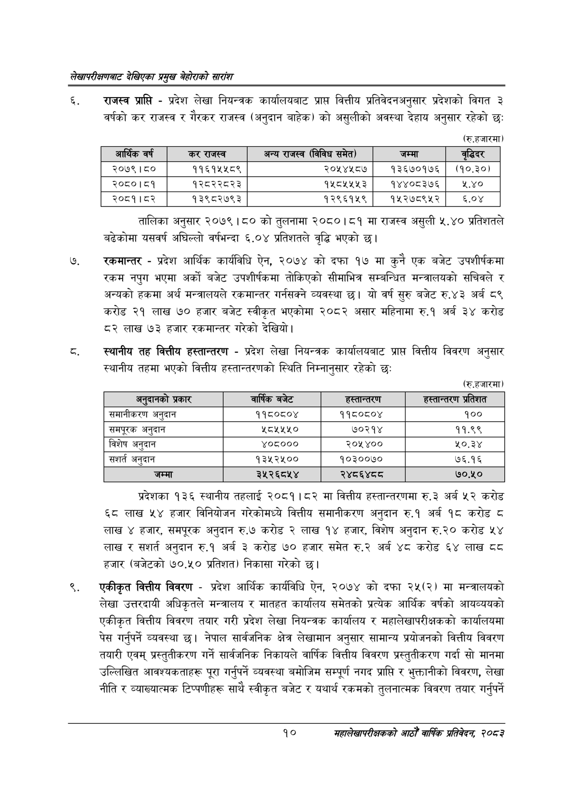

# Page 30 QA

## Rendered page


## Extracted text

```text
लेखापरीक्षणबाट देखिएका प्रमुख बेहोराको सारांश
राजस्व प्राप्ति -प्रदेश लेखा नियन्त्रक कार्यालयबाट प्राप्त वित्तीय प्रतिवेदनअनुसार प्रदेशको विगत ३ वर्षको कर राजस्व र गैरकर राजस्व (अनुदान बाहेक) को असुलीको अवस्था देहाय अनुसार रहेको छः
(रु.हजारमा)
तालिका अनुसार २०७९ | ५ को तुलनामा २०८०।८१ मा राजस्व असुली ५.४० प्रतिशतले बढेकोमा यसवर्ष अघिल्लो वर्षभन्दा ६.०४ प्रतिशतले वृद्धि भएको छ।
रकमान्तर -प्रदेश आर्थिक कार्यविधि ऐन, २०७४ को दफा १७ मा कुनै एक बजेट उपशीर्षकमा रकम नपुग भएमा अर्को बजेट उपशीर्षकमा तोकिएको सीमाभित्र सम्बन्धित मन्त्रालयको सचिवले र अन्यको हकमा अर्थ मन्त्रालयले रकमान्तर गर्नसक्ने व्यवस्था छ। यो वर्ष सुरु बजेट रु.४३ अर्ब ८९ करोड २१ लाख ७० हजार बजेट स्वीकृत भएकोमा २०८२ असार महिनामा रु.१ अर्ब ३४ करोड ८२ लाख ७३ हजार रकमान्तर गरेको देखियो |
स्थानीय तह वित्तीय हस्तान्तरण -प्रदेश लेखा नियन्त्रक कार्यालयबाट प्राप्त वित्तीय विवरण अनुसार स्थानीय तहमा भएको वित्तीय हस्तान्तरणको स्थिति निम्नानुसार रहेको छः
(रु.हजारमा)
प्रदेशका १३६ स्थानीय तहलाई २०८१।८२ मा वित्तीय हस्तान्तरणमा रु. ३ अर्ब ५२ करोड ६८ लाख ५४ हजार विनियोजन गरेकोमध्ये वित्तीय समानीकरण अनुदान रु.१ अर्ब १८ करोड ८ लाख ४ हजार, समपूरक अनुदान रु.७ करोड २ लाख १४ हजार, विशेष अनुदान रु.२० करोड ५४ लाख र सशर्त अनुदान रु.१ अर्ब ३ करोड ७० हजार समेत अर्ब ४८ करोड ६४ लाख ८ हजार (बजेटको प्रतिशत) निकासा गरेको छ।
एकीकृत वित्तीय विवरण -प्रदेश आर्थिक कार्यविधि ऐन, २०७४ को दफा २५(२) मा मन्त्रालयको लेखा उत्तरदायी अधिकृतले मन्त्रालय र मातहत कार्यालय समेतको प्रत्येक आर्थिक वर्षको आयव्ययको एकीकृत वित्तीय विवरण तयार गरी प्रदेश लेखा नियन्त्रक कार्यालय र महालेखापरीक्षकको कार्यालयमा पेस गर्नुपर्ने व्यवस्था छ। नेपाल सार्वजनिक क्षेत्र लेखामान अनुसार सामान्य प्रयोजनको वित्तीय विवरण तयारी एवम्‌ प्रस्तुतीकरण गर्ने सार्वजनिक निकायले वार्षिक वित्तीय विवरण प्रस्तुतीकरण गर्दा सो मानमा उल्लिखित आवश्यकताहरू पूरा गर्नुपर्ने व्यवस्था बमोजिम सम्पूर्ण नगद प्राप्ति र भुक्तानीको विवरण, लेखा नीति र व्याख्यात्मक टिप्पणीहरू साथै स्वीकृत बजेट र यथार्थ रकमको तुलनात्मक विवरण तयार गर्नुपर्ने
१०
महालेखापरीक्षकको आठौँ वाषिकि प्रतिवेदन २०८२

| आर्थिक वर्ष | 'कर राजस्व | अन्य राजस्व (विविध समेत) | जम्मा | द्द्धिदर |
| --- | --- | --- | --- | --- |
| २०७९।८० | ११६१५५८९ | २०५४५८७ | १३६७०१७६ | (१०.३०) |
| २०८०।८१ | १२८२२८२३ | १५८५५५३ | १४४०८३७६ | १.४० |
| २०८१।८२ | १३९८२७९३ | १२९६१५९ | १४५२७८९५२ | ६.०४ |

| अर्‌ दानको प्रकार | वाष्कि बजेट | हत्तान्तरण | हल्तान्तरण प्रतिशत |
| --- | --- | --- | --- |
| खमानीकरण अनुदान | ११८०८०४ | ११८०८०४ | १०० |
| खभमपूरक अनुदान | २८५५५० | ७०२१४ | ११.९९ |
| विशेष अनुदान | ४०८००० | २०५४०० | ५०.३४ |
| संशर्त अनुदान | १३५२५०० | १०३००७० | ७६.१६ |
| जम्मा | ३५२६८५४ | २४८६४८८ | ७०.५० |
```

## Flags
- table_page
- medium_quality_table
