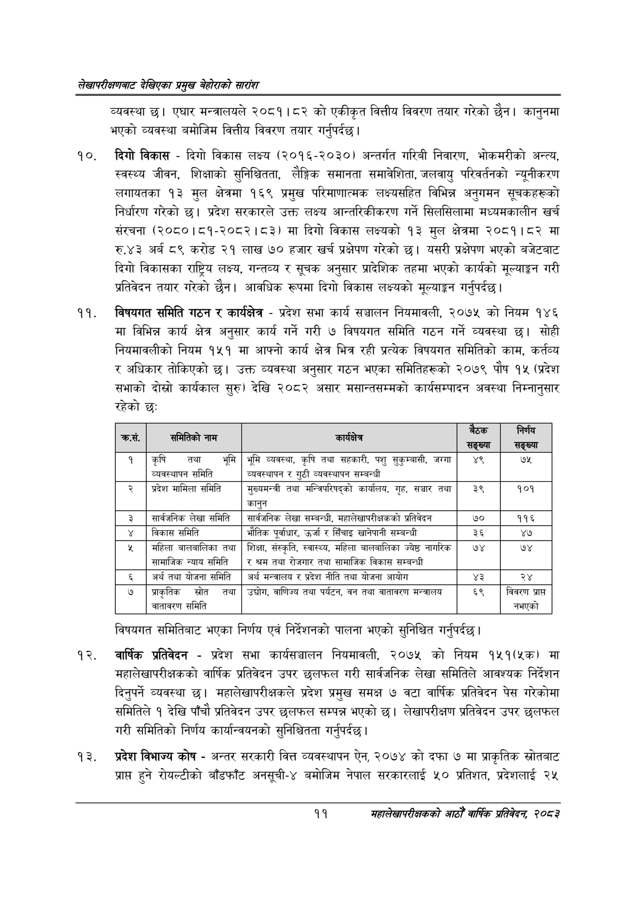

# Page 31 QA

## Rendered page


## Extracted text

```text
लेखापरीक्षणबाट देखिएका प्रमुख बेहोराको सारांश
व्यवस्था छ। एघार मन्त्रालयले २०८१।८२ को एकीकृत वित्तीय विवरण तयार गरेको छैन। कानुनमा भएको व्यवस्था बमोजिम वित्तीय विवरण तयार गर्नुपर्दछ |
दिगो विकास -दिगो विकास लक्ष्य (२०१६-२०३०) अन्तर्गत गरिबी निवारण, भोकमरीको अन्त्य, स्वस्थ्य जीवन, शिक्षाको सुनिश्चितता, लैङ्गिक समानता समावेशिता, जलवायु परिवर्तनको न्यूनीकरण लगायतका १३ मुल क्षेत्रमा १६९ प्रमुख परिमाणात्मक लक्ष्यसहित विभिन्न अनुगमन सूचकहरूको निर्धारण गरेको छ। प्रदेश सरकारले उक्त लक्ष्य आन्तरिकीकरण गर्ने सिलसिलामा मध्यमकालीन खर्च संरचना (२०८०।८१-२०८२।८३) मा दिगो विकास लक्ष्यको ९३ मुल क्षेत्रमा २०८१।८२ मा रु.४३ अर्ब ८९ करोड २१ लाख ७० हजार खर्च प्रक्षेपण गरेको छ। यसरी प्रक्षेपण भएको बजेटबाट दिगो विकासका राष्ट्रिय लक्ष्य, गन्तव्य र सूचक अनुसार प्रादेशिक तहमा भएको कार्यको मूल्याङ्कन गरी प्रतिवेदन तयार गरेको छैन। आवधिक रूपमा दिगो विकास लक्ष्यको मूल्याङ्कन गर्नुपर्दछ |
विषयगत समिति गठन र कार्यक्षेत्र -प्रदेश सभा कार्य सञ्चालन नियमावली, २०७५ को नियम १४६ मा विभिन्न कार्य क्षेत्र अनुसार कार्य गर्ने गरी ७ विषयगत समिति गठन गर्ने व्यवस्था छ। सोही नियमावलीको नियम १५१ मा आफ्नो कार्य क्षेत्र भित्र रही प्रत्यक विषयगत समितिको काम, कर्तव्य र अधिकार तोकिएको छ। उक्त व्यवस्था अनुसार गठन भएका समितिहरूको २०७९ पौष १५ (प्रदेश सभाको दोस्रो कार्यकाल सुरु) देखि २०८२ असार मसान्तसम्मको कार्यसम्पादन अवस्था निम्नानुसार रहेको छ:
विषयगत समितिबाट भएका निर्णय एवं निर्देशनको पालना भएको सुनिश्चित गर्नुपर्दछ |
वार्षिक प्रतिवेदन -प्रदेश सभा कार्यसञ्चालन नियमावली, २०७५ को नियम १५१(४क) मा महालेखापरीक्षकको वार्षिक प्रतिवेदन उपर छलफल गरी सार्वजनिक लेखा समितिले आवश्यक निर्देशन दिनुपर्ने व्यवस्था छ। महालेखापरीक्षकले प्रदेश प्रमुख समक्ष ७ वटा वार्षिक प्रतिवेदन पेस गरेकोमा समितिले १ देखि पाँचौ प्रतिवेदन उपर छलफल सम्पन्न भएको छ। लेखापरीक्षण प्रतिवेदन उपर छलफल गरी समितिको निर्णय कार्यान्वयनको सुनिश्चितता गर्नुपर्दछ |
प्रदेश विभाज्य कोष -अन्तर सरकारी वित्त व्यवस्थापन ऐन, २०७४ को दफा ७ मा प्राकृतिक स्रोतबाट प्राप्त हुने रोयल्टीको बाँडफाँट अनसूची-४ बमोजिम नेपाल सरकारलाई ५० प्रतिशत, प्रदेशलाई २५
११
महालेखापरीक्षकको आठौँ वाषिकि प्रतिवेदन २०८२

| सं. क्रस. | पो समितिको नाम | कार्यक्षेत्र | बैठक सङ्ख्या | निर्णय सङ्ख्या |
| --- | --- | --- | --- | --- |
| १ | कृषि तथा भूमि व्यवस्थापन समिति | भूमि व्यवस्था, कृषि तथा सहकारी, पशु , जग्गा व्यवस्थापन र गुठी व्यवस्थापन सम्बन्धी | ४९ | ७५ |
| २ | प्रदेश मामिला समिति | सुल्चभन्त्री तथा भन्जिपरिषद्को कार्यालय, गृह, सञ्चार तया 'कानुन | ३९ | १०१ |
| ३ | सार्वजनिक लेखा समिति | सार्बजनिक लेखा सम्बन्धी, महालेखापरीक्षकको प्रतिवेदन | ७० | ११६ |
| ४ | विकास समिति | भौतिक पूर्वाधार, उर्जा र सिँचाइ ७५) सम्बन्धी | ३६ | ४७ |
| ५ | महिला बालबालिका तथा लामाजिक न्याय समिति | शिक्षा, संस्कृति, स्वास्थ्य, महिला बालबालिका ज्येष्ठ नागरिक र श्रम तथा रोजगार तथा विकास सम्बन्धी | ७४ | ७४ |
| ६ | अर्थ तथा योजना समिति | अर्थ मन्त्रालय र प्रदेश नीति तथा योजना आयोग | ३ | २४ |
| ७ | जाकृतिक स्रोत तथा वातावरण समिति | उद्योग, वाणिज्य तथा पर्यटन, वन तथा वातावरण मन्त्रालय | ६९ | विवरण प्राप्त नभएको |
```

## Flags
- table_page
- medium_quality_table
