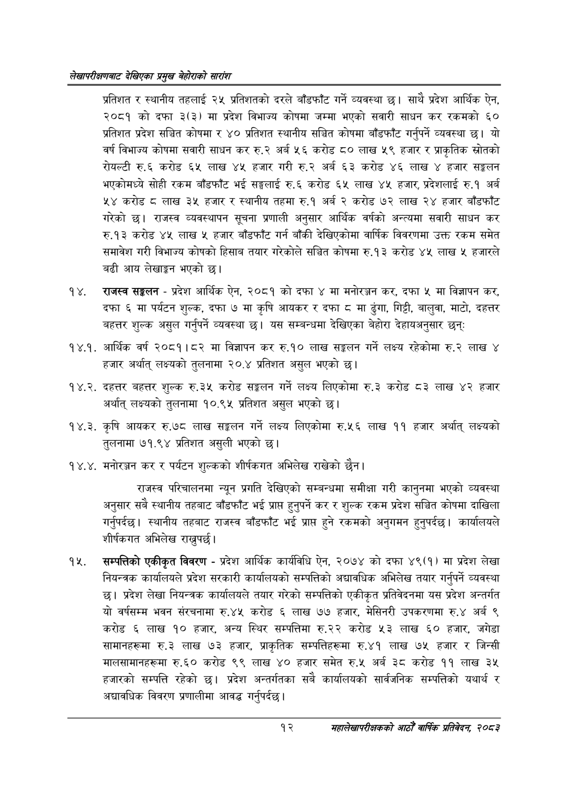

# Page 32 QA

## Rendered page


## Extracted text

```text
लेखापरीक्षणबाट देखिएका प्रमुख बेहोराको सारांश
प्रतिशत र स्थानीय तहलाई २५ प्रतिशतको दरले बाँडफाँट गर्ने व्यवस्था छ। साथै प्रदेश आर्थिक ऐन, २०८१ को दफा ३(३) मा प्रदेश विभाज्य कोषमा जम्मा भएको सवारी साधन कर रकमको ६० प्रतिशत प्रदेश सञ्चित कोषमा र ४० प्रतिशत स्थानीय सञ्चित कोषमा बाँडफाँट गर्नुपर्ने व्यवस्था छ। यो वर्ष विभाज्य कोषमा सवारी साधन कर रु.२ अर्ब ५६ करोड ८० लाख ५९ हजार र प्राकृतिक स्रोतको रोयल्टी रु.६ करोड ६५ लाख ४५ हजार गरी रु.२ अर्ब ६३ करोड ४६ लाख हजार सङ्गलन भएकोमध्ये सोही रकम बाँडफाँट भई सङ्घलाई रु.६ करोड ६५ लाख ४५ हजार, प्रदेशलाई रु.१ अर्ब ५४ करोड लाख ३५ हजार र स्थानीय तहमा रु.१ अर्ब २ करोड ७२ लाख २४ हजार बाँडफाँट गरेको छ। राजस्व व्यवस्थापन सूचना प्रणाली अनुसार आर्थिक वर्षको अन्त्यमा सवारी साधन कर रु.१३ करोड ४५ लाख ५ हजार बाँडफाँट गर्न बाँकी देखिएकोमा वार्षिक विवरणमा उक्त रकम समेत समावेश गरी विभाज्य कोषको हिसाब तयार गरेकोले सञ्चित कोषमा रु.१३ करोड ४५ लाख ५ हजारले बढी आय लेखाङ्गन भएको |
राजस्व सङ्कलन -प्रदेश आर्थिक ऐन, २०८१ को दफा ४ मा मनोरञ्जन कर, दफा ५ मा विज्ञापन कर, दफा ६ मा पर्यटन शुल्क, दफा ७ मा कृषि आयकर र दफा ८ मा ढुंगा, गिट्टी, बालुवा, माटो, दहत्तर बहत्तर शुल्क असुल गर्नुपर्ने व्यवस्था | यस सम्बन्धमा देखिएका बेहोरा देहायअनुसार छन्‌ः
१४.१. आर्थिक वर्ष २०८१।८२ मा विज्ञापन कर रु.१० लाख सङ्कलन गर्ने लक्ष्य रहेकोमा रु.२ लाख ४ हजार अर्थात्‌ लक्ष्यको तुलनामा २०.४ प्रतिशत असुल भएको |
१४.२. दहत्तर बहत्तर शुल्क रु.३५ करोड सङ्कलन गर्ने लक्ष्य लिएकोमा रु.३ करोड ८३ लाख ४२ हजार अर्थात्‌ लक्ष्यको तुलनामा १०.९५ प्रतिशत असुल भएको छ।
१४.३. कृषि आयकर रु.७८ लाख सङ्कलन गर्ने लक्ष्य लिएकोमा रु.५६ लाख ११ हजार अर्थात्‌ लक्ष्यको तुलनामा ौ७१.९४ प्रतिशत असुली भएको छ।
४. मनोरञ्जन कर र पर्यटन शुल्कको शीर्षकगत अभिलेख राखेको छैन |
राजस्व परिचालनमा न्यून प्रगति देखिएको सम्बन्धमा समीक्षा गरी कानुनमा भएको व्यवस्था अनुसार सबै स्थानीय तहबाट बाँडफाँट भई प्राप्त हुनुपर्ने कर र शुल्क रकम प्रदेश सञ्चित कोषमा दाखिला गर्नुपर्दछ। स्थानीय तहबाट राजस्व बाँडफाँट भई प्राप्त हुने रकमको अनुगमन हुनुपर्दछ। कार्यालयले शीर्षकगत अभिलेख राख्नुपर्छ |
सम्पत्तिको एकीकृत विवरण -प्रदेश आर्थिक कार्यविधि ऐन, २०७४ को दफा ४९(१) मा प्रदेश लेखा नियन्त्रक कार्यालयले प्रदेश सरकारी कार्यालयको सम्पत्तिको अद्यावधिक अभिलेख तयार गर्नुपर्ने व्यवस्था छ। प्रदेश लेखा नियन्त्रक कार्यालयले तयार गरेको सम्पत्तिको एकीकृत प्रतिवेदनमा यस प्रदेश अन्तर्गत यो वर्षसम्म भवन संरचनामा रु.४५ करोड ६ लाख ७७ हजार, मेसिनरी उपकरणमा रु.४ अर्ब ९ करोड ६ लाख ९० हजार, अन्य स्थिर सम्पत्तिमा रु.२२ करोड ५३ लाख ६० हजार, जगेडा सामानहरूमा रु.३ लाख ७३ हजार, प्राकृतिक सम्पत्तिहरूमा रु.४१ लाख ७५ हजार र जिन्सी मालसामानहरूमा रु.६० करोड ९९ लाख ४० हजार समेत रु.५ अर्ब ३ करोड ११ लाख ३४ हजारको सम्पत्ति रहेको छ। प्रदेश अन्तर्गतका सबै कार्यालयको सार्वजनिक सम्पत्तिको यथार्थ र अद्यावधिक विवरण प्रणालीमा आवद्ध गर्नुपर्दछ |
१२
महालेखापरीक्षकको आठौँ वाषिकि प्रतिवेदन २०८२
```

## Flags
- None
