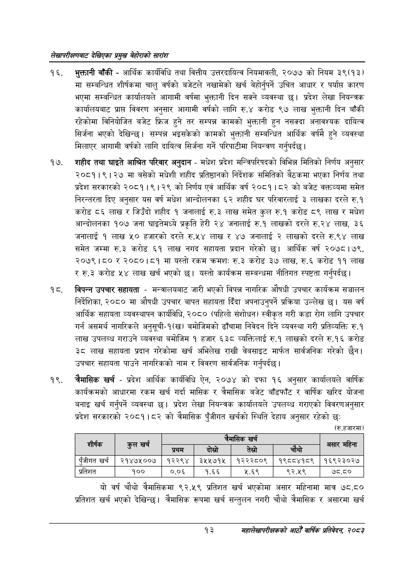

# Page 33 QA

## Rendered page


## Extracted text

```text
लेखापरीक्षणबाट देखिएका प्रमुख बेहोराको सारांश
भुक्तानी बाँकी -आर्थिक कार्यविधि तथा वित्तीय उत्तरदायित्व नियमावली, २०७७ को नियम ३९(१३) मा सम्बन्धित शीर्षकमा चालु वर्षको बजेटले नखामेको खर्च बेहोर्नुपर्ने उचित आधार र पर्याप्त कारण भएमा सम्बन्धित कार्यालयले आगामी वर्षमा भुक्तानी दिन सक्ने व्यवस्था छ। प्रदेश लेखा नियन्त्रक कार्यालयबाट प्राप्त विवरण अनुसार आगामी वर्षको लागि रु.४ करोड ९७ लाख भुक्तानी दिन बाँकी रहेकोमा विनियोजित बजेट फ्रिज हुने तर सम्पन्न कामको भुक्तानी हुन नसक्दा अनावश्यक दायित्व सिर्जना भएको देखिन्छ। सम्पन्न भइसकेको कामको भुक्तानी सम्बन्धित आर्थिक वर्षमै हुने व्यवस्था मिलाएर आगामी वर्षको लागि दायित्व सिर्जना गर्ने परिपाटीमा नियन्त्रण गर्नुपर्दछ |
शहीद तथा घाइते आश्रित परिवार अनुदान -मधेश प्रदेश मन्त्रिपरिषदको विभिन्न मितिको निर्णय अनुसार २०८१।९।२७ मा बसेको मधेशी शहीद प्रतिष्ठानको निर्देशक समितिको बैठकमा भएका निर्णय तथा प्रदेश सरकारको २०८१।९।२९ को निर्णय एवं आर्थिक वर्ष २०८१।८२ को बजेट वक्तव्यमा समेत निरन्तरता दिए अनुसार यस वर्ष मधेश आन्दोलनका ६२ शहीद घर परिवारलाई ३ लाखका दरले रु.१ करोड ८६ लाख र जिउँदो शहीद १ जनालाई रु.३ लाख समेत कुल रु.१ करोड ८९ लाख र मधेश आन्दोलनका १०७ जना घाइतेमध्ये प्रकृति हेरी २४ जनालाई रु.१ लाखको दरले रु.२४ लाख, ३६ जनालाई १ लाख ५० हजारको दरले रु.५४ लाख र ४७ जनालाई २ लाखको दरले रु.९४ लाख समेत जम्मा रु.३ करोड ६१ लाख नगद सहायता प्रदान गरेको छ। आर्थिक वर्ष २०७८। ७९, २०७९।८० र २०८०।८१ मा यस्तो रकम क्रमशः रु.३ करोड ३७ लाख, रु.६ करोड ९९ लाख ररु.३ करोड ५४ लाख खर्च भएको | यस्तो कार्यक्रम सम्बन्धमा नीतिगत स्पष्टता गर्नुपर्दछ |
विपन्न उपचार सहायता -मन्त्रालयबाट जारी भएको विपन्न नागरिक औषधी उपचार कार्यक्रम सञ्चालन निर्देशिका, २०८० मा औषधी उपचार बापत सहायता दिँदा अपनाउनुपर्ने प्रक्रिया उल्लेख छ। यस वर्ष आर्थिक सहायता व्यवस्थापन कार्यविधि, २०८० (पहिलो संशोधन) स्वीकृत गरी कडा रोग लागि उपचार गर्न असमर्थ नागरिकले अनुसूची-१(ख) बमोजिमको ढाँचामा निवेदन दिने व्यवस्था गरी प्रतिव्यक्ति रु.१ लाख उपलब्ध गराउने व्यवस्था बमोजिम १ हजार ६३८ व्यक्तिलाई रु.१ लाखको दरले रु.१६ करोड ३८ लाख सहायता प्रदान गरेकोमा खर्च अभिलेख राखी वेबसाइट मार्फत सार्वजनिक गरेको छैन। उपचार सहायता पाउने नागरिकको नाम र विवरण सार्वजनिक गर्नुपर्दछ |
चैमासिक खर्च -प्रदेश आर्थिक कार्यविधि ऐन, २०७४ को दफा १६ अनुसार कार्यालयले वार्षिक कार्यक्रमको आधारमा रकम खर्च गर्दा मासिक र त्रैमासिक बजेट बाँडफाँट र वार्षिक खरिद योजना बनाइ खर्च गर्नुपर्ने व्यवस्था छ। प्रदेश लेखा नियन्त्रक कार्यालयले उपलब्ध गराएको विवरणअनुसार प्रदेश सरकारको २०८१।८२ को त्रैमासिक पुँजीगत खर्चको स्थिति देहाय अनुसार रहेको छः
(रु.हजारमा)
यो वर्ष चौथो त्रैमासिकमा ९२.५९ प्रतिशत खर्च भएकोमा असार महिनामा मात्र ७८,८० प्रतिशत खर्च भएको देखिन्छ। त्रैमासिक रूपमा खर्च सन्तुलन नगरी चौथो त्रैमासिक र असारमा खर्च
१३
महालेखापरीक्षकको आठौँ वाषिकि प्रतिवेदन २०८२

| शीर्षक | हल खर्च |  | २ | खर्च |  | महिना चे |
| --- | --- | --- | --- | --- | --- | --- |
|  |  | प्रथम | बेख्रो | तेस्रो | . चेयो | असार |
| पुँजीगत खर्च | २१४७५००७ | १२२९४ | ३५५७१५ | १२२२८०९ | १९८८४१८९ | १६९२३०२७ |
| प्रतिशत | १०० | ०.०६ | १.६६ | ५.६९ | ९२.५९ | ७८.८० |
```

## Flags
- table_page
- medium_quality_table
