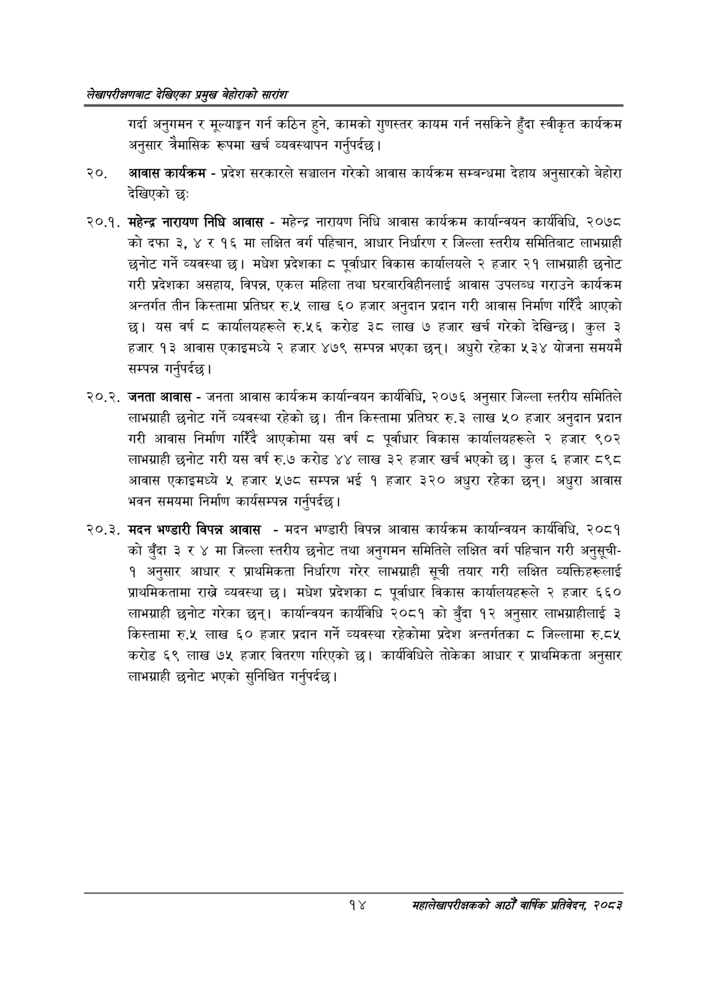

# Page 34 QA

## Rendered page


## Extracted text

```text
लेखापरीक्षणबाट देखिएका प्रमुख बेहोराको सारांश
गर्दा अनुगमन र मूल्याङ्कन गर्न कठिन हुने, कामको गुणस्तर कायम गर्न नसकिने हुँदा स्वीकृत कार्यक्रम अनुसार त्रैमासिक रूपमा खर्च व्यवस्थापन गर्नुपर्दछ |
२०, आवास कार्यक्रम -प्रदेश सरकारले सञ्चालन गरेको आवास कार्यक्रम सम्बन्धमा देहाय अनुसारको बेहोरा देखिएको छः
२०.१. महेन्द्र नारायण निधि आवास -महेन्द्र नारायण निधि आवास कार्यक्रम कार्यान्वयन कार्यविधि, २०७८ कोदफा ३, १६ मा लक्षित वर्ग पहिचान, आधार निर्धारण र जिल्ला स्तरीय समितिबाट लाभग्राही छनोट गर्ने व्यवस्था | मधेश प्रदेशका ८ पूर्वाधार विकास कार्यालयले २ हजार २१ लाभग्राही छनोट गरी प्रदेशका असहाय, विपन्न, एकल महिला तथा घरबारविहीनलाई आवास उपलब्ध गराउने कार्यक्रम अन्तर्गत तीन किस्तामा प्रतिघर रु.५ लाख ६० हजार अनुदान प्रदान गरी आवास निर्माण गरिँदै आएको छ। यस वर्ष ८ कार्यालयहरूले रु.५६ करोड ३८ लाख ७ हजार खर्च गरेको देखिन्छ। कुल ३ हजार १३ आवास एकाइमध्ये २ हजार ४७९ सम्पन्न भएका छन्‌। अधुरो रहेका ५३४ योजना समयमै सम्पन्न गर्नुपर्दछ |
२०.२. जनता आवास -जनता आवास कार्यक्रम कार्यान्वयन कार्यविधि, २०७६ अनुसार जिल्ला स्तरीय समितिले लाभग्राही छनोट गर्ने व्यवस्था रहेको छ। तीन किस्तामा प्रतिघर रु.३ लाख ५० हजार अनुदान प्रदान गरी आवास निर्माण गरिँदै आएकोमा यस वर्ष ८ पूर्वाधार विकास कार्यालयहरूले २ हजार ९०२ लाभग्राही छनोट गरी यस वर्ष रु.७ करोड ४४ लाख ३२ हजार खर्च भएको छ। कुल ६ हजार ८९८ आवास एकाइमध्ये « हजार ५७८ सम्पन्न भई १ हजार ३२० अधुरा रहेका छन्‌। अधुरा आवास भवन समयमा निर्माण कार्यसम्पन्न गर्नुपर्दछ |
२०.३. मदन भण्डारी विपन्न आवास -मदन भण्डारी विपन्न आवास कार्यक्रम कार्यान्वयन कार्यविधि, २०८१ को बुँदा ३ र ४ मा जिल्ला स्तरीय छनोट तथा अनुगमन समितिले लक्षित वर्ग पहिचान गरी अनुसूची१ अनुसार आधार र प्राथमिकता निर्धारण गरेर लाभग्राही सूची तयार गरी लक्षित व्यक्तिहरूलाई प्राथमिकतामा राख्ने व्यवस्था छ। मधेश प्रदेशका ८ पूर्वाधार विकास कार्यालयहरूले २ हजार ६६० लाभग्राही छनोट गरेका छन्‌। कार्यान्वयन कार्यविधि २०८१ को बुँदा १२ अनुसार लाभग्राहीलाई ३ किस्तामा रु.५ लाख ६० हजार प्रदान गर्ने व्यवस्था रहेकोमा प्रदेश अन्तर्गतका ८ जिल्लामा रु.८५ करोड ६९ लाख ७५ हजार वितरण गरिएको छ। कार्यविधिले तोकेका आधार र प्राथमिकता अनुसार लाभग्राही छनोट भएको सुनिश्चित गर्नुपर्दछ |
१४
महालेखापरीक्षकको आठौँ वाषिकि प्रतिवेदन २०८२
```

## Flags
- None
