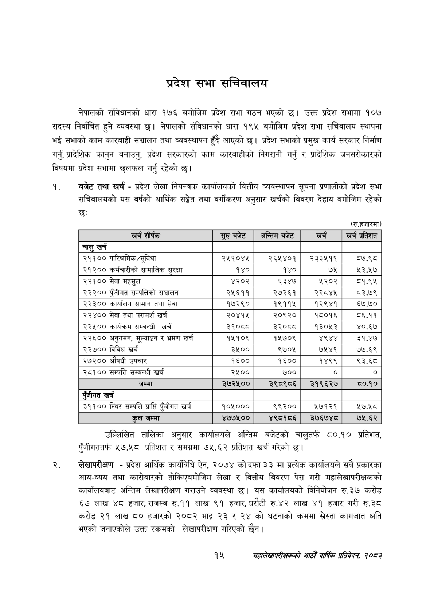

# Page 37 QA

## Rendered page


## Extracted text

```text
प्रदेश सभा सचिवालय
नेपालको संविधानको धारा १७६ बमोजिम प्रदेश सभा गठन भएको छ। उक्त प्रदेश सभामा १०७ सदस्य निर्वाचित हुने व्यवस्था छ। नेपालको संविधानको धारा १९५ बमोजिम प्रदेश सभा सचिवालय स्थापना भई सभाको काम कारबाही सञ्चालन तथा व्यवस्थापन हुँदै आएको छ। प्रदेश सभाको प्रमुख कार्य सरकार निर्माण गर्नु, प्रादेशिक कानुन बनाउनु, प्रदेश सरकारको काम कारबाहीको निगरानी गर्नु र प्रादेशिक जनसरोकारको विषयमा प्रदेश सभामा छलफल गर्नु रहेको छ।
बजेट तथा खर्च -प्रदेश लेखा नियन्त्रक कार्यालयको वित्तीय व्यवस्थापन सूचना प्रणालीको प्रदेश सभा सचिवालयको यस वर्षको आर्थिक सङ्गेत तथा वर्गीकरण अनुसार खर्चको विवरण देहाय बमोजिम रहेको छः
(रु.हजारमा)
उल्लिखित तालिका अनुसार कार्यालयले अन्तिम बजेटको चालुतर्फ ८०.१० प्रतिशत, पुँजीगततर्फ ५७.५८ प्रतिशत र समग्रमा ७५.६२ प्रतिशत खर्च गरेको छ।
लेखापरीक्षण -प्रदेश आर्थिक कार्यविधि ऐन, २०७४ कोदफा ३३ मा प्रत्येक कार्यालयले सबै प्रकारका आय-व्यय तथा कारोबारको तोकिएबमोजिम लेखा र वित्तीय विवरण पेस गरी महालेखापरीक्षकको कार्यालयबाट अन्तिम लेखापरीक्षण गराउने व्यवस्था छु। यस कार्यालयको विनियोजन रु.३७ करोड ६७ लाख ४८ हजार, राजस्व रु.११ लाख ९१ हजार, धरौटी रु.४२ लाख ४१ हजार गरी रु.३८ करोड २१ लाख ८० हजारको २०८२ भाद्र २३ र २४ को घटनाको क्रममा ख्ेस्ता कागजात क्षति भएको जनाएकोले उक्त रकमको लेखापरीक्षण गरिएको छैन।
१५
महालेखापरीक्षकको आठौ वाषिकि प्रतिवेदन २०८२

| खर्च शीर्षक | सुरु बबेट | अन्तिम बजेट | खर्च | खर प्रतिशत |
| --- | --- | --- | --- | --- |
| चालु खर्च |  |  |  |  |
| २११०० पारिश्रमिक/सुविधा | २५१०४४ | २६५२४०१ | २३३५११ | ८७.९८ |
| २१२०० कर्मचारीको सामाजिक सुरक्षा | १४० | १४० |  | २३.५७ |
| २२१०० सेवा महसुल | ४२०२ | ६३४७ | १२०२ | ८१.९५ |
| २२२०० पुँजीगत सम्पत्तिको सञ्चालन | २५६११ | २७२६१ | २२८४५ | ८३.७९ |
| २२३०० कार्यालय सामान तथा सेवा | १७२९० | १९११५ | १२९४१ | ६७.७० |
| २२४०० सेवा तथा परामर्श खर्च | २०४१५ | २०९२० | १८०१६ | ८६.११ |
| २२५०० कार्यक्रम सम्बन्धी खर्च | ३१०८८ | ३२०८८ | १३०५३ | ४०.६७ |
| २२६०० अनुगमन, र भ्रमण खर्च | १५१०९ | १५७०९ | ४९४४ | ३१.४७ |
| २२७०० विविध खर्च | ३५०० | ९७०५ | ७५४१ | ७७.६९ |
| २७२०० औषधी उपचार | १६०० | १६०० | १४९९ | ९३.६८ |
| २८१०० सम्पत्ति सम्बन्धी खर्च | २५०० | ७०० | ० | ० |
| जम्मा | ३७२५०० | २९८९८६ | २१९६२४ | ८०.१० |
| रंजीगत खर्च |  |  |  |  |
| ३११०० स्थिर सम्पत्ति प्राप्ति पुँजीगत खर्च | १०५००० | २२३०० | १८९३९ | २७.५८ |
| हल जम्मा | ४७७५०० | ४९८१८५६ | ३७६७४८ | ७५.६२ |
```

## Flags
- table_page
- medium_quality_table
