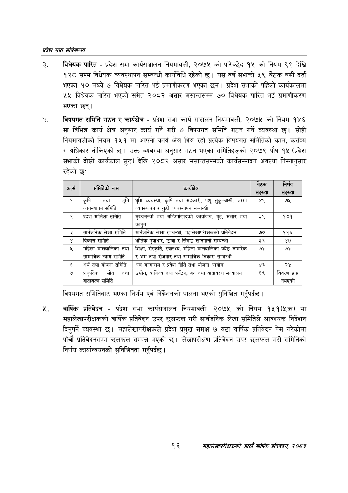

# Page 38 QA

## Rendered page


## Extracted text

```text
प्रदेश सभा सचिवालय
विधेयक पारित -प्रदेश सभा कार्यसञ्चालन नियमावली, २०७५ को परिच्छेद १५ को नियम ९९ देखि १२८ सम्म विधेयक व्यवस्थापन सम्बन्धी कार्यविधि रहेको छ। यस वर्ष सभाको ५९ बैठक बसी दर्ता भएका १० मध्ये ७ विधेयक पारित भई प्रमाणीकरण भएका छन्‌। प्रदेश सभाको पहिलो कार्यकालमा ४५ विधेयक पारित भएको समेत २०८२ असार मसान्तसम्म ७० विधेयक पारित भई प्रमाणीकरण भएका छन्‌।
विषयगत समिति गठन र कार्यक्षेत्र -प्रदेश सभा कार्य सञ्चालन नियमावली, २०७५ को नियम १४६ मा विभिन्न कार्य क्षेत्र अनुसार कार्य गर्ने गरी ७ विषयगत समिति गठन गर्ने व्यवस्था छ। सोही नियमावलीको नियम १५१ मा आफ्नो कार्य क्षेत्र भित्र रही प्रत्यक विषयगत समितिको काम, कर्तव्य र अधिकार तोकिएको छ। उक्त व्यवस्था अनुसार गठन भएका समितिहरूको २०७९ पौष १५ (प्रदेश सभाको दोस्रो कार्यकाल सुरु) देखि २०८२ असार मसान्तसम्मको कार्यसम्पादन अवस्था निम्नानुसार रहेको छ:
विषयगत समितिबाट भएका निर्णय एवं निर्देशनको पालना भएको सुनिश्चित गर्नुपर्दछ |
वार्षिक प्रतिवेदन -प्रदेश सभा कार्यसञ्चालन नियमावली, २०७५ को नियम १५१(५क) मा महालेखापरीक्षकको वार्षिक प्रतिवेदन उपर छलफल गरी सार्वजनिक लेखा समितिले आवश्यक निर्देशन दिनुपर्ने व्यवस्था छ। महालेखापरीक्षकले प्रदेश प्रमुख समक्ष ७ वटा वार्षिक प्रतिवेदन पेस गरेकोमा पाँचौ प्रतिवेदनसम्म छलफल सम्पन्न भएको छ। लेखापरीक्षण प्रतिवेदन उपर छलफल गरी समितिको निर्णय कार्यान्वयनको सुनिश्चितता गर्नुपर्दछ |
१६
महालेखापरीक्षकको आठौ वाषिकि प्रतिवेदन २०८२

| काम, | मिलेको नाम |  | सङ्ख्या | सङ्ख्या |
| --- | --- | --- | --- | --- |
| १ | कृषि तथा भूमि व्यवस्थापन समिति | भूमि व्यवस्था, कृषि तथा सहकारी, पशु , जग्गा व्ववस्थापन र गुठी व्ववस्थापन सम्बन्धी | ४९ | ७५ |
| २ | प्रदेश मामिला समिति | सुल्चभन्त्री तथा मन्तिपरिषद्‌्को कार्षालन, गृह, सञ्चार तया कानुन | ३९ | १०१ |
| ३ | सार्वजनिक लेखा समिति | सार्वजनिक लेखा सम्बन्धी, महालेखापरीक्षकको प्रतिवेदन | ७० | ११६ |
| ४ | विकास समिति | भौतिक पूर्वाधार, उर्जा र सिँचाइ खानेपानी सम्बन्धी | ३६ | ४७ |
| ५ | महिला नालनालिका तथा लामाजिक न्याय समिति | शिक्षा, संस्कृति, स्वास्थ्य, महिला नालनालिका ज्येष्ठ नागरिक र श्रम तथा रोजगार तथा धामाजिक विकास सम्बन्धी | ७४ | ७४ |
| ६ | अर्थ तथा योजना समिति | अर्थ मन्त्रालय र प्रदेश नीति तथा योजना आयोग | ३ | २४ |
| ७ | जाकृतिक स्रोत तथा वातावरण समिति | उद्योग, वाणिज्य तथा पर्यटन, वन तथा वातावरण भन्त्रालय | ६९ | विवरण प्राप्त नभएको |
```

## Flags
- table_page
- medium_quality_table
