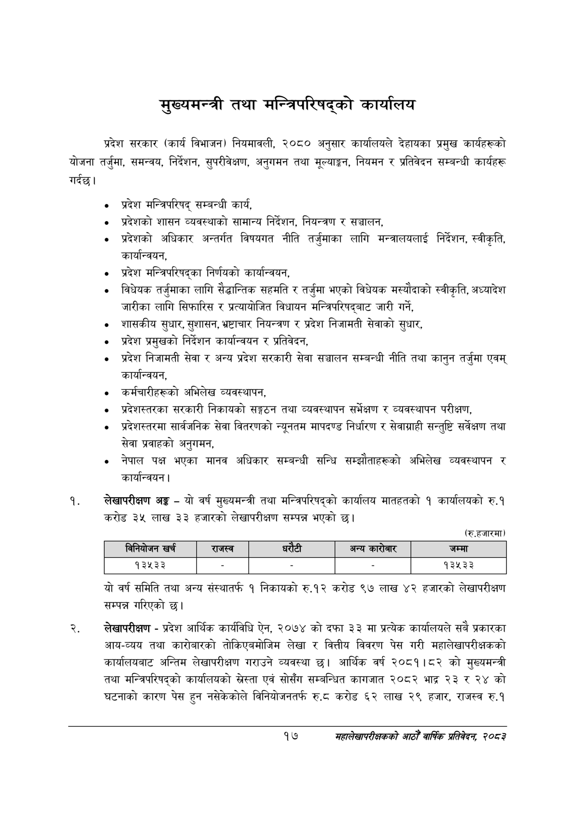

# Page 39 QA

## Rendered page


## Extracted text

```text
मुख्यमन्त्री तथा मन्त्रिपरिषद्को कार्यालय
प्रदेश सरकार (कार्य विभाजन) नियमावली, २०८० अनुसार कार्यालयले देहायका प्रमुख कार्यहरूको योजना तर्जुमा, समन्वय, निर्देशन, सुपरीवेक्षण, अनुगमन तथा मूल्याङ्कन, नियमन र प्रतिवेदन सम्बन्धी कार्यहरू गर्दछ।
प्रदेश मन्त्रिपरिषद्‌ सम्बन्धी कार्य,
प्रदेशको शासन व्यवस्थाको सामान्य निर्देशन, नियन्त्रण र सञ्चालन,
प्रदेशको अधिकार अन्तर्गत विषयगत नीति तर्जुमाका लागि मन्त्रालयलाई निर्देशन, स्वीकृति, कार्यान्वयन,
प्रदेश मन्त्रिपरिषद्का निर्णयको कार्यान्वयन,
विधेयक तर्जुमाका लागि सैद्धान्तिक सहमति र तर्जुमा भएको विधेयक मस्यौदाको स्वीकृति, अध्यादेश जारीका लागि सिफारिस र प्रत्यायोजित विधायन मन्त्रिपरिषद्बाट जारी गर्ने,
शासकीय सुधार, सुशासन, भ्रष्टाचार नियन्त्रण र प्रदेश निजामती सेवाको सुधार,
प्रदेश प्रमुखको निर्देशन कार्यान्वयन र प्रतिवेदन,
प्रदेश निजामती सेवा र अन्य प्रदेश सरकारी सेवा सञ्चालन सम्बन्धी नीति तथा कानुन तर्जुमा एवम्‌ कार्यान्वयन,
कर्मचारीहरूको अभिलेख व्यवस्थापन,
प्रदेशस्तरका सरकारी निकायको सङ्गठन तथा व्यवस्थापन सर्भेक्षण र व्यवस्थापन परीक्षण,
प्रदेशस्तरमा सार्वजनिक सेवा वितरणको न्यूनतम मापदण्ड निर्धारण र सेवाग्राही सन्तुष्टि सर्वेक्षण तथा सेवा प्रवाहको अनुगमन,
नेपाल पक्ष भएका मानव अधिकार सम्बन्धी सन्धि सम्झौताहरूको अभिलेख व्यवस्थापन र कार्यान्वयन |
लेखापरीक्षण अङ्ग -यो वर्ष मुख्यमन्त्री तथा मन्त्रिपरिषद्को कार्यालय मातहतको १ कार्यालयको रु.१ करोड ३५ लाख ३३ हजारको लेखापरीक्षण सम्पन्न भएको छ।
(रु.हजारमा)
यो वर्ष समिति तथा अन्य संस्थातर्फ १ निकायको रु.१२ करोड ९७ लाख ४२ हजारको लेखापरीक्षण सम्पन्न गरिएको छ।
लेखापरीक्षण -प्रदेश आर्थिक कार्यविधि ऐन, २०७४ को दफा ३३ मा प्रत्येक कार्यालयले सबै प्रकारका आय-व्यय तथा कारोबारको तोकिएबमोजिम लेखा र वित्तीय विवरण पेस गरी महालेखापरीक्षकको कार्यालयबाट अन्तिम लेखापरीक्षण गराउने व्यवस्था छ। आर्थिक वर्ष २०८१।८२ को मुख्यमन्त्री तथा मन्त्रिपरिषद्को कार्यालयको स्रेस्ता एवं सोसँग सम्बन्धित कागजात २०८२ भाद्र २३र २४ को घटनाको कारण पेस हुन नसेकेकोले विनियोजनतर्फ रु.८ करोड ६२ लाख २९ हजार, राजस्व रु.१
१७
महालेखापरीक्षकको आठौ वाषिकि प्रतिवेदन २०८२

|  |  | 'ननेकोणन खरी |  | राजस्व | ५ १ १ १ १ ५ ५११ १२ ३२ १४ ९६.४४७८६१ अन्य ५ १ १ १ १ ६ ५५१ ६ ५७ २० ४५.५८८३६० कारोबार ५ १ १ १ १ ७ ७१६ १२ ४० १४ ८९.३९८७१२ जम्मा ४ १ १ १ २ ० ६६ ४५ ७०० १६ -१ ५ १ १ १ २ १ ६६ ४५ ६१ १६ ७७.५२०८२८ १३५३३ ५ १ १ १ २ २ २४४ ५३ ५ १ ९६.०२८९६९ - ५ १ १ १ २ ३ ३८८ ५३ ५ १ ९५.६४६३६२ - ५ १ १ १ २ ४ ५५६ ५३ ५ १ ९५.०३३५३९ - ५ १ १ १ २ ५ ७०६ ४५ ६० १६ ७५.९०७८८३ ९३४३३ |  |  |  |
| --- | --- | --- | --- | --- | --- | --- | --- | --- |
|  |  |  |  |  |  |  |  |  |
```

## Flags
- table_page
- low_quality_table
