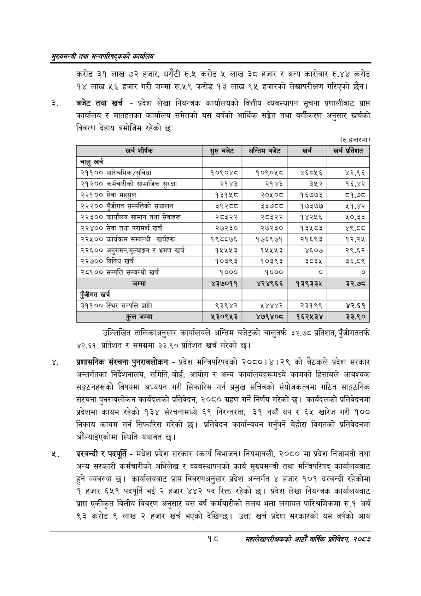

# Page 40 QA

## Rendered page


## Extracted text

```text
सृख्यसन्त्री तथा सन्च्रपरिवद्कको कायलिय
करोड ३१ लाख ७२ हजार, धरौटी रु.५ करोड ५ लाख ३८ हजार र अन्य कारोबार रु.४४ करोड १४ लाख ५६ हजार गरी जम्मा रु.५९ करोड १३ लाख ९५ हजारको लेखापरीक्षण गरिएको छैन।
बजेट तथा खर्च -प्रदेश लेखा नियन्त्रक कार्यालयको वित्तीय व्यवस्थापन सूचना प्रणालीबाट प्राप्त कार्यालय र मातहतका कार्यालय समेतको यस वर्षको आर्थिक सङ्गेत तथा वर्गीकरण अनुसार खर्चको विवरण देहाय बमोजिम रहेको छः
(रु.हजारमा)
उल्लिखित तालिकाअनुसार कार्यालयले अन्तिम बजेटको चालुतर्फ ३२.७८ प्रतिशत, पुँजीगततर्फ ४२.६१ प्रतिशत र समग्रमा ३३.९० प्रतिशत खर्च गरेको छ।
प्रशासनिक संरचना पुनरावलोकन -प्रदेश मन्त्रिपरिषद्को २०८०।४।२९ को बैठकले प्रदेश सरकार अन्तर्गतका निर्देशनालय, समिति, बोर्ड, आयोग र अन्य कार्यालयहरूमध्ये कामको हिसाबले आवश्यक सङ्गठनहरूको विषयमा अध्ययन गरी सिफारिस गर्न प्रमुख सचिवको संयोजकत्वमा गठित साङ्गठनिक संरचना पुनरावलोकन कार्यदलको प्रतिवेदन, २०८० ग्रहण गर्ने निर्णय गरेको छ। कार्यदलको प्रतिवेदनमा प्रदेशमा कायम रहेको १३४ संरचनामध्ये ६९ निरन्तरता, ३१ नयाँ थप र ६५ खारेज गरी १०० निकाय कायम गर्न सिफारिस गरेको छ। प्रतिवेदन कार्यान्वयन गर्नुपर्ने बेहोरा विगतको प्रतिवेदनमा औंल्याइएकोमा स्थिति यथावत छ।
दरबन्दी र पदपूर्ति -मधेश प्रदेश सरकार (कार्य विभाजन) नियमावली, २०८० मा प्रदेश निजामती तथा अन्य सरकारी कर्मचारीको अभिलेख र व्यवस्थापनको कार्य मुख्यमन्त्री तथा मन्त्रिपरिषद्‌ कार्यालयबाट हुने व्यवस्था छ। कार्यालयबाट प्राप्त विवरणअनुसार प्रदेश अन्तर्गत ४ हजार १०१ दरबन्दी रहेकोमा १ हजार ६५९ पदपूर्ति ४ २ हजार ४४२ पद रिक्त रहेको छ। प्रदेश लेखा नियन्त्रक कार्यालयबाट प्राप्त एकीकृत वित्तीय विवरण अनुसार यस वर्ष कर्मचारीको तलब भत्ता लगायत पारिश्रमिकमा रु.१ अर्ब ९३ करोड ९ लाख २ हजार खर्च भएको देखिन्छ। उक्त खर्च प्रदेश सरकारको यस वर्षको आय
१८
महालेखापरीक्षकको आठौ वाषिकि प्रतिवेदन २०८२

| खर्च शीर्षक | सुरु बबेट | अन्तिम बजेट | खर्च | खर्च प्रतिशत |
| --- | --- | --- | --- | --- |
| चालु खर्च |  |  |  |  |
| २११०० पारिन्रमिक/सुविधा | १०९०४८ | १०९०५८० | ४६८५६ | ४२.९६ |
| २१२०० कर्चारीको सामाजिक सुरक्षा | २१४३ | २१४३ | ३५२ | १६.४२ |
| २२१०० सेवा महसुल | १३१५८ | २०१०८ | १६७७३ | ८१.७८ |
| २२२०० पुँजीगत सम्पत्तिको सञ्चालन | ३१ २८८ | ३३७८८ | १७३७७ | ५१.४२ |
| २२३०० कार्यालय सामान तथा सेवाहरू | २८३२२ | २८३२२ | १४२५६ | %०.३३ |
| २२४०० सेवा तथा परामर्श खर्च | २७२३० | २७२३० | ९३४५३ | ४९,८०८ |
| २२५०० कार्यक्रम सम्बन्धी खर्चहरू | १९८८७६ | १७६९७१ | २१६९३ | १२.२५ |
| २२६०० अनुगमन,५९४।ङ"१ र भ्रमण खर्च | १५५५३ | १५५५३ | ४६०७ | २९.६२ |
| २२७०० विविध खर्च | १०३९३ | १०३९३ | ३८३५ | ३६.८९ |
| २८१०० सम्पत्ति सम्बन्धी खर्च | १००० | १००० | ० | ० |
| जम्मा | ४३२७०११ | ४२४९६६ | १३९३३५ | ३२.७८ |
| पूँजीगत खर्च |  |  |  |  |
| ३११०० स्थिर सम्पत्ति प्राप्त | ९३९४२ | ४४४२ | २३१९९ | ४२.६१ |
| कुल जम्मा | ५३०९५३ | ४७९४०८ | १६२५३४ | ३३.९० |
```

## Flags
- table_page
- medium_quality_table
