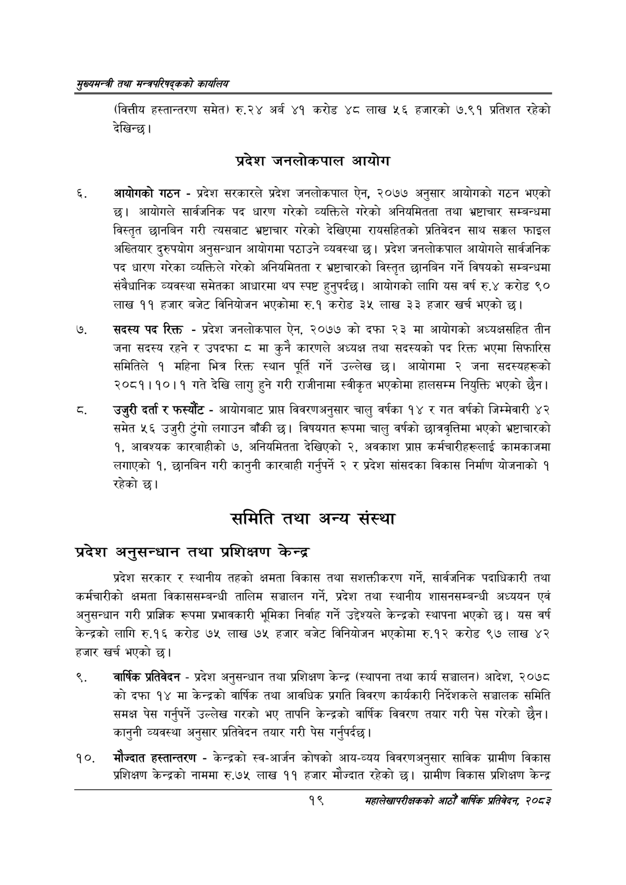

# Page 41 QA

## Rendered page


## Extracted text

```text
सृख्यसन्त्री तथा सन्च्रपरिवद्कको कायलिय
(वित्तीय हस्तान्तरण समेत) रु. २४ अर्ब ४१ करोड ४८ लाख ५६ हजारको ७.९१ प्रतिशत रहेको देखिन्छ।
प्रदेश जनलोकपाल आयोग
आयोगको गठन -प्रदेश सरकारले प्रदेश जनलोकपाल ऐन, २०७७ अनुसार आयोगको गठन भएको छ। आयोगले सार्वजनिक पद धारण गरेको व्यक्तिले गरेको अनियमितता तथा भ्रष्टाचार सम्बन्धमा विस्तृत छानबिन गरी त्यसबाट भ्रष्टाचार गरेको देखिएमा रायसहितको प्रतिवेदन साथ सक्कल फाइल अख्तियार दुरुपयोग अनुसन्धान आयोगमा पठाउने व्यवस्था छ। प्रदेश जनलोकपाल आयोगले सार्वजनिक पद धारण गरेका व्यक्तिले गरेको अनियमितता र भ्रष्टाचारको विस्तृत छानबिन गर्ने विषयको सम्बन्धमा संवैधानिक व्यवस्था समेतका आधारमा थप स्पष्ट हुनुपर्दछ। आयोगको लागि यस वर्ष रु.४ करोड ९० लाख ११ हजार बजेट विनियोजन भएकोमा रु.१ करोड ३५ लाख ३३ हजार खर्च भएको छ।
सदस्य पद रिक्त -प्रदेश जनलोकपाल ऐन, २०७७ को दफा २३ मा आयोगको अध्यक्षसहित तीन जना सदस्य रहने र उपदफा ८ मा कुनै कारणले अध्यक्ष तथा सदस्यको पद रिक्त भएमा सिफारिस समितिले १ महिना भित्र रिक्त स्थान पूर्ति गर्ने उल्लेख छ। आयोगमा २ जना सदस्यहरूको २०८१।१०।१ गते देखि लागु हुने गरी राजीनामा स्वीकृत भएकोमा हालसम्म नियुक्ति भएको छैन।
उजुरी दर्ता र फस्यौट -आयोगबाट प्राप्त विवरणअनुसार चालु वर्षका १४ र गत वर्षको जिम्मेवारी ४२ समेत ५६ उजुरी टुंगो लगाउन बाँकी छ। विषयगत रूपमा चालु वर्षको छात्रवृत्तिमा भएको भ्रष्टाचारको १, आवश्यक कारबाहीको ७, अनियमितता देखिएको २, अवकाश प्राप्त कर्मचारीहरूलाई कामकाजमा लगाएको १, छानबिन गरी कानुनी कारबाही गर्नुपर्ने २ र प्रदेश सांसदका विकास निर्माण योजनाको १ रहेको छ।
समिति तथा अन्य संस्था
प्रदेश अनुसन्धान तथा प्रशिक्षण केन्द्र
प्रदेश सरकार र स्थानीय तहको क्षमता विकास तथा सशक्तीकरण गर्ने, सार्वजनिक पदाधिकारी तथा कर्मचारीको क्षमता विकाससम्बन्धी तालिम सञ्चालन गर्ने, प्रदेश तथा स्थानीय शासनसम्बन्धी अध्ययन एवं अनुसन्धान गरी प्राज्ञिक रूपमा प्रभावकारी भूमिका निर्वाह गर्ने उद्देश्यले केन्द्रको स्थापना भएको छ। यस वर्ष केन्द्रको लागि रु.१६ करोड ७५ लाख ७५ हजार बजेट विनियोजन भएकोमा रु.१२ करोड ९७ लाख ४२ हजार खर्च भएको छ।
वार्षिक प्रतिवेदन -प्रदेश अनुसन्धान तथा प्रशिक्षण केन्द्र (स्थापना तथा कार्य सञ्चालन) आदेश, २०७८ को दफा १४ मा केन्द्रको वार्षिक तथा आवधिक प्रगति विवरण कार्यकारी निर्देशकले सञ्चालक समिति समक्ष पेस गर्नुपर्ने उल्लेख गरको भए तापनि केन्द्रको वार्षिक विवरण तयार गरी पेस गरेको छैन। कानुनी व्यवस्था अनुसार प्रतिवेदन तयार गरी पेस गर्नुपर्दछ।
मौज्दात हस्तान्तरण -केन्द्रको स्व-आर्जन कोषको आय-व्यय विवरणअनुसार साविक ग्रामीण विकास प्रशिक्षण केन्द्रको नाममा रु.७५ लाख ११ हजार मौज्दात रहेको छ। ग्रामीण विकास प्रशिक्षण केन्द्र
१९
महालेखापरीक्षकको आठौ वाषिकि प्रतिवेदन २०८२
```

## Flags
- None
