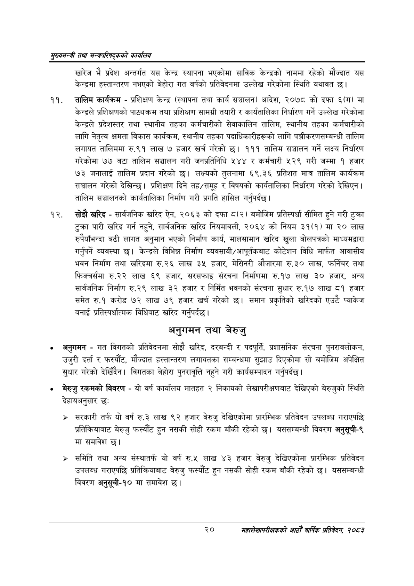

# Page 42 QA

## Rendered page


## Extracted text

```text
सृख्यसन्त्री तथा सन्च्रपरिवद्कको कायलिय
खारेज भै प्रदेश अन्तर्गत यस केन्द्र स्थापना भएकोमा साविक केन्द्रको नाममा रहेको मौज्दात यस केन्द्रमा हस्तान्तरण नभएको बेहोरा गत वर्षको प्रतिवेदनमा उल्लेख गरेकोमा स्थिति यथावत छ।
तालिम कार्यक्रम -प्रशिक्षण केन्द्र (स्थापना तथा कार्य सञ्चालन) आदेश, २०७८ को दफा ६(ग) मा केन्द्रले प्रशिक्षणको पाठ्यक्रम तथा प्रशिक्षण सामग्री तयारी र कार्यतालिका निर्धारण गर्ने उल्लेख गरेकोमा केन्द्रले प्रदेशस्तर तथा स्थानीय तहका कर्मचारीको सेवाकालिन तालिम, स्थानीय तहका कर्मचारीको लागि नेतृत्व क्षमता विकास कार्यक्रम, स्थानीय तहका पदाधिकारीहरूको लागि पञ्जीकरणसम्बन्धी तालिम लगायत तालिममा रु.९१ लाख ७ हजार खर्च गरेको छ। १११ तालिम सञ्चालन गर्ने लक्ष्य निर्धारण गरेकोमा ७७ वटा तालिम सञ्चालन गरी जनप्रतिनिधि ५४४ र कर्मचारी ५२९ गरी जम्मा १ हजार ७३ जनालाई तालिम प्रदान गरेको छ। लक्ष्यको तुलनामा ६९.३६ प्रतिशत मात्र तालिम कार्यक्रम सञ्चालन गरेको देखिन्छ। प्रशिक्षण दिने तह/समूह र विषयको कार्यतालिका निर्धारण गरेको देखिएन | तालिम सञ्चालनको कार्यतालिका निर्माण गरी प्रगति हासिल गर्नुपर्दछ |
सोझै खरिद -सार्वजनिक खरिद ऐन, २०६३ को दफा ८(२) बमोजिम प्रतिस्पर्धा सीमित हुने गरी टुक्रा टुक्रा पारी खरिद गर्न नहुने, सार्वजनिक खरिद नियमावली, २०६४ को नियम ३१(१) मा २० लाख रुपैयाँभन्दा बढी लागत अनुमान भएको निर्माण कार्य, मालसामान खरिद खुला बोलपत्रको माध्यमद्वारा गर्नुपर्ने व्यवस्था छ। केन्द्रले विभिन्न निर्माण व्यवसायी/आपूर्तवकबाट कोटेशन विधि मार्फत आवासीय भवन निर्माण तथा खरिदमा रु.२६ लाख ३५ हजार, मेसिनरी औजारमा रु.३० लाख, फर्निचर तथा फिक्चर्समा रु.२२ लाख ६९ हजार, सरसफाइ संरचना निर्माणमा रु.१७ लाख ३० हजार, अन्य सार्वजनिक निर्माण रु.२९ लाख ३२ हजार र निर्मित भवनको संरचना सुधार रु.१७ लाख ८१ हजार समेत रु.१ करोड ७२ लाख ७९ हजार खर्च गरेको छ। समान प्रकृतिको खरिदको एउटै प्याकेज बनाई प्रतिस्पर्धात्मक विधिबाट खरिद गर्नुपर्दछ |
अनुगमन तथा बेरुजु
० अनुगमन -गत विगतको प्रतिवेदनमा सोझै खरिद, दरबन्दी र पदपूर्ति, प्रशासनिक संरचना पुनरावलोकन, उजुरी दर्ता र फस्यौट, मौज्दात हस्तान्तरण लगायतका सम्बन्धमा सुझाउ दिएकोमा सो बमोजिम अपेक्षित सुधार गरेको देखिँदैन। विगतका बेहोरा पुनरावृत्ति नहुने गरी कार्यसम्पादन गर्नुपर्दछ |
बेरुजु रकमको विवरण -यो वर्ष कार्यालय मातहत २ निकायको लेखापरीक्षणबाट देखिएको बेरुजुको स्थिति देहायअनुसार छः
> सरकारी तर्फ यो वर्ष रु.३ लाख ९२ हजार बेरुजु देखिएकोमा प्रारम्भिक प्रतिवेदन उपलब्ध गराएपछि प्रतिक्रियाबाट बेरुजु फस्यौट हुन नसकी सोही रकम बाँकी रहेको छ। यससम्बन्धी विवरण अनुसूची-९ मा समावेश छ।
> समिति तथा अन्य संस्थातर्फ यो वर्ष रु.५ लाख ४३ हजार बेरुजु देखिएकोमा प्रारम्भिक प्रतिवेदन उपलब्ध गराएपछि प्रतिक्रियाबाट बेरुजु फस्यौंट हुन नसकी सोही रकम बाँकी रहेको | यससम्बन्धी विवरण अनुसूची-१० मा समावेश छ।
२०
महालेखापरीक्षकको आठौ वाषिकि प्रतिवेदन २०८२
```

## Flags
- None
