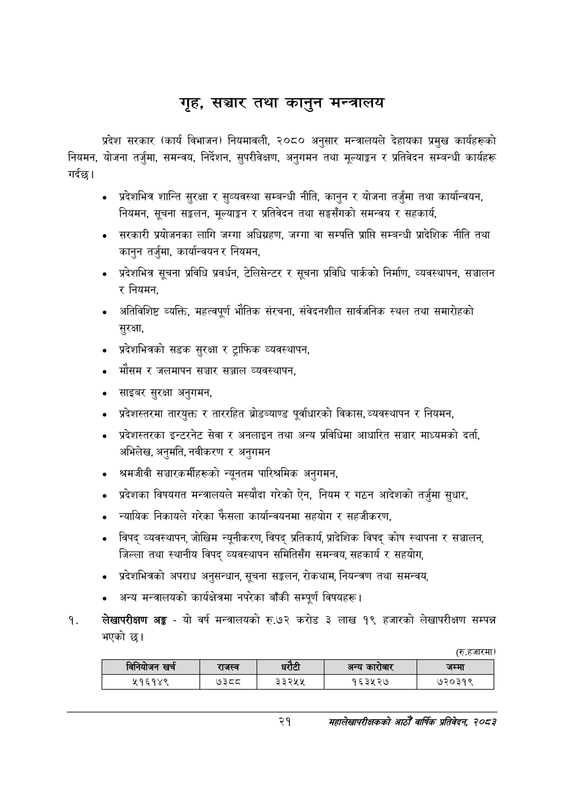

# Page 43 QA

## Rendered page


## Extracted text

```text
गृह, तथा कानुन मन्त्रालय
गर्दछ। प्रदेश सरकार (कार्य विभाजन) नियमावली, २०८० अनुसार मन्त्रालयले देहायका प्रमुख कार्यहरूको नियमन, योजना तर्जुमा, समन्वय, निर्देशन, सुपरीवेक्षण, अनुगमन तथा मूल्याङ्कन र प्रतिवेदन सम्बन्धी कार्यहरू
प्रदेशभित्र शान्ति सुरक्षा र सुव्यवस्था सम्बन्धी नीति, कानुन र योजना तर्जुमा तथा कार्यान्वयन, नियमन, सूचना सङ्कलन, मूल्याङ्कन र प्रतिवेदन तथा सङ्घसँगको समन्वय र सहकार्य,
सरकारी प्रयोजनका लागि जग्गा अधिग्रहण, जग्गा वा सम्पत्ति प्राप्ति सम्बन्धी प्रादेशिक नीति तथा कानुन तर्जुमा, कार्यान्वयन र नियमन,
प्रदेशभित्र सूचना प्रविधि प्रवर्धन, टेलिसेन्टर र सूचना प्रविधि पार्कको निर्माण, व्यवस्थापन, सञ्चालन र नियमन,
अतिविशिष्ट व्यक्ति, महत्वपूर्ण भौतिक संरचना, संवेदनशील सार्वजनिक स्थल तथा समारोहको सुरक्षा,
प्रदेशभित्रको सडक सुरक्षा र ट्राफिक व्यवस्थापन,
मौसम र जलमापन सञ्चार सञ्जाल व्यवस्थापन,
साइबर सुरक्षा अनुगमन,
प्रदेशस्तरमा तारयुक्त र ताररहित ब्रोडब्याण्ड पूर्वाधारको विकास, व्यवस्थापन र नियमन,
प्रदेशस्तरका इन्टरनेट सेवा र अनलाइन तथा अन्य प्रविधिमा आधारित सञ्चार माध्यमको दर्ता, अभिलेख, अनुमति, नवीकरण र अनुगमन
श्रमजीवी सञ्चारकर्मीहरूको न्यूनतम पारिश्रमिक अनुगमन,
प्रदेशका विषयगत मन्त्रालयले मस्यौदा गरेको ऐन, नियम र गठन आदेशको तर्जुमा सुधार,
न्यायिक निकायले गरेका फैसला कार्यान्वयनमा सहयोग र सहजीकरण,
विपद्‌ व्यवस्थापन, जोखिम न्यूनीकरण, विपद्‌ प्रतिकार्य, प्रादेशिक विपद्‌ कोष स्थापना र सञ्चालन, जिल्ला तथा स्थानीय विपद्‌ व्यवस्थापन समितिसँग समन्वय, सहकार्य र सहयोग,
प्रदेशभित्रको अपराध अनुसन्धान, सूचना सङ्कलन, रोकथाम, नियन्त्रण तथा समन्वय,
अन्य मन्त्रालयको कार्यक्षेत्रमा नपरेका बाँकी सम्पूर्ण विषयहरू |
लेखापरीक्षण अङ्ग -यो वर्ष मन्त्रालयको रु.७२ करोड ३ लाख १९ हजारको लेखापरीक्षण सम्पन्न भएको छ।
(रु.हजारमा)
२१
महालेखापरीक्षकको आठौ वाषिकि प्रतिवेदन २०८२

|  | बानिकाजन खर्च | राजस्व |  |  | अन्य | जम्मा |
| --- | --- | --- | --- | --- | --- | --- |
|  | २१६१४९ |  | ३३२५५ |  | १६३५२७ | ७२०३१९ |
```

## Flags
- table_page
- medium_quality_table
