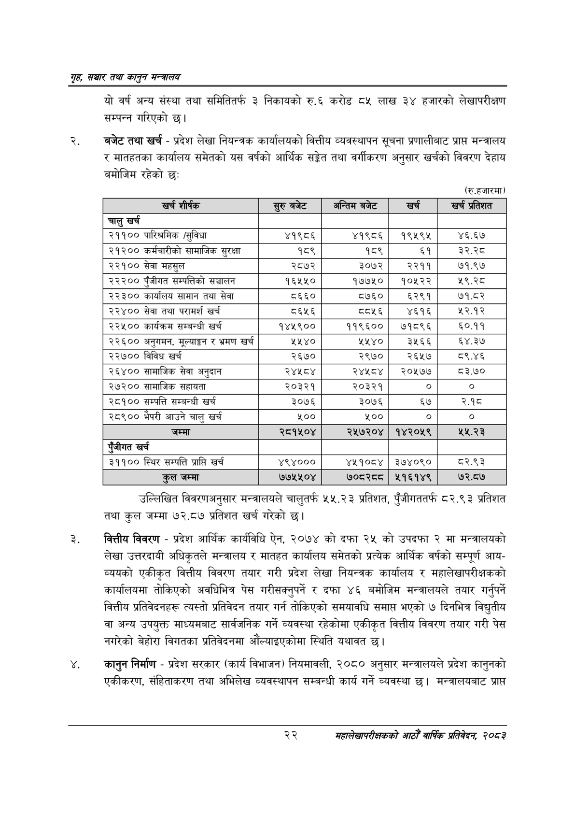

# Page 44 QA

## Rendered page


## Extracted text

```text
गृह सञ्चार तथा कालुन सन्तालय
यो वर्ष अन्य संस्था तथा समितितर्फ ३ निकायको रु.६ करोड ८५ लाख ३४ हजारको लेखापरीक्षण सम्पन्न गरिएको |
बजेट तथा खर्च -प्रदेश लेखा नियन्त्रक कार्यालयको वित्तीय व्यवस्थापन सूचना प्रणालीबाट प्राप्त मन्त्रालय र मातहतका कार्यालय समेतको यस वर्षको आर्थिक सङ्गेत तथा वर्गीकरण अनुसार खर्चको विवरण देहाय बमोजिम रहेको छः
(रु.हजारमा)
उल्लिखित विवरणअनुसार मन्त्रालयले चालुतर्फ ५५.२३ प्रतिशत, पुँजीगततर्फ ८२.९३ प्रतिशत तथा कुल जम्मा ७२.८७ प्रतिशत खर्च गरेको छ।
वित्तीय विवरण -प्रदेश आर्थिक कार्यविधि ऐन, २०७४ को दफा २५ को उपदफा २ मा मन्त्रालयको लेखा उत्तरदायी अधिकृतले मन्त्रालय र मातहत कार्यालय समेतको प्रत्येक आर्थिक वर्षको सम्पूर्ण आयव्ययको एकीकृत वित्तीय विवरण तयार गरी प्रदेश लेखा नियन्त्रक कार्यालय र महालेखापरीक्षकको कार्यालयमा तोकिएको अवधिभित्र पेस गरीसक्नुपर्ने र दफा ४६ बमोजिम मन्त्रालयले तयार गर्नुपर्ने वित्तीय प्रतिवेदनहरू त्यस्तो प्रतिवेदन तयार गर्न तोकिएको समयावधि समाप्त भएको ७ दिनभित्र विद्युतीय वा अन्य उपयुक्त माध्यमबाट सार्वजनिक गर्ने व्यवस्था रहेकोमा एकीकृत वित्तीय विवरण तयार गरी पेस नगरेको बेहोरा विगतका प्रतिवेदनमा औंल्याइएकोमा स्थिति यथावत छ।
कानुन निर्माण -प्रदेश सरकार (कार्य विभाजन) नियमावली, २०८० अनुसार मन्त्रालयले प्रदेश कानुनको एकीकरण, संहिताकरण तथा अभिलेख व्यवस्थापन सम्बन्धी कार्य गर्ने व्यवस्था छ। मन्त्रालयबाट प्राप्त
२२
महालेखापरीक्षकको आठौ वाषिकि प्रतिवेदन २०८२

| खर्च शीर्षक | सुरु बजेट | अन्तिम बजेट | खर्च | खर्च प्रतिशत |
| --- | --- | --- | --- | --- |
| चालु खर्च |  |  |  |  |
| २११०० पारिश्रमिक /सुविधा | ४१९८६ | ४१९८६ | १९५९४५ | ४६.६७ |
| २१२०० कर्मचारीको सामाजिक सुरक्षा | १८९ | १८९ | ६१ | ३२.२८ |
| २२१०० सेवा महसुल | २८७२ | ३०७२ | २२११ | ७१.९७ |
| २२२०० पुँजीगत सम्पत्तिको सञ्चालन | १६५५० | १७७५० | १०५२२ | २९.२८ |
| २२३०० कार्यालय सामान तथा सेवा | ८६६० | ८७६० | ६२९१ | ७१.८२ |
| २२४०० सेवा तथा परामर्श खर्च | ८६५६ |  | ४६१६ | ५२.१२ |
| २२५०० कार्यक्रम सम्बन्धी खर्च | १४५९०० | ११९६०० | ७१८९६ | ६०.११ |
| २२६०० अनुगमन, मूल्याङ्कन र भ्रमण खर्च | ५५४० | २५४० | ३५६६ | ६४.३७ |
| २२७०० विविध खर्च | २६७० | २९७० | २६५७ | ८९.४६ |
| २६४०० सामाजिक सेवा अनुदान | २४४५८४ | २४५८४ | २०१७७ | ८३.७० |
| २७२०० सामाजिक सहायता | २०३२१ | २०३२१ |  |  |
| २८१०० सम्पत्ति सम्बन्धी खर्च | ३०७६ | ३०७६ | ६७ | २.१८ |
| २८९०० भैपरी आउने चालु खर्च | ५०० | ५०० |  |  |
| जम्मा | २८१५०४ | २५७२०४ | १४२०५९ | ५.२रे |
| एंजीगत खर्च |  |  |  |  |
| ३११०० स्थिर सम्पत्ति प्राप्ति खर्च | ४९४००० | ४५१०८४ | ३७४०९० | ८२.९३ |
| हल जम्मा | ७७५५०४ | ७०८२८८ | ५१६१४९ | ७२.८७ |
```

## Flags
- table_page
- medium_quality_table
