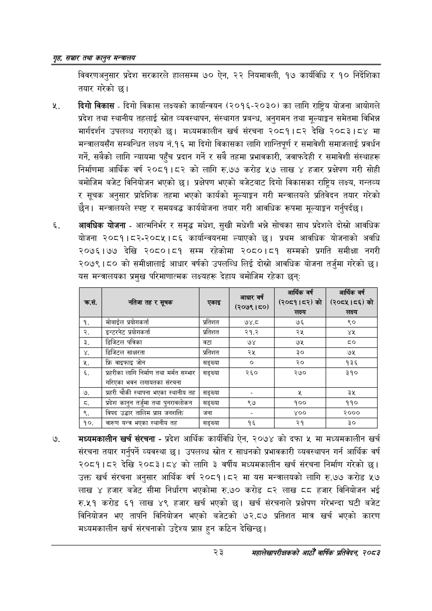

# Page 45 QA

## Rendered page


## Extracted text

```text
गृह सञ्चार तथा कालुन सन्तालय
विवरणअनुसार प्रदेश सरकारले हालसम्म ७० ऐन, २२ नियमावली, १७ कार्यविधि र १० निर्देशिका तयार गरेको |
दिगो विकास -दिगो विकास लक्ष्यको कार्यान्वयन (२०१६-२०३०) का लागि राष्ट्रिय योजना आयोगले प्रदेश तथा स्थानीय तहलाई स्रोत व्यवस्थापन, संस्थागत प्रबन्ध, अनुगमन तथा मूल्याङ्कन समेतमा विभिन्न मार्गदर्शन उपलब्ध गराएको छ। मध्यमकालीन खर्च संरचना २०८१।८२ देखि २०८३।८४ मा मन्त्रालयसँग सम्बन्धित लक्ष्य नं.१६ मा दिगो विकासका लागि शान्तिपूर्ण र समावेशी समाजलाई प्रवर्धन गर्ने, सबैको लागि न्यायमा पहुँच प्रदान गर्ने र सबै तहमा प्रभावकारी, जवाफदेही र समावेशी संस्थाहरू निर्माणमा आर्थिक वर्ष २०८१।८२ को लागि रु.७७ करोड ५७ लाख ४ हजार प्रक्षेपण गरी सोही बमोजिम बजेट विनियोजन भएको छ। प्रक्षेपण भएको बजेटबाट दिगो विकासका राष्ट्रिय लक्ष्य, गन्तव्य र सूचक अनुसार प्रादेशिक तहमा भएको कार्यको मूल्याङ्कन गरी मन्त्रालयले प्रतिवेदन तयार गरेको छैन। मन्त्रालयले स्पष्ट र समयबद्ध कार्ययोजना तयार गरी आवधिक रूपमा मूल्याङ्कन गर्नुपर्दछ |
आवधिक योजना -आत्मनिर्भर र समृद्ध मधेश, सुखी मधेशी भन्ने सोचका साथ प्रदेशले दोस्रो आवधिक योजना २०८१।८२-२०८५।८६ कार्यान्वयनमा ल्याएको छ। प्रथम आवधिक योजनाको अवधि २०७६।७७ देखि २०८०।८१ सम्म रहेकोमा २०८०।८१ सम्मको प्रगति समीक्षा नगरी २०७९।८० को समीक्षालाई आधार वर्षको उपलब्धि लिई दोस्रो आवधिक योजना तर्जुमा गरेको छ। यस मन्त्रालयका प्रमुख परिमाणात्मक लक्ष्यहरू देहाय बमोजिम रहेका छन्‌ः
मध्यमकालीन खर्च संरचना -प्रदेश आर्थिक कार्यविधि ऐन, २०७४ को दफा ४५ मा मध्यमकालीन खर्च संरचना तयार गर्नुपर्ने व्यवस्था छ। उपलब्ध स्रोत र साधनको प्रभावकारी व्यवस्थापन गर्न आर्थिक वर्ष २०८१।८२ देखि २०८३।८४ को लागि ३ वर्षीय मध्यमकालीन खर्च संरचना निर्माण गरेको छ। उक्त खर्च संरचना अनुसार आर्थिक वर्ष २०८१।८२ मा यस मन्त्रालयको लागि रु.७७ करोड ५७ लाख ४ हजार बजेट सीमा निर्धारण भएकोमा रु.७० करोड ८२ लाख दद हजार विनियोजन भई रु.५१ करोड ६१ लाख ४९ हजार खर्च भएको | खर्च संरचनाले प्रक्षेपण गरेभन्दा घटी बजेट विनियोजन भए तापनि विनियोजन भएको बजेटको ७२.८७ प्रतिशत मात्र खर्च भएको कारण मध्यमकालीन खर्च संरचनाको उद्देश्य प्रापत हुन कठिन देखिन्छ।
२३
महालेखापरीक्षकको आठौ वाषिकि प्रतिवेदन २०८२

| कस, | नतिजा तह र सूचक | एकाई | (२०७९।८०) | आर्थिक वर्ष (२०८१।८२)को लक्ष्य | आर्थिक वर्ष (२०८४।८६) को लक्ष्य |
| --- | --- | --- | --- | --- | --- |
| १ | मोबाईल श्रवोगकर्ता | प्रतिशत | ७४.८ | ७६ | ९० |
| २ | इन्टरनेट अरवोनकर्ता | प्रतिशत | २१.२ | २५ | यश |
| ३ | डिजिटल पत्रिका | वटा | ७४ | ७५ |  |
| ४ | डिजिटल साक्षरता | प्रतिशत | २५ | ३० | ७५ |
| ५ | फ्रि वाइफाइ जोन | सङ्ख्या | ० | २० | १३६ |
| ६ | प्रहरीका लागि निर्माण तथा मर्मत सम्भार गरिएका भवन लगायतका संरचना | सङ्ख्या | २६० | २७० | ३१० |
| ७ | प्रहरी चौकी स्थापना भएका स्थानीय तत | सङ्ख्या |  |  | ३५ |
| ८ | प्रदेश कानुन तर्जुमा तथा पुनरावलोकन | सङ्ख्या | ९७ | १०० | ११० |
| ९ | विपद उद्धार तालिम प्राप्त जनशक्ति | जना |  | ४०० | २००० |
| १० | वारुण यन्त्र भएका स्थानीय तह | सङ्ख्या | १६ | २१ | ३० |
```

## Flags
- table_page
- medium_quality_table
