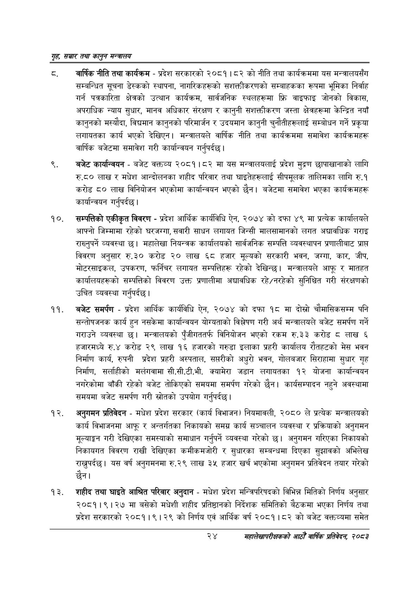

# Page 46 QA

## Rendered page


## Extracted text

```text
गृह सञ्चार तथा कालुन सन्तालय
ठ. वार्षिक नीति तथा कार्यक्रम -प्रदेश सरकारको २०८१।८२ को नीति तथा कार्यक्रममा यस मन्त्रालयसँग सम्बन्धित सूचना डेस्कको स्थापना, नागरिकहरूको सशक्तीकरणको सम्बाहकका रूपमा भूमिका निर्वाह गर्न पत्रकारिता क्षेत्रको उत्थान कार्यक्रम, सार्वजनिक स्थलहरूमा फ्रि वाइफाइ जोनको विकास, अपराधिक न्याय सुधार, मानव अधिकार संरक्षण र कानुनी सशक्तीकरण जस्ता क्षेत्रहरूमा केन्द्रित नयाँ कानुनको मस्यौदा, विद्यमान कानुनको परिमार्जन र उदयमान कानुनी चुनौतीहरूलाई सम्बोधन गर्ने प्रकृया लगायतका कार्य भएको देखिएन। मन्त्रालयले वार्षिक नीति तथा कार्यक्रममा समावेश कार्यक्रमहरू वार्षिक बजेटमा समावेश गरी कार्यान्वयन गर्नुपर्दछ |
बजेट कार्यान्वयन -बजेट वक्तव्य २०८१।८२ मा यस मन्त्रालयलाई प्रदेश मुद्रण छापाखानाको लागि.५० लाख र मधेश आन्दोलनका शहीद परिवार तथा घाइतेहरूलाई सीपमूलक तालिमका लागि रु.१ करोड ८० लाख विनियोजन भएकोमा कार्यान्वयन भएको छैन। बजेटमा समावेश भएका कार्यक्रमहरू कार्यान्वयन गर्नुपर्दछ |
सम्पत्तिको एकीकृत विवरण -प्रदेश आर्थिक कार्यविधि ऐन, २०७४ को दफा ४९ मा प्रत्येक कार्यालयले आफ्नो जिम्मामा रहेको घरजग्गा, सवारी साधन लगायत जिन्सी मालसामानको लगत अद्यावधिक गराइ राख्नुपर्ने व्यवस्था | महालेखा नियन्त्रक कार्यालयको सार्वजनिक सम्पत्ति व्यवस्थापन प्रणालीबाट प्राप्त विवरण अनुसार रु.३० करोड २० लाख ६८ हजार मूल्यको सरकारी भवन, जग्गा, कार, जीप, मोटरसाइकल, उपकरण, फर्निचर लगायत सम्पत्तिहरू रहेको देखिन्छ। मन्त्रालयले आफू र मातहत कार्यालयहरूको सम्पत्तिको विवरण उक्त प्रणालीमा अद्यावधिक रहे/नरहेको सुनिश्चित गरी संरक्षणको उचित व्यवस्था गर्नुपर्दछ |
बजेट समर्पण -प्रदेश आर्थिक कार्यविधि ऐन, २०७४ को दफा १८ मा दोस्रो चौमासिकसम्म पनि सन्तोषजनक कार्य हुन नसकेमा कार्यान्वयन योग्यताको विश्लेषण गरी अर्थ मन्त्रालयले बजेट समर्पण गर्ने गराउने व्यवस्था छ। मन्त्रालयको पुँजीगततर्फ विनियोजन भएको रकम रु.३३ करोड ८ लाख ६ हजारमध्ये रु.४ करोड २९ लाख १६ हजारको गरुडा इलाका प्रहरी कार्यालय रौतहटको मेस भवन निर्माण कार्य, रुपनी प्रदेश प्रहरी अस्पताल, सप्तरीको अधुरो भवन, गोलबजार सिराहामा सुधार गृह निर्माण, सर्लाहीको मलेंगवामा सी.सी.टी.भी. क्यामेरा जडान लगायतका १२ योजना कार्यान्वयन नगरेकोमा बाँकी रहेको बजेट तोकिएको समयमा समर्पण गरेको छैन। कार्यसम्पादन नहुने अवस्थामा समयमा बजेट समर्पण गरी स्रोतको उपयोग गर्नुपर्दछ।
अनुगमन प्रतिवेदन -मधेश प्रदेश सरकार (कार्य विभाजन) नियमावली, २०८० ले प्रत्येक मन्त्रालयको कार्य विभाजनमा आफू र अन्तर्गतका निकायको समग्र कार्य सञ्चालन व्यवस्था र प्रक्रियाको अनुगमन मूल्याङ्कन गरी देखिएका समस्याको समाधान गर्नुपर्ने व्यवस्था गरेको छ। अनुगमन गरिएका निकायको निकायगत विवरण राखी देखिएका कमीकमजोरी र सुधारका सम्बन्धमा दिएका सुझावको अभिलेख राख्नुपर्दछ। यस वर्ष अनुगमनमा रु.२९ लाख ३५ हजार खर्च भएकोमा अनुगमन प्रतिवेदन तयार गरेको छैन।
शहीद तथा घाइते परिवार अनुदान -मधेश प्रदेश मन्त्रिपरिषदको विभिन्न मितिको निर्णय अनुसार २०८१।९।२७ मा बसेको मधेशी शहीद प्रतिष्ठानको निर्देशक समितिको बैठकमा भएका निर्णय तथा प्रदेश सरकारको २०८१।९।२९ को निर्णय एवं आर्थिक वर्ष २०८१।८२ को बजेट वक्तव्यमा समेत
२४
महालेखापरीक्षकको आठौ वाषिकि प्रतिवेदन २०८२
```

## Flags
- None
