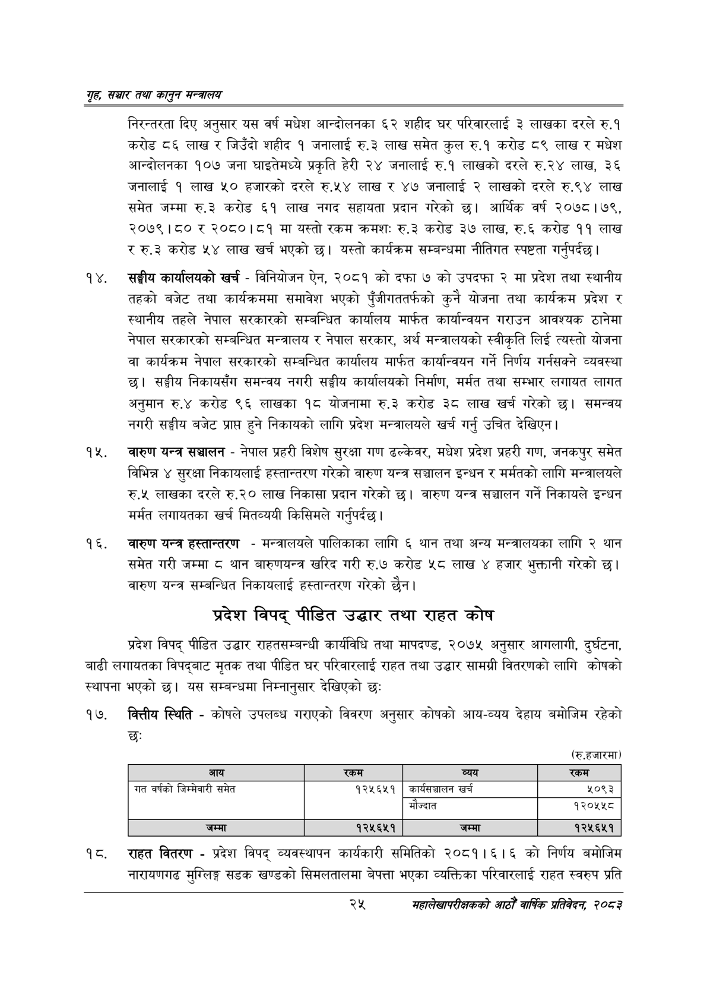

# Page 47 QA

## Rendered page


## Extracted text

```text
गृह सञ्चार तथा कालुन सन्तालय
निरन्तरता दिए अनुसार यस वर्ष मधेश आन्दोलनका ६२ शहीद घर परिवारलाई ३ लाखका दरले रु.१ करोड ८६ लाख र जिउँदो शहीद १ जनालाई रु.३ लाख समेत कुल रु.१ करोड ८९ लाख र मधेश आन्दोलनका १०७ जना घाइतेमध्ये प्रकृति हेरी २४ जनालाई रु.१ लाखको दरले रु.२४ लाख, ३६ जनालाई १ लाख ५० हजारको दरले रु.५४ लाख र ४७ जनालाई २ लाखको दरले रु.९४ लाख समेत जम्मा रु.३ करोड ६१ लाख नगद सहायता प्रदान गरेको छ। आर्थिक वर्ष २०७८। ७९, २०७९।८० र २०८०।८१ मा यस्तो रकम क्रमश: रु.३ करोड ३७ लाख, रु.६ करोड ११ लाख ररु.३ करोड ५४ लाख खर्च भएको | यस्तो कार्यक्रम सम्बन्धमा नीतिगत स्पष्टता गर्नुपर्दछ।
सङ्घीय कार्यालयको खर्च -विनियोजन ऐन, २०८१ को दफा ७ को उपदफा २ मा प्रदेश तथा स्थानीय तहको बजेट तथा कार्यक्रममा समावेश भएको पुँजीगततर्फको कुनै योजना तथा कार्यक्रम प्रदेश र स्थानीय तहले नेपाल सरकारको सम्बन्धित कार्यालय मार्फत कार्यान्वयन गराउन आवश्यक ठानेमा नेपाल सरकारको सम्बन्धित मन्त्रालय र नेपाल सरकार, अर्थ मन्त्रालयको स्वीकृति लिई त्यस्तो योजना वा कार्यक्रम नेपाल सरकारको सम्बन्धित कार्यालय मार्फत कार्यान्वयन गर्ने निर्णय गर्नसक्ने व्यवस्था छ। सङ्घीय निकायसँग समन्वय नगरी सङ्घीय कार्यालयको निर्माण, मर्मत तथा सम्भार लगायत लागत अनुमान रु.४ करोड ९६ लाखका १८ योजनामा रु.३ करोड ३८ लाख खर्च गरेको छ। समन्वय नगरी सङ्घीय बजेट प्राप्त हुने निकायको लागि प्रदेश मन्त्रालयले खर्च गर्नु उचित देखिएन |
वारुण यन्त्र सञ्चालन -नेपाल प्रहरी विशेष सुरक्षा गण ढल्केवर, मधेश प्रदेश प्रहरी गण, जनकपुर समेत विभिन्न ४ सुरक्षा निकायलाई हस्तान्तरण गरेको वारुण यन्त्र सञ्चालन इन्धन र मर्मतको लागि मन्त्रालयले रु.५ लाखका दरले रु.२० लाख निकासा प्रदान गरेको | वारुण यन्त्र सञ्चालन गर्ने निकायले इन्धन मर्मत लगायतका खर्च मितव्ययी किसिमले गर्नुपर्दछ |
वारुण यन्त्र हस्तान्तरण -मन्त्रालयले पालिकाका लागि ६ थान तथा अन्य मन्त्रालयका लागि २ थान समेत गरी जम्मा ८ थान बारुणयन्त्र खरिद गरी रु.७ करोड ५८ लाख ४ हजार भुक्तानी गरेको ५ | वारुण यन्त्र सम्बन्धित निकायलाई हस्तान्तरण गरेको छैन।
प्रदेश विपद्‌ पीडित उद्धार तथा राहत कोष
प्रदेश विपद्‌ पीडित उद्धार राहतसम्बन्धी कार्यविधि तथा मापदण्ड, २०७५ अनुसार आगलागी, दुर्घटना, बाढी लगायतका विपद्बाट मृतक तथा पीडित घर परिवारलाई राहत तथा उद्धार सामग्री वितरणको लागि कोषको स्थापना भएको | यस सम्बन्धमा निम्नानुसार देखिएको छः
वित्तीय स्थिति -कोषले उपलब्ध गराएको विवरण अनुसार कोषको आय-व्यय देहाय बमोजिम रहेको छः
(रु.हजारमा)
राहत वितरण -प्रदेश विपद्‌ व्यवस्थापन कार्यकारी समितिको २०८१।६।६ को निर्णय बमोजिम नारायणगढ मुग्लिङ्ग सडक खण्डको सिमलतालमा वेपत्ता भएका व्यक्तिका परिवारलाई राहत स्वरुप प्रति
२५
महालेखापरीक्षकको आठौ वाषिकि प्रतिवेदन २०८२

| आय | 'रकम | व्यय | रकम |
| --- | --- | --- | --- |
| गत वर्षको [३०१० समेत | १२५६५१ | कार्वसञ्चालन खर्च | ५०९३ |
|  |  | मौज्दात | १२०१५८ |
| जम्मा | १२५६५१ | जम्मा | १२५६५१ |
```

## Flags
- table_page
- medium_quality_table
