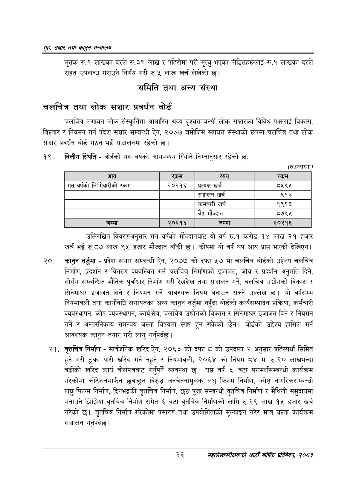

# Page 48 QA

## Rendered page


## Extracted text

```text
गृह सञ्चार तथा कालुन सन्तालय
मृतक रु.१ लाखका दरले रु.३९ लाख र पहिरोमा परी मृत्यु भएका पीडितहरूलाई रु.१ लाखका दरले राहत उपलब्ध गराउने निर्णय गरी रु.५ लाख खर्च लेखेको छु।
समिति तथा अन्य संस्था
चलचित्र तथा लोक सञ्चार प्रवर्धन बोर्ड
चलचित्र लगायत लोक संस्कृतिमा आधारित श्रव्य दृश्यसम्बन्धी लोक सञ्चारका विविध पक्षलाई विकास, विस्तार र नियमन गर्न प्रदेश सञ्चार सम्बन्धी ऐन, २०७७ बमोजिम स्वायत्त संस्थाको रूपमा चलचित्र तथा लोक सञ्चार प्रवर्धन बोर्ड गठन भई सञ्चालनमा रहेको छ।
बित्तीय स्थिति -बोर्डको यस वर्षको आय-व्यय स्थिति निम्नानुसार रहेको छः
(रु.हजारमा)
उल्लिखित विवरणअनुसार गत वर्षको मौज्दातबाट यो वर्ष रु.१ करोड १४ लाख २१ हजार खर्च भई रु.८७ लाख ९५ हजार मौज्दात बाँकी छ। कोषमा यो वर्ष थप आय प्राप्त भएको देखिएन।
कानुन तर्जुमा -प्रदेश सञ्चार सम्बन्धी ऐन, २०७७ को दफा ५७ मा चलचित्र बोर्डको उद्देश्य चलचित्र निर्माण, प्रदर्शन र वितरण व्यवस्थित गर्न चलचित्र निर्माणको इजाजत, जाँच र प्रदर्शन अनुमति दिने, सोसँग सम्बन्धित भौतिक पूर्वाधार निर्माण गरी रेखदेख तथा सञ्चालन गर्ने, चलचित्र उद्योगको विकास र सिनेमाघर इजाजत दिने र नियमन गर्ने आवश्यक नियम बनाउन सक्ने उल्लेख छ। यो वर्षसम्म नियमावली तथा कार्यविधि लगायतका अन्य कानुन तर्जुमा नहुँदा बोर्डको कार्यसम्पादन प्रक्रिया, कर्मचारी व्यवस्थापन, कोष व्यवस्थापन, कार्यक्षेत्र, चलचित्र उद्योगको विकास र सिनेमाघर इजाजत दिने र नियमन गर्ने र अन्तरनिकाय समन्वय जस्ता विषयमा स्पष्ट हुन सकेको छैन। बोर्डको उद्देश्य हासिल गर्न आवश्यक कानुन तयार गरी लागु गर्नुपर्दछ |
वृत्तचित्र निर्माण -सार्वजनिक खरिद ऐन, २०६३ को दफा ८ को उपदफा २ अनुसार प्रतिस्पर्धा सिमित हुने गरी टुक्रा पारी खरिद गर्न नहुने र नियमावली, २०६४ को नियम ८४ मा रु.२० लाखभन्दा बढीको खरिद कार्य बोलपत्रबाट गर्नुपर्ने व्यवस्था यस वर्ष ६ वटा परामर्शसम्बन्धी कार्यक्रम गरेकोमा कोटेशनमार्फत छुवाछुत विरुद्ध जनचेतनामूलक लघु फिल्म निर्माण, ज्येष्ठ नागरिकसम्बन्धी लघु फिल्म निर्माण, दिनभद्रकी वृत्तचित्र निर्माण, छठ पूजा सम्बन्धी वृतचित्र निर्माण र मैथिली समुदायमा मनाउने झिझिया वृतचित्र निर्माण समेत ६ वटा वृतचित्र निर्माणको लागि रु.२९ लाख १५ हजार खर्च गरेको छ। वृतचित्र निर्माण गरेकोमा प्रसारण तथा उपयोगिताको मूल्याङ्कन गरेर मात्र यस्ता कार्यक्रम सञ्चालन गर्नुपर्दछ।
२६
महालेखापरीक्षकको आठौ वाषिकि प्रतिवेदन २०८२

| आय | 'रकम | व्यय | रकम |
| --- | --- | --- | --- |
| गत वर्षको जिश्मेवारीको रकम | २०२१६ | प्रत्यक्ष खर्च | ८२९५ |
|  |  | सञ्चालन खर्च | ९१३ |
|  |  | कर्मचारी खर्च | १९१३ |
|  |  | बैङ्क मौज्दात | ८७९५ |
| जम्मा | २०२१६ | जम्मा | २०२१६ |
```

## Flags
- table_page
- medium_quality_table
