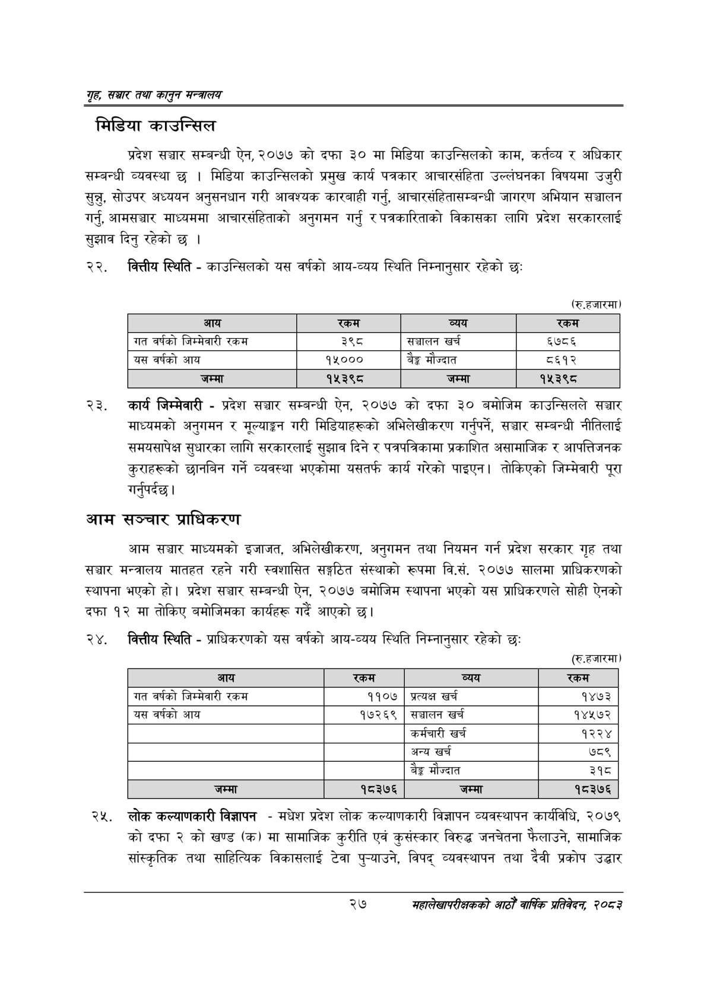

# Page 49 QA

## Rendered page


## Extracted text

```text
गृह सञ्चार तथा कालुन सन्तालय
मिडिया काउन्सिल
प्रदेश सञ्चार सम्बन्धी ऐन, २०७७ को दफा ३० मा मिडिया काउन्सिलको काम, कर्तव्य र अधिकार सम्बन्धी व्यवस्था छ | मिडिया काउन्सिलको प्रमुख कार्य पत्रकार आचारसंहिता उल्लंघनका विषयमा उजुरी सुन्नु, सोउपर अध्ययन अनुसनधान गरी आवश्यक कारबाही गर्नु, आचारसंहितासम्बन्धी जागरण अभियान सञ्चालन गर्नु, आमसञ्चार माध्यममा आचारसंहिताको अनुगमन गर्नु र पत्रकारिताको विकासका लागि प्रदेश सरकारलाई सुझाव दिनु रहेको छ।
२२, वित्तीय स्थिति -काउन्सिलको यस वर्षको आय-व्यय स्थिति निम्नानुसार रहेको छः:
(रु.हजारमा)
कार्य जिम्मेवारी -प्रदेश सञ्चार सम्बन्धी ऐन, २०७७ को दफा ३० बमोजिम काउन्सिलले सञ्चार माध्यमको अनुगमन र मूल्याङ्कन गरी मिडियाहरूको अभिलेखीकरण गर्नुपर्ने, सञ्चार सम्बन्धी नीतिलाई समयसापेक्ष सुधारका लागि सरकारलाई सुझाव दिने र पत्रपत्रिकामा प्रकाशित असामाजिक र आपत्तिजनक कुराहरूको छानबिन गर्ने व्यवस्था भएकोमा यसतर्फ कार्य गरेको पाइएन। तोकिएको जिम्मेवारी पूरा गर्नुपर्दछ |
आम सञ्चार प्राधिकरण
आम सञ्चार माध्यमको इजाजत, अभिलेखीकरण, अनुगमन तथा नियमन गर्न प्रदेश सरकार गृह तथा सञ्चार मन्त्रालय मातहत रहने गरी स्वशासित सङ्गठित संस्थाको रूपमा वि.सं. २०७७ सालमा प्राधिकरणको स्थापना भएको हो। प्रदेश सञ्चार सम्बन्धी ऐन, २०७७ बमोजिम स्थापना भएको यस प्राधिकरणले सोही ऐनको दफा १२ मा तोकिए बमोजिमका कार्यहरू गर्दै आएको छ।
वित्तीय स्थिति -प्राधिकरणको यस वर्षको आय-व्यय स्थिति निम्नानुसार रहेको छः
(रु.हजारमा)
लोक कल्याणकारी विज्ञापन -मधेश प्रदेश लोक कल्याणकारी विज्ञापन व्यवस्थापन कार्यविधि, २०७९ कोदफा २ को खण्ड (क) मा सामाजिक कुरीति एवं कुसंस्कार विरुद्ध जनचेतना फैलाउने, सामाजिक सांस्कृतिक तथा साहित्यिक विकासलाई टेवा पुन्याउने, विपद्‌ व्यवस्थापन तथा दैवी प्रकोप उद्धार
२७
महालेखापरीक्षकको आठौ वाषिकि प्रतिवेदन २०८२

| आय | रकम | व्यय | रकम |
| --- | --- | --- | --- |
| गत वर्षको [जिनभव१री रकम | ३९८ | सञ्चालन खर्च | ६७८६ |
| यस वर्षको आय | १५००० | बैङ्क मौज्दात | ८६१२ |
| जम्मा | १५३९८ | जम्मा | १५३९८ |

| आय | 'रकम | व्यय | रकम |
| --- | --- | --- | --- |
| गत वर्षको जिश्मेवारी रकम | ११०७ | प्रत्यक्ष खर्च | १४७३ |
| यस वर्षको आय | १७२६९ | सञ्चालन खर्च | १४५७२ |
|  |  | कर्मचारी खर्च | १२२४ |
|  |  | अन्य खर्च | ७८९ |
|  |  | बैङ्क मौज्दात | ३१८ |
| जम्मा | १८३७६ | जम्मा | १८३७६ |
```

## Flags
- table_page
- medium_quality_table
