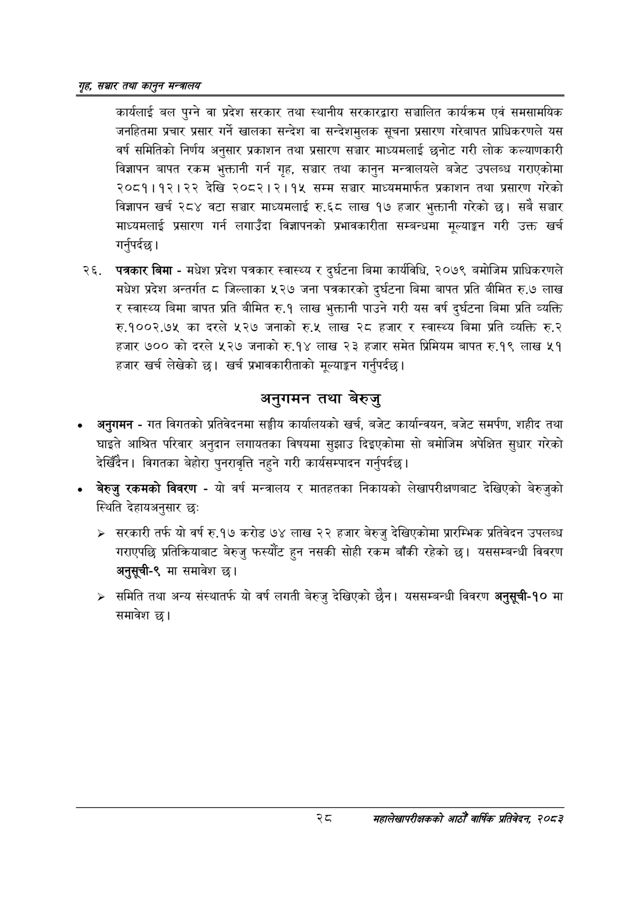

# Page 50 QA

## Rendered page


## Extracted text

```text
गृह सञ्चार तथा कालुन सन्तालय
कार्यलाई बल पुग्ने वा प्रदेश सरकार तथा स्थानीय सरकारद्वारा सञ्चालित कार्यक्रम एवं समसामयिक जनहितमा प्रचार प्रसार गर्ने खालका सन्देश वा सन्देशमुलक सूचना प्रसारण गरेबापत प्राधिकरणले यस वर्ष समितिको निर्णय अनुसार प्रकाशन तथा प्रसारण सञ्चार माध्यमलाई छनोट गरी लोक कल्याणकारी विज्ञापन बापत रकम भुक्तानी गर्न गृह, सञ्चार तथा कानुन मन्त्रालयले बजेट उपलब्ध गराएकोमा २०८१।१२।२२ देखि २०८२।२।१५ सम्म सञ्चार माध्यममार्फत प्रकाशन तथा प्रसारण गरेको विज्ञापन खर्च २८४ वटा सञ्चार माध्यमलाई रु.६८ लाख १७ हजार भुक्तानी गरेको छ। सबै सञ्चार माध्यमलाई प्रसारण गर्न लगाउँदा विज्ञापनको प्रभावकारीता सम्बन्धमा मूल्याङ्गन गरी उक्त खर्च गर्नुपर्दछ |
पत्रकार बिमा -मधेश प्रदेश पत्रकार स्वास्थ्य र दुर्घटना बिमा कार्यविधि, २०७९ बमोजिम प्राधिकरणले मधेश प्रदेश अन्तर्गत ८ जिल्लाका ५२७ जना पत्रकारको दुर्घटना बिमा बापत प्रति बीमित रु.७ लाख र स्वास्थ्य बिमा बापत प्रति बीमित रु.१ लाख भुक्तानी पाउने गरी यस वर्ष दुर्घटना बिमा प्रति व्यक्ति रु.१००२.७५ का दरले ५२७ जनाको रु.५ लाख २८ हजार र स्वास्थ्य बिमा प्रति व्यक्ति रु.२ हजार ७०० को दरले ५२७ जनाको रु.१४ लाख २३ हजार समेत प्रिमियम बापत रु.१९ लाख ५१ हजार खर्च लेखेको छ। खर्च प्रभावकारीताको मूल्याङ्कन गर्नुपर्दछ |
अनुगमन तथा बेरुजु
० अनुगमन -गत विगतको प्रतिवेदनमा सङ्घीय कार्यालयको खर्च, बजेट कार्यान्वयन, बजेट समर्पण, शहीद तथा घाइते आश्रित परिवार अनुदान लगायतका विषयमा सुझाउ दिइएकोमा सो बमोजिम अपेक्षित सुधार गरेको देखिँदैन। विगतका बेहोरा पुनरावृत्ति नहुने गरी कार्यसम्पादन गर्नुपर्दछ |
बेरुजु रकमको विवरण -यो वर्ष मन्त्रालय र मातहतका निकायको लेखापरीक्षणबाट देखिएको बेरुजुको स्थिति देहायअनुसार छः
» सरकारी तर्फ यो वर्ष रु.१७ करोड ७४ लाख २२ हजार बेरुजु देखिएकोमा प्रारम्भिक प्रतिवेदन उपलब्ध गराएपछि प्रतिक्रियाबाट बेरुजु फस्यौट हुन नसकी सोही रकम बाँकी रहेको छ। यससम्बन्धी विवरण अनुसूची-९ मा समावेश छ।
समिति तथा अन्य संस्थातर्फ यो वर्ष लगती बेरुजु देखिएको छैन। यससम्बन्धी विवरण अनुसूची-१० मा समावेश छ।
महालेखापरीक्षकको वाषिकि प्रतिवेदन २०८२
```

## Flags
- None
