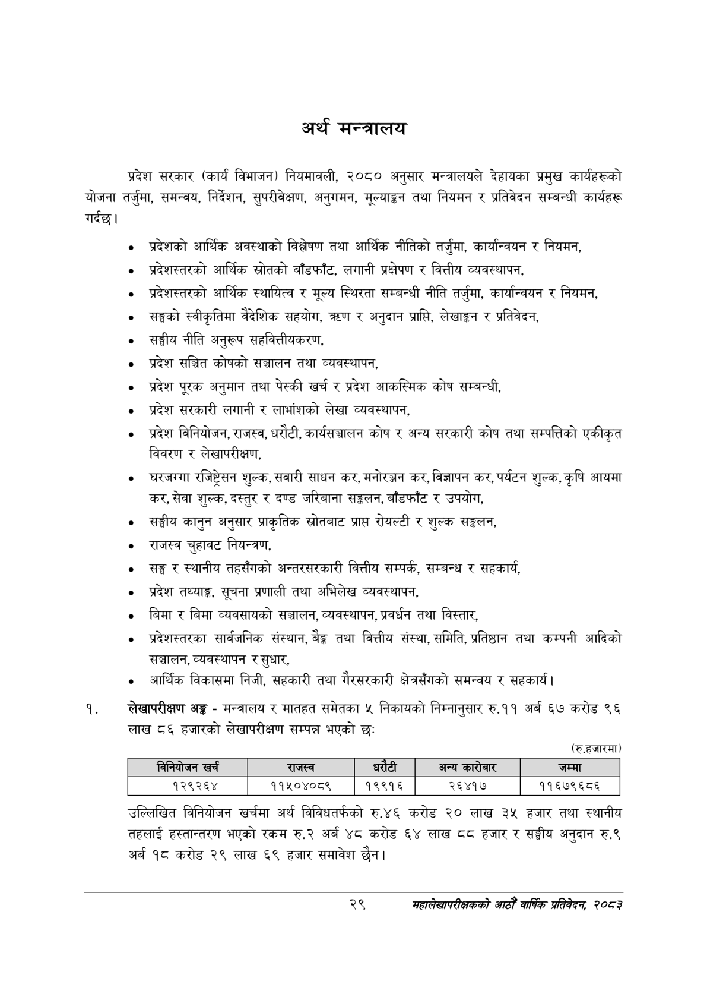

# Page 51 QA

## Rendered page


## Extracted text

```text
अर्थ मन्त्रालय
गर्दछ। प्रदेश सरकार (कार्य विभाजन) नियमावली, २०८० अनुसार मन्त्रालयले देहायका प्रमुख कार्यहरूको योजना तर्जुमा, समन्वय, निर्देशन, सुपरीवेक्षण, अनुगमन, मूल्याङ्कन तथा नियमन र प्रतिवेदन सम्बन्धी कार्यहरू
प्रदेशको आर्थिक अवस्थाको विश्लेषण तथा आर्थिक नीतिको तर्जुमा, कार्यान्वयन र नियमन,
प्रदेशस्तरको आर्थिक स्रोतको बाँडफाँट, लगानी प्रक्षेपण र वित्तीय व्यवस्थापन,
प्रदेशस्तरको आर्थिक स्थायित्व र मूल्य स्थिरता सम्बन्धी नीति तर्जुमा, कार्यान्वयन र नियमन,
सङ्घको स्वीकृतिमा वैदेशिक सहयोग, त्रण र अनुदान प्राप्ति, लेखाङ्कन र प्रतिवेदन,
सङ्घीय नीति अनुरूप सहवित्तीयकरण,
प्रदेश सञ्चित कोषको सञ्चालन तथा व्यवस्थापन,
प्रदेश पूरक अनुमान तथा पेस्की खर्च र प्रदेश आकस्मिक कोष सम्बन्धी,
प्रदेश सरकारी लगानी र लाभांशको लेखा व्यवस्थापन,
प्रदेश विनियोजन, राजस्व, धरौटी, कार्यसञ्चालन कोष र अन्य सरकारी कोष तथा सम्पत्तिको एकीकृत विवरण र लेखापरीक्षण,
घरजग्गा रजिष्ट्रेसन शुल्क, सवारी साधन कर, मनोरञ्जन कर, विज्ञापन कर, पर्यटन शुल्क, कृषि आयमा कर, सेवा शुल्क, दस्तुर र दण्ड जरिबाना सङ्कलन, बाँडफाँट र उपयोग,
सङ्घीय कानुन अनुसार प्राकृतिक स्रोतबाट प्राप्त रोयल्टी र शुल्क सङ्कलन,
राजस्व चुहावट नियन्त्रण,
सङ्ग र स्थानीय तहसँगको अन्तरसरकारी वित्तीय सम्पर्क, सम्बन्ध र सहकार्य,
प्रदेश तथ्याङ्ग, सूचना प्रणाली तथा अभिलेख व्यवस्थापन,
बिमा र बिमा व्यवसायको सञ्चालन, व्यवस्थापन, प्रवर्धन तथा विस्तार,
प्रदेशस्तरका सार्वजनिक संस्थान, बैङ्क तथा वित्तीय संस्था, समिति, प्रतिष्ठान तथा कम्पनी आदिको सञ्चालन, व्यवस्थापन र सुधार,
आर्थिक विकासमा निजी, सहकारी तथा गैरसरकारी क्षेत्रसँगको समन्वय र सहकार्य।
लेखापरीक्षण अङ्ग -मन्त्रालय र मातहत समेतका ५ निकायको निम्नानुसार रु.११ अर्ब ६७ करोड ९६ लाख ८६ हजारको लेखापरीक्षण सम्पन्न भएको छः:
(रु.हजारमा)
उल्लिखित विनियोजन खर्चमा अर्थ विविधतर्फको रु.४६ करोड २० लाख ३५ हजार तथा स्थानीय तहलाई हस्तान्तरण भएको रकम रु.२ अर्ब ४८ करोड ६४ लाख ८८ हजार र सङ्घीय अनुदान रु.९ अर्ब १८ करोड २९ लाख ६९ हजार समावेश छैन।
२९
महालेखापरीक्षकको आठौ वाषिकि प्रतिवेदन २०८२

|  |  | 'ननिबोजन |  | राजस्व |  |  | अन्य कारोबार | जम्मा |
| --- | --- | --- | --- | --- | --- | --- | --- | --- |
```

## Flags
- table_page
- medium_quality_table
