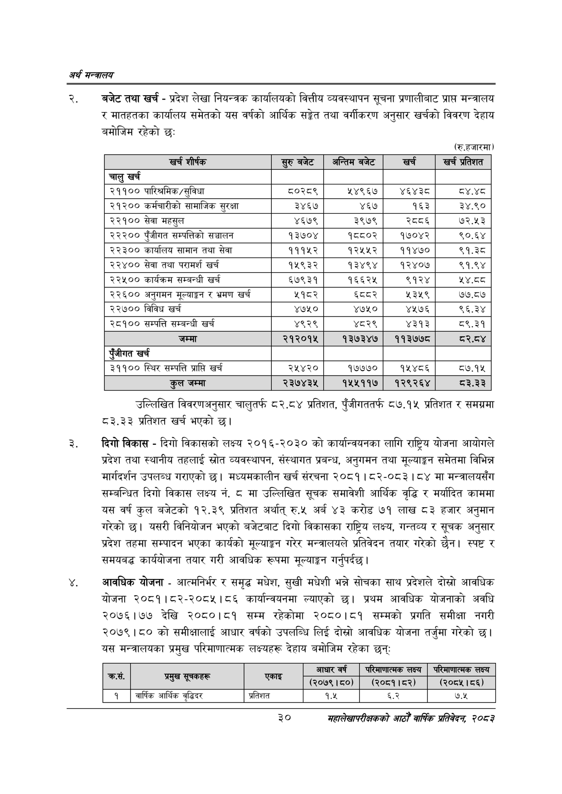

# Page 52 QA

## Rendered page


## Extracted text

```text
अर्थ सन्वबालय
बजेट तथा खर्च -प्रदेश लेखा नियन्त्रक कार्यालयको वित्तीय व्यवस्थापन सूचना प्रणालीबाट प्राप्त मन्त्रालय र मातहतका कार्यालय समेतको यस वर्षको आर्थिक सङ्केत तथा वर्गीकरण अनुसार खर्चको विवरण देहाय बमोजिम रहेको छः
(रु.हजारमा)
उल्लिखित विवरणअनुसार चालुतर्फ ८२.८४ प्रतिशत, पुँजीगततर्फ ८७.१५ प्रतिशत र समग्रमा ८३.३३ प्रतिशत खर्च भएको छ।
दिगो विकास -दिगो विकासको लक्ष्य २०१६-२०३० को कार्यान्वयनका लागि राष्ट्रिय योजना आयोगले प्रदेश तथा स्थानीय तहलाई स्रोत व्यवस्थापन, संस्थागत प्रबन्ध, अनुगमन तथा मूल्याङ्कन समेतमा विभिन्न मार्गदर्शन उपलब्ध गराएको छ। मध्यमकालीन खर्च संरचना २०८१। ८२-०८३। ८४ मा मन्त्रालयसँग सम्बन्धित दिगो विकास लक्ष्य नं. ८ मा उल्लिखित सूचक समावेशी आर्थिक वृद्धि र मर्यादित काममा यस वर्ष कुल बजेटको १२.३९ प्रतिशत अर्थात्‌ रु.५ अर्ब ४३ करोड ७१ लाख ८३ हजार अनुमान गरेको | यसरी विनियोजन भएको बजेटबाट दिगो विकासका राष्ट्रिय लक्ष्य, गन्तव्य र सूचक अनुसार प्रदेश तहमा सम्पादन भएका कार्यको मूल्याङ्कन गरेर मन्त्रालयले प्रतिवेदन तयार गरेको | स्पष्ट र समयबद्ध कार्ययोजना तयार गरी आवधिक रूपमा मूल्याङ्कन गर्नुपर्दछ |
आवधिक योजना -आत्मनिर्भर र समृद्ध मधेश, सुखी मधेशी भन्ने सोचका साथ प्रदेशले दोस्रो आवधिक योजना २०८१।८२-२०८५।८६ कार्यान्वयनमा ल्याएको छ। प्रथम आवधिक योजनाको अवधि २०७६।७७ देखि २०८०।८१ सम्म रहेकोमा २०८०।८१ सम्मको प्रगति समीक्षा नगरी २०७९।८० को समीक्षालाई आधार वर्षको उपलब्धि लिई दोस्रो आवधिक योजना तर्जुमा गरेको छ। यस मन्त्रालयका प्रमुख परिमाणात्मक लक्ष्यहरू देहाय बमोजिम रहेका छन्‌ः
३०
महालेखापरीक्षकको आठौ वाषिकि प्रतिवेदन २०८२

| खर्च शीर्षक | सुरु बबेट | अन्तिम बजेट | खर्च | खच प्रतेशत |
| --- | --- | --- | --- | --- |
| चालु खर्च |  |  |  |  |
| २११०० पारिश्रमिक/सुविधा | ५०२८९ | ५४९६७ | ४६४३८ | ८४.४८ |
| २१२०० कर्मचारीको सामाजिक सुरक्षा | ३४६७ | ४६७ | १६३ | ३४.९० |
| २२१०० सेवा महसुल | ४६७९ | ३९७९ | २८८६ | ७२.४५३ |
| २२२०० पुँजीगत क्षम्पतिको सञ्चालन | १३७०४ | १८८०२ | १७०४२ | ९०.६४ |
| २२३०० कार्बालष सामान तथा सेवा | १११५२ | १२५५२ | ११४७० | ९१.३८ |
| २२४०० सेवा तथा परामर्श खर्च | १५९३२ | १३४९४ | १२४०७ | ९१.९४ |
| २२४५०० कार्यक्रम सम्बन्धी खर्च | ६७९३१ | १६६२४५ | ९१२४ | ५४.ठठ |
| २२६०० अनुगमन र भ्रमण खर्च | २१८२ | ध्व्वर | ५३५९ | ७७.८७ |
| २२७०० विविध खर्च | ४७५० | ४७५० | ४५७६ | ९६.३४ |
| २८१०० सम्पत्ति सम्बन्धी खर्च | ४९२९ | ४८२९ | ४३१३ | ८९.३१ |
| जम्मा | २१२०१५ | १३७३२४७ | ११३७७८ | ८र२.८४ |
| एंजीगत खर्च |  |  |  |  |
| ३११०० स्थिर सम्पत्ति प्राप्ति खर्च | २५४२० | १७७७० | १५४८६ | ८७.१५ |
| जम्मा | २३७४३५ | १५५११७ | १२९२६४ | ८३.३३ |

| कस, |  |  | आधार वर्ष | परिनाणात्मक लक्ष्य | पारमाणात्मक लक्ष्य |
| --- | --- | --- | --- | --- | --- |
|  | प्रसुख चनाको |  | ( १५०) | (२०८१।५२) | (२०८५।८६) |
| १ | वार्षिक आर्थिक वृद्धिदर | प्रतिशत | १.५ | ६.२ | ७.५ |
```

## Flags
- table_page
- medium_quality_table
