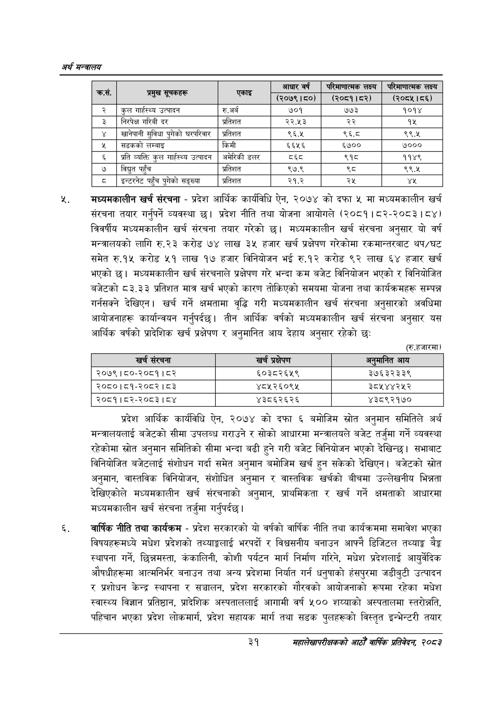

# Page 53 QA

## Rendered page


## Extracted text

```text
अर्थ सन्वबालय
मध्यमकालीन खर्च संरचना -प्रदेश आर्थिक कार्यविधि ऐन, २०७४ को दफा ५ मा मध्यमकालीन खर्च संरचना तयार गर्नुपर्ने व्यवस्था छ। प्रदेश नीति तथा योजना आयोगले (२०८१।८२-२०८३। ८४) त्रिवर्षीय मध्यमकालीन खर्च संरचना तयार गरेको छ। मध्यमकालीन खर्च संरचना अनुसार यो वर्ष मन्त्रालयको लागि रु.२३ करोड ७४ लाख ३५ हजार खर्च प्रक्षेपण गरेकोमा रकमान्तरबाट थप/घट समेत रु.१५ करोड ५१ लाख १७ हजार विनियोजन भई रु.१२ करोड ९२ लाख ६४ हजार खर्च भएको छ। मध्यमकालीन खर्च संरचनाले प्रक्षेपण गरे भन्दा कम बजेट विनियोजन भएको र विनियोजित बजेटको ८३.३३ प्रतिशत मात्र खर्च भएको कारण तोकिएको समयमा योजना तथा कार्यक्रमहरू सम्पन्न गर्नसक्ने देखिएन। खर्च गर्ने क्षमतामा वृद्धि गरी मध्यमकालीन खर्च संरचना अनुसारको अवधिमा आयोजनाहरू कार्यान्वयन गर्नुपर्दछ। तीन आर्थिक वर्षको मध्यमकालीन खर्च संरचना अनुसार यस आर्थिक वर्षको प्रादेशिक खर्च प्रक्षेपण र अनुमानित आय देहाय अनुसार रहेको छः
(रु.हजारमा)
।
प्रदेश आर्थिक कार्यविधि ऐन, २०७४ को दफा ६ बमोजिम स्रोत अनुमान समितिले अर्थ मन्त्रालयलाई बजेटको सीमा उपलब्ध गराउने र सोको आधारमा मन्त्रालयले बजेट तर्जुमा गर्ने व्यवस्था रहेकोमा स्रोत अनुमान समितिको सीमा भन्दा बढी हुने गरी बजेट विनियोजन भएको देखिन्छ। सभाबाट विनियोजित बजेटलाई संशोधन गर्दा समेत अनुमान बमोजिम खर्च हुन सकेको देखिएन। बजेटको स्रोत अनुमान, वास्तविक विनियोजन, संशोधित अनुमान र वास्तविक खर्चको बीचमा उल्लेखनीय भिन्नता देखिएकोले मध्यमकालीन खर्च संरचनाको अनुमान, प्राथमिकता र खर्च गर्ने क्षमताको आधारमा मध्यमकालीन खर्च संरचना तर्जुमा गर्नुपर्दछ।
वार्षिक नीति तथा कार्यक्रम -प्रदेश सरकारको यो वर्षको वार्षिक नीति तथा कार्यक्रममा समावेश भएका विषयहरूमध्ये मधेश प्रदेशको तथ्याङ्कलाई भरपर्दो र विश्वसनीय बनाउन आफ्नै डिजिटल तथ्याङ्क बेङ्ग स्थापना गर्ने, छिन्नमस्ता, कंकालिनी, कोशी पर्यटन मार्ग निर्माण गरिने, मधेश प्रदेशलाई आयुर्वेदिक औषधीहरूमा आत्मनिर्भर बनाउन तथा अन्य प्रदेशमा निर्यात गर्न धनुषाको हंसपुरमा जडीबुटी उत्पादन र प्रशोधन केन्द्र स्थापना र सञ्चालन, प्रदेश सरकारको गौरवको आयोजनाको रूपमा रहेका मधेश स्वास्थ्य विज्ञान प्रतिष्ठान, प्रादेशिक अस्पताललाई आगामी वर्ष ५०० शय्याको अस्पतालमा स्तरोन्नति, पहिचान भएका प्रदेश लोकमार्ग, प्रदेश सहायक मार्ग तथा सडक पुलहरूको विस्तृत इन्भेन्टरी तयार
३१
महालेखापरीक्षकको आठौ वाषिकि प्रतिवेदन २०८२

|  |  |  | आधार वर्ष | लक्ष्य | परिकानात्नक लक्ष्य |
| --- | --- | --- | --- | --- | --- |
| १ | न |  | (२०७९।५०) | (२०८१।५२) | (२०८५।५६) |
| २ | कुल गार्हस्थ्य उत्पादन | रु.अर्ब | ७०१ | ७७३ | १०१४ |
| ३ | निरपेक्ष गरिबी दर | प्रतिशत | २२.५३ | २२ | १५ |
| ४ | खानेपानी सुविधा पुगेको ५९५२वा८ | प्रतिशत | ९६.४५ | ९६.८ | ९६९.४५ |
| ५ | सडकको लम्बाइ | किमी | ६६५६ | ६७०० | ७००० |
| ६ | प्रति व्यक्ति कुल गार्हस्थ्य उत्पादन | अमेरिकी डलर | व्६्८ | ९१ | ११४९ |
| ७ | विद्युत पहुँच | प्रतिशत | ९७.९ | %५ | ९६९.४५ |
| ८ | इन्टलेट पहुँच पुगेको सङ्ख्या | प्रतिशत | २१.२ | २५ | यश |

| खर्च संरचना | खर्च प्रक्षेपण | अर्‌ नानित आय |
| --- | --- | --- |
| २०७९।८०-२०८१।८२ | ६०३८२६५९ | ३७६३२३३९ |
| २०८०।८१-२०८२। ८३ | ४८५२६०९५ | ३८५४४२५२ |
| २०८१।८२-२०८३। ८४ | ४३८६२६२६ | ४३८९२१७० |
```

## Flags
- table_page
- medium_quality_table
