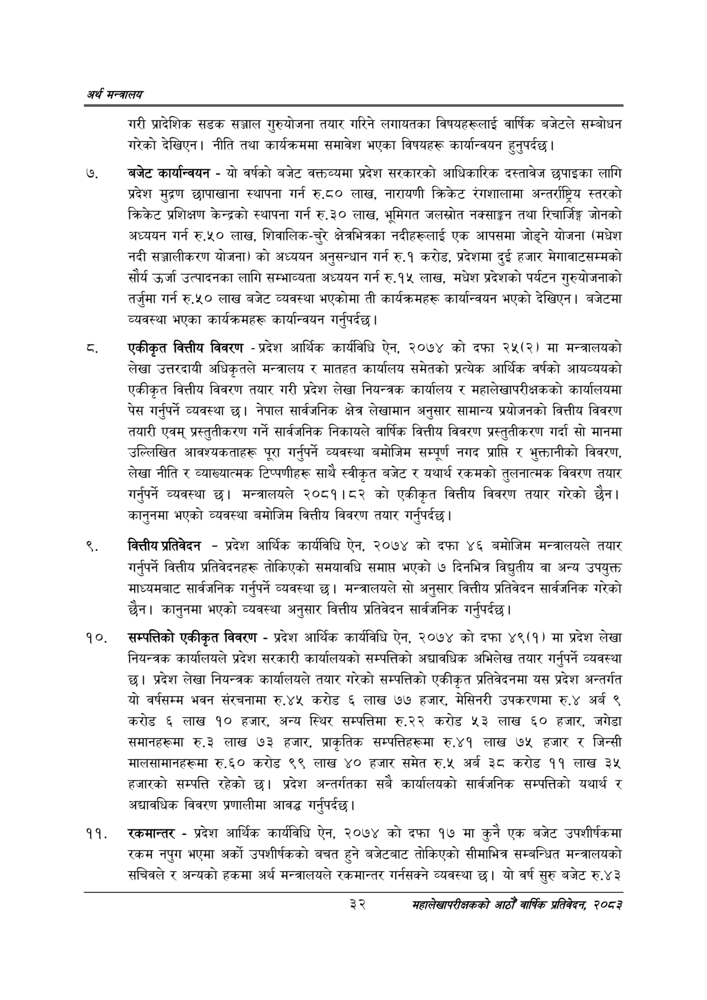

# Page 54 QA

## Rendered page


## Extracted text

```text
अर्थ सन्वबालय
गरी प्रादेशिक सडक सञ्जाल गुरुयोजना तयार गरिने लगायतका विषयहरूलाई वार्षिक बजेटले सम्बोधन गरेको देखिएन। नीति तथा कार्यक्रममा समावेश भएका विषयहरू कार्यान्वयन हुनुपर्दछ |
बजेट कार्यान्वयन -यो वर्षको बजेट वक्तव्यमा प्रदेश सरकारको आधिकारिक दस्तावेज छपाइका लागि प्रदेश मुद्रण छापाखाना स्थापना गर्न रु.८० लाख, नारायणी क्रिकेट रंगशालामा अन्तर्राष्ट्रिय स्तरको क्रिकेट प्रशिक्षण केन्द्रको स्थापना गर्न रु.३० लाख, भूमिगत जलस्रोत नक्साङ्गन तथा रिचार्जिङ्ग जोनको अध्ययन गर्न रु.५० लाख, शिवालिक-चुरे क्षेत्रभित्रका नदीहरूलाई एक आपसमा जोड्ने योजना (मधेश नदी सञ्जालीकरण योजना) को अध्ययन अनुसन्धान गर्न रु.१ करोड, प्रदेशमा दुई हजार मेगावाटसम्मको सौर्य उर्जा उत्पादनका लागि सम्भाव्यता अध्ययन गर्न रु.१५ लाख, मधेश प्रदेशको पर्यटन गुरुयोजनाको तर्जुमा गर्न रु.५० लाख बजेट व्यवस्था भएकोमा ती कार्यक्रमहरू कार्यान्वयन भएको देखिएन। बजेटमा व्यवस्था भएका कार्यक्रमहरू कार्यान्वयन गर्नुपर्दछ |
एकीकृत वित्तीय विवरण -प्रदेश आर्थिक कार्यविधि ऐन, २०७४ को दफा २५(२) मा मन्त्रालयको लेखा उत्तरदायी अधिकृतले मन्त्रालय र मातहत कार्यालय समेतको प्रत्येक आर्थिक वर्षको आयव्ययको एकीकृत वित्तीय विवरण तयार गरी प्रदेश लेखा नियन्त्रक कार्यालय र महालेखापरीक्षकको कार्यालयमा पेस गर्नुपर्ने व्यवस्था छ। नेपाल सार्वजनिक क्षेत्र लेखामान अनुसार सामान्य प्रयोजनको वित्तीय विवरण तयारी एवम्‌ प्रस्तुतीकरण गर्ने सार्वजनिक निकायले वार्षिक वित्तीय विवरण प्रस्तुतीकरण गर्दा सो मानमा उल्लिखित आवश्यकताहरू पूरा गर्नुपर्ने व्यवस्था बमोजिम सम्पूर्ण नगद प्राप्ति र भुक्तानीको विवरण, लेखा नीति र व्याख्यात्मक टिप्पणीहरू साथै स्वीकृत बजेट र यथार्थ रकमको तुलनात्मक विवरण तयार गर्नुपर्ने व्यवस्था छ। मन्त्रालयले २०८१।८२ को एकीकृत वित्तीय विवरण तयार गरेको छैन। कानुनमा भएको व्यवस्था बमोजिम वित्तीय विवरण तयार गर्नुपर्दछ |
वित्तीय प्रतिवेदन -प्रदेश आर्थिक कार्यविधि ऐन, २०७४ को दफा ४६ बमोजिम मन्त्रालयले तयार गर्नुपर्ने वित्तीय प्रतिवेदनहरू तोकिएको समयावधि समाप्त भएको ७ दिनभित्र विद्युतीय वा अन्य उपयुक्त माध्यमबाट सार्वजनिक गर्नुपर्ने व्यवस्था छ। मन्त्रालयले सो अनुसार वित्तीय प्रतिवेदन सार्वजनिक गरेको छैन। कानुनमा भएको व्यवस्था अनुसार वित्तीय प्रतिवेदन सार्वजनिक गर्नुपर्दछ |
सम्पत्तिको एकीकृत विवरण -प्रदेश आर्थिक कार्यविधि ऐन, २०७४ को दफा ४९(१) मा प्रदेश लेखा नियन्त्रक कार्यालयले प्रदेश सरकारी कार्यालयको सम्पत्तिको अद्यावधिक अभिलेख तयार गर्नुपर्ने व्यवस्था छ। प्रदेश लेखा नियन्त्रक कार्यालयले तयार गरेको सम्पत्तिको एकीकृत प्रतिवेदनमा यस प्रदेश अन्तर्गत यो वर्षसम्म भवन संरचनामा रु.४५ करोड ६ लाख ७७ हजार, मेसिनरी उपकरणमा रु.४ अर्ब ९ करोड ६ लाख ९० हजार, अन्य स्थिर सम्पत्तिमा रु.२२ करोड ५३ लाख ६० हजार, जगेडा समानहरूमा रु.३ लाख ७३ हजार, प्राकृतिक सम्पत्तिहरूमा रु.४१ लाख ७५ हजार र जिन्सी मालसामानहरूमा रु.६० करोड ९९ लाख ४० हजार समेत रु.५ अर्ब ३८ करोड ११ लाख ३५ हजारको सम्पत्ति रहेको छ। प्रदेश अन्तर्गतका सबै कार्यालयको सार्वजनिक सम्पत्तिको यथार्थ र अद्यावधिक विवरण प्रणालीमा आवद्ध गर्नुपर्दछ |
रकमान्तर -प्रदेश आर्थिक कार्यविधि ऐन, २०७४ को दफा १७ मा कुनै एक बजेट उपशीर्षकमा रकम नपुग भएमा अर्को उपशीर्षकको बचत हुने बजेटबाट तोकिएको सीमाभित्र सम्बन्धित मन्त्रालयको सचिवले र अन्यको हकमा अर्थ मन्त्रालयले रकमान्तर गर्नसक्ने व्यवस्था छ। यो वर्ष सुरु बजेट रु.४३
३२
महालेखापरीक्षकको आठौ वाषिकि प्रतिवेदन २०८२
```

## Flags
- None
