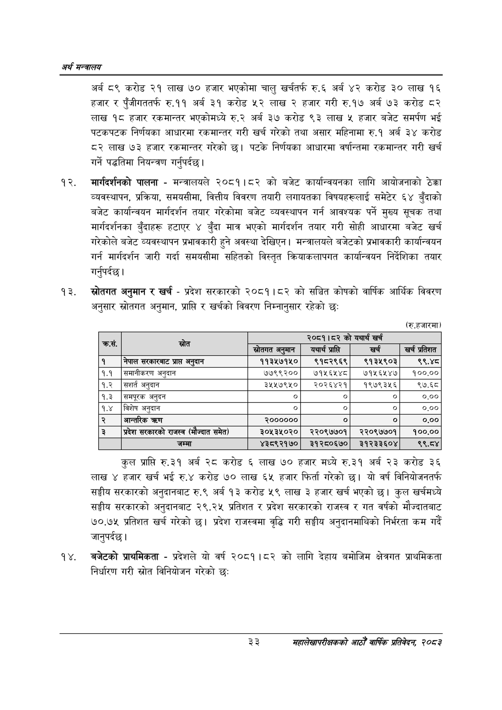

# Page 55 QA

## Rendered page


## Extracted text

```text
अर्थ सन्वबालय
अर्ब ८९ करोड २१ लाख ७० हजार भएकोमा चालु खर्चतर्फ रु.६ अर्ब ४२ करोड ३० लाख १६ हजार र पुँजीगततर्फ रु.११ अर्ब ३१ करोड ५२ लाख २ हजार गरी रु.१७ अर्ब ७३ करोड ८२ लाख १८ हजार रकमान्तर भएकोमध्ये रु.२ अर्ब ३७ करोड ९३ लाख ५ हजार बजेट समर्पण भई पटकपटक निर्णयका आधारमा रकमान्तर गरी खर्च गरेको तथा असार महिनामा रु.१ अर्ब ३४ करोड ८२ लाख ७३ हजार रकमान्तर गरेको | पटके निर्णयका आधारमा वर्षान्तमा रकमान्तर गरी खर्च गर्ने पद्धतिमा नियन्त्रण गर्नुपर्दछ |
मार्गदर्शनको पालना -मन्त्रालयले २०८१।८२ को बजेट कार्यान्वयनका लागि आयोजनाको ठेक्का व्यवस्थापन, प्रक्रिया, समयसीमा, वित्तीय विवरण तयारी लगायतका विषयहरूलाई समेटेर ६४ बुँदाको बजेट कार्यान्वयन मार्गदर्शन तयार गरेकोमा बजेट व्यवस्थापन गर्न आवश्यक पर्ने मुख्य सूचक तथा मार्गदर्शनका बुँदाहरू हटाएर ४ बुँदा मात्र भएको मार्गदर्शन तयार गरी सोही आधारमा बजेट खर्च गरेकोले बजेट व्यवस्थापन प्रभावकारी हुने अवस्था देखिएन। मन्त्रालयले बजेटको प्रभावकारी कार्यान्वयन गर्न मार्गदर्शन जारी गर्दा समयसीमा सहितको विस्तृत क्रियाकलापगत कार्यान्वयन निर्देशिका तयार गर्नुपर्दछ |
स्रोतगत अनुमान र खर्च -प्रदेश सरकारको २०८१।८२ को सञ्चित कोषको वार्षिक आर्थिक विवरण अनुसार स्रोतगत अनुमान, प्राप्ति र खर्चको विवरण निम्नानुसार रहेको छः
(रु.हजारमा)
कुल प्राप्ति रु.३१ अर्ब २८ करोड ६ लाख ७० हजार मध्ये रु.३१ अर्ब २३ करोड ३६ लाख ४ हजार खर्च भई रु.४ करोड ७० लाख ६५ हजार फिर्ता गरेको छ। यो वर्ष विनियोजनतर्फ सङ्घीय सरकारको अनुदानबाट रु.९ अर्ब १३ करोड ५९ लाख ३ हजार खर्च भएको छ। कुल खर्चमध्ये सङ्घीय सरकारको अनुदानबाट २९.२५ प्रतिशत र प्रदेश सरकारको राजस्व र गत वर्षको मौज्दातबाट ७०.७५ प्रतिशत खर्च गरेको | प्रदेश राजस्वमा वृद्धि गरी सङ्घीय अनुदानमाथिको निर्भरता कम गर्दै जानुपर्दछ |
बजेटको प्राथमिकता -प्रदेशले यो वर्ष २०८१।८२ को लागि देहाय बमोजिम क्षेत्रगत प्राथमिकता निर्धारण गरी स्रोत विनियोजन गरेको छः
३३
महालेखापरीक्षकको आठौ वाषिकि प्रतिवेदन २०८२

| र) | लल |  | २०८१।८२ को | यथार्थ खर्च |  |
| --- | --- | --- | --- | --- | --- |
|  |  | स्रोतगत अनुमान | यथार्थ प्राप्ति | खर्च | खर्च प्रतिशत |
| १ | नेपाल प्राप्त अनुदान | ११३५७१५० | ९१८२९६९ | ९१३५९०३ | ९९,४८ |
| १.१ | समानीकरण अनुदान | ७७९९२०० | ७१५६४५४८ | ७१५६५४७ | १००.०० |
| १.२ | सशार्त अनुदान | ३५५७९५० | २०२६४२१ | १९७९३४५६ | ९७.६८ |
| १.३ | समपूरक अनुदन | ० | ० | ० | ०.०० |
| १.४ | विशेष अनुदान | ० | ० | ० | ०.०० |
| २ | जान्तरिक | २०००००० | ० | ० | ०.०० |
| ३ | प्रदेश सरक५९को राजस्व (मौज्दात समेत) | ३०५३५०२० | २२०९७७०१ | २२०९७७०१ | १००.०० |
|  | जम्मा | ४३८९२१७० | ३१२८०६७० | ३१२३३६०४ | ९९.८४ |
```

## Flags
- table_page
- medium_quality_table
