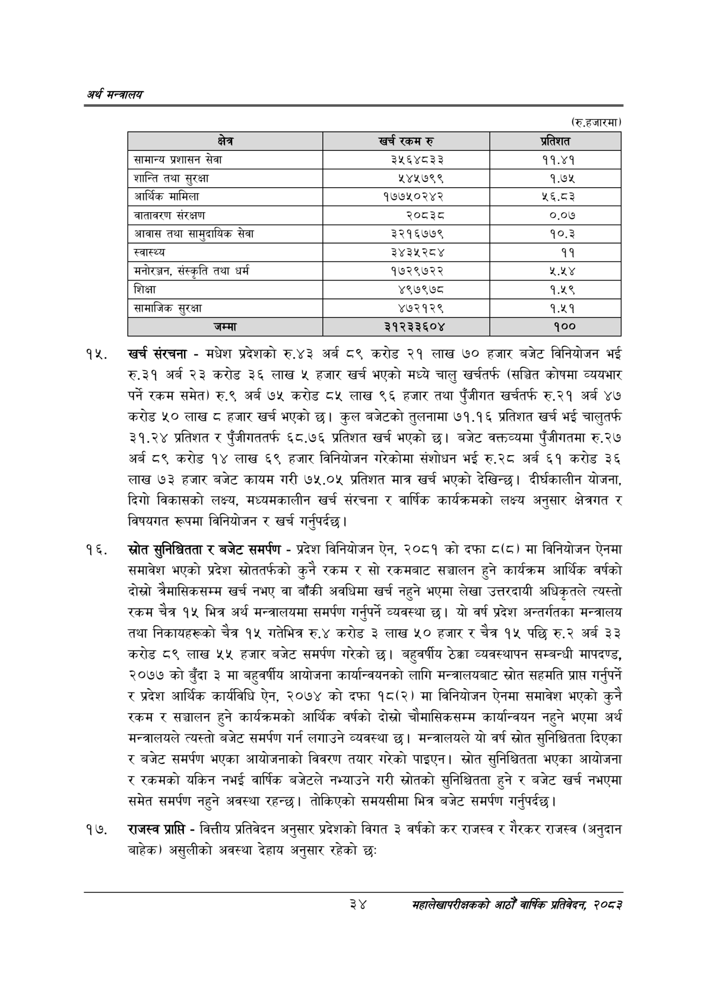

# Page 56 QA

## Rendered page


## Extracted text

```text
अर्थ सन्वबालय
(रु.हजारमा)
खर्च संरचना -मधेश प्रदेशको रु.४३ अर्ब ८९ करोड २१ लाख ७० हजार बजेट विनियोजन भई रु.३१ अर्ब २३ करोड ३६ लाख ५ हजार खर्च भएको मध्ये चालु खर्चतर्फ (सञ्चित कोषमा व्ययभार पर्ने रकम समेत) रु.९ अर्ब ७५ करोड ८५ लाख ९६ हजार तथा पुँजीगत खर्चतर्फ रु.२१ अर्ब ४७ करोड ५० लाख ८ हजार खर्च भएको | कुल बजेटको तुलनामा ७१.१६ प्रतिशत खर्च भई चालुतर्फ ३१.२४ प्रतिशत र पुँजीगततर्फ ६८.७६ प्रतिशत खर्च भएको छ। बजेट वक्तव्यमा पुँजीगतमा रु.२७ अर्ब ८९ करोड १४ लाख ६९ हजार विनियोजन गरेकोमा संशोधन भई रु.२८ अर्ब ६१ करोड ३६ लाख ७३ हजार बजेट कायम गरी ७५.०५ प्रतिशत मात्र खर्च भएको देखिन्छ। दीर्घकालीन योजना, दिगो विकासको लक्ष्य, मध्यमकालीन खर्च संरचना र वार्षिक कार्यक्रमको लक्ष्य अनुसार क्षेत्रगत र विषयगत रूपमा विनियोजन र खर्च गर्नुपर्दछ।
स्रोत सुनिश्चितता र बजेट समर्पण -प्रदेश विनियोजन ऐन, २०८१ को दफा ८(८) मा विनियोजन ऐनमा समावेश भएको प्रदेश स्रोततर्फको कुनै रकम र सो रकमबाट सञ्चालन हुने कार्यक्रम आर्थिक वर्षको दोस्रो त्रैमासिकसम्म खर्च नभए वा बाँकी अवधिमा खर्च नहुने भएमा लेखा उत्तरदायी अधिकृतले त्यस्तो रकम चैत्र १५ भित्र अर्थ मन्त्रालयमा समर्पण गर्नुपर्ने व्यवस्था छ। यो वर्ष प्रदेश अन्तर्गतका मन्त्रालय तथा निकायहरूको चैत्र १५ गतेभित्र रु.४ करोड ३ लाख ५० हजार र चैत्र १५ पछि रु.२ अर्ब ३३ करोड ८९ लाख ५५ हजार बजेट समर्पण गरेको छ। बहुवर्षीय ठेक्का व्यवस्थापन सम्बन्धी मापदण्ड, २०७७ को बुँदा ३ मा बहुवर्षीय आयोजना कार्यान्वयनको लागि मन्त्रालयबाट स्रोत सहमति प्राप्त गर्नुपर्ने र प्रदेश आर्थिक कार्यविधि ऐन, २०७४ को दफा १८(२) मा विनियोजन ऐनमा समावेश भएको कुनै रकम र सञ्चालन हुने कार्यक्रमको आर्थिक वर्षको दोस्रो चौमासिकसम्म कार्यान्वयन नहुने भएमा अर्थ मन्त्रालयले त्यस्तो बजेट समर्पण गर्न लगाउने व्यवस्था छ। मन्त्रालयले यो वर्ष स्रोत सुनिश्चितता दिएका र बजेट समर्पण भएका आयोजनाको विवरण तयार गरेको पाइएन। स्रोत सुनिश्चितता भएका आयोजना र रकमको यकिन नभई वार्षिक बजेटले नभ्याउने गरी स्रोतको सुनिश्चितता हुने र बजेट खर्च नभएमा समेत समर्पण नहुने अवस्था रहन्छ। तोकिएको समयसीमा भित्र बजेट समर्पण गर्नुपर्दछ |
राजस्व प्राप्ति -वित्तीय प्रतिवेदन अनुसार प्रदेशको विगत ३ वर्षको कर राजस्व र गैरकर राजस्व (अनुदान बाहेक) असुलीको अवस्था देहाय अनुसार रहेको छः
३४
महालेखापरीक्षकको आठौ वाषिकि प्रतिवेदन २०८२

| क्षेत्र | खर्च रकम रु | प्रतिशत |
| --- | --- | --- |
| सामान्य प्रशासन सेवा | ३५६४८३३ | ११.४१ |
| शान्ति तथा सुरक्षा | ५४५७९९ | १.७५ |
| आर्थिक मामिला | १७७५०२४२ | ५६.८३ |
| वातावरण संरक्षण | २०८३८ | ०.०७ |
| आवास तथा सासुदाथिक सेवा | ३२१६७७९ | १०.३ |
| स्वास्थ्य | ३४३५२८४ | ११ |
| मनोरञ्जन, संस्कृति तथा धर्म | १७२९७२२ |  |
| शिक्षा | ४९७९७८ | ९.४% |
| सामाजिक सुरक्षा | ४७२१२९ | १.४५१ |
| जम्मा | ३१२३३६०४ | १०० |
```

## Flags
- table_page
- medium_quality_table
