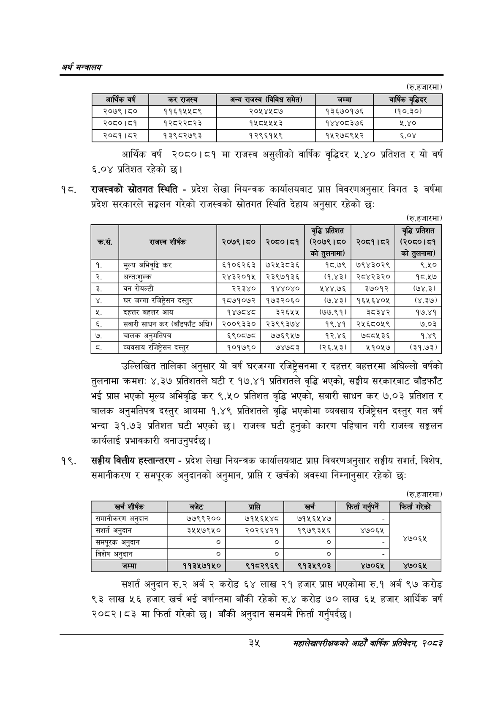

# Page 57 QA

## Rendered page


## Extracted text

```text
अर्थ सन्वबालय
(रु.हजारमा)
आर्थिक वर्ष २०८०।८१ मा राजस्व असुलीको वार्षिक वृद्धिदर ५.४० प्रतिशत र यो वर्ष ६,००४ प्रतिशत रहेको
प्रदेश सरकारले सङ्कलन गरेको राजस्वको स्रोतगत स्थिति देहाय अनुसार रहेको छः राजस्वको स्रोतगत स्थिति -प्रदेश लेखा नियन्त्रक कार्यालयबाट प्राप्त विवरणअनुसार विगत ३ वर्षमा
(रु.हजारमा)
उल्लिखित तालिका अनुसार यो वर्ष घरजग्गा रजिषट्रेसनमा र दहत्तर बहत्तरमा अघिल्लो वर्षको तुलनामा क्रमशः ४. ३७ प्रतिशतले घटी र १७.४१ प्रतिशतले वृद्धि भएको, सङ्घीय सरकारबाट बाँडफाँट भई प्राप्त भएको मूल्य अभिवृद्धि कर ९.५० प्रतिशत वृद्धि भएको, सवारी साधन कर ७.०३ प्रतिशत र चालक अनुमतिपत्र दस्तुर आयमा १.४९ प्रतिशतले वृद्धि भएकोमा व्यवसाय रजिष्ट्रेसन दस्तुर गत वर्ष भन्दा ३१.७३ प्रतिशत घटी भएको छ। राजस्व घटी हुनुको कारण पहिचान गरी राजस्व सङ्कलन कार्यलाई प्रभावकारी बनाउनुपर्दछ।
सङ्घीय वित्तीय हस्तान्तरण -प्रदेश लेखा नियन्त्रक कार्यालयबाट प्राप्त विवरणअनुसार सङ्घीय सशर्त, विशेष, समानीकरण र समपूरक अनुदानको अनुमान, प्राप्ति र खर्चको अवस्था निम्नानुसार रहेको छः
(रु.हजारमा)
कित
गरको
सशर्त अनुदान रु.२ अर्ब २ करोड ६४ लाख २१ हजार प्राप्त भएकोमा रु.१ अर्ब ९७ करोड ९३ लाख ५६ हजार खर्च भई वर्षान्तमा बाँकी रहेको रु.४ करोड ७० लाख ६५ हजार आर्थिक वर्ष २०८२।८३ मा फिर्ता गरेको छ। बाँकी अनुदान समयमै फिर्ता गर्नुपर्दछ |
३५
महालेखापरीक्षकको आठौ वाषिकि प्रतिवेदन २०८२

| आर्थिक वर्ष | 'कर राजस्व | अन्य राजस्व (विविध समेत) | जम्मा | वार्षिक वृद्धिदर |
| --- | --- | --- | --- | --- |
| २०७९।८० | ११६१५५८९ | २०५४५८७ | १३६७०१७६ | (१०.३०) |
| २०८०।८१ | १२८२२८२३ | १५८४५४५५३ | १४४०८३७६ | २.४० |
| २०८१।५२ | १३९८२७९३ | १२९६१५९ | १५२७८९५२ | ६.०४ |

| कस. | राजस्व शीर्षक | २०७९।८० | २०८०।८१ | वृद्धि प्रतिशत (२०७९।८० को ट्लनामा) | २०८१।८२ | वृद्धि प्रतिशत (२०८०।८१ को हूलनामा) |
| --- | --- | --- | --- | --- | --- | --- |
| १. | मूल्य अभिवृद्धि कर | ६१०६२६३ | ७२५३८३६ | १८.७९ | ७९४३०२९ | ९.५० |
| २. | अन्त-शुल्क | २४३२०१५ | २३९७१३६ | (१.४३) | २८४२३२० | १८.१७ |
| डे. | वन रोयल्टी | २२३४० | १४४०४० | १४४.७६ | ३७०१२ | (७४.३) |
|  | घर जग्गा रजिषट्रेधण दस्तुर | १८७१०७२ | १७३२०६० | (७.४३। | १६५६४०४५ | (४.३७। |
| न. | दहत्तर बहत्तर आय | १४७८४८ | ३ | (७७.९१। | ३८३४२ | १७.४१ |
|  | सवारी साधन कर (बाँडफाँट अघि) | २००९३३० | २३९९३७४ | १९.४१ | २४५६८०५९ | ७.०३ |
| ७. | चालक अनुमतिपत्र | ६९०८७८ | ७७६९५७ | १२.४६ | ७८८५३६ | १.४९ |
|  | व्यवसाय रजिष्ट्रेसन दस्तुर | १०१७९० | ७४७८३ | (२६.५३। | ५१०५७ | (३१.७३। |

| खर्च शीर्षक | 'बजेट | प्राप्ति | खर्च | फिर्ता गन्पर्ने | फिर्ता गरेको |
| --- | --- | --- | --- | --- | --- |
| समानीकरण अनुदान | ७७९९२०० | ७१५६५४८ | ७१५६४५४७ |  |  |
| सशर्त अनुदान | ३५५७९५० | २०२६४२१ | १९७९३४५६ | ४७०६५ |  |
| समपूरक अनुदान | ० | ० | ० |  | ४७०६ |
| विशेष अनुदान | ० |  | ० |  |  |
| जम्मा | ११३५७१५० | ९१८२९६९ | ९१३५९०३ | ४७०६५ | ४७०६५ |
```

## Flags
- table_page
- medium_quality_table
