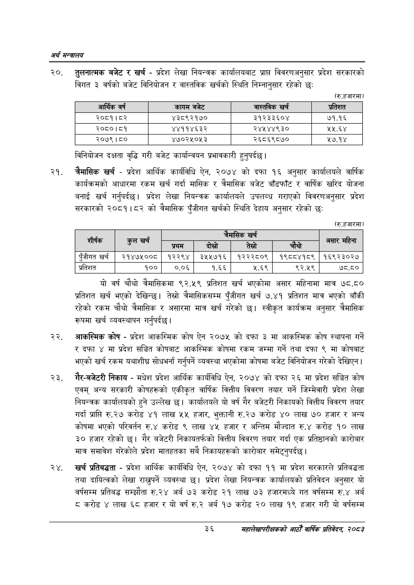

# Page 58 QA

## Rendered page


## Extracted text

```text
अर्थ सन्वबालय
२०, तुलनात्मक बजेट र खर्च -प्रदेश लेखा नियन्त्रक कार्यालयबाट प्राप्त विवरणअनुसार प्रदेश सरकारको विगत ३ वर्षको बजेट विनियोजन र वास्तविक खर्चको स्थिति निम्नानुसार रहेको छः
(रु.हजारमा)
विनियोजन दक्षता वृद्धि गरी बजेट कार्यान्वयन प्रभावकारी हुनुपर्दछ |
चैमासिक खर्च -प्रदेश आर्थिक कार्यविधि ऐन, २०७४ को दफा १६ अनुसार कार्यालयले वार्षिक कार्यक्रमको आधारमा रकम खर्च गर्दा मासिक र त्रैमासिक बजेट बाँडफाँट र वार्षिक खरिद योजना बनाई खर्च गर्नुपर्दछ। प्रदेश लेखा नियन्त्रक कार्यालयले उपलब्ध गराएको विवरणअनुसार प्रदेश सरकारको २०८१।८२ को त्रैमासिक पुँजीगत खर्चको स्थिति देहाय अनुसार रहेको छः
(रु.हजारमा)
यो वर्ष चौथो त्रैमासिकमा ९२.५९ प्रतिशत खर्च भएकोमा असार महिनामा मात्र ७८,.८० प्रतिशत खर्च भएको देखिन्छ। तेस्रो त्रैमासिकसम्म पुँजीगत खर्च ७.४१ प्रतिशत मात्र भएको बाँकी रहेको रकम चौथो त्रैमासिक र असारमा मात्र खर्च गरेको छ। स्वीकृत कार्यक्रम अनुसार त्रैमासिक रूपमा खर्च व्यवस्थापन गर्नुपर्दछ |
आकस्मिक कोष -प्रदेश आकस्मिक कोष ऐन २०७५ को दफा ३ मा आकस्मिक कोष स्थापना गर्ने रदफा ४ मा प्रदेश सञ्चित कोषबाट आकस्मिक कोषमा रकम जम्मा गर्ने तथा दफा ९ मा कोषबाट भएको खर्च रकम यथाशीघ्र सोधभर्ना गर्नुपर्ने व्यवस्था भएकोमा कोषमा बजेट विनियोजन गरेको देखिएन |
शैर-बजेटरी निकाय -मधेश प्रदेश आर्थिक कार्यविधि ऐन, २०७४ को दफा २६ मा प्रदेश सञ्चित कोष एवम्‌ अन्य सरकारी कोषहरूको एकीकृत वार्षिक वित्तीय विवरण तयार गर्ने जिम्मेवारी प्रदेश लेखा नियन्त्रक कार्यालयको हुने उल्लेख | कार्यालयले यो वर्ष गैर बजेटरी निकायको वित्तीय विवरण तयार गर्दा प्राप्ति रु.२७ करोड ४१ लाख ५५ हजार, भुक्तानी रु.२७ करोड ४० लाख ७० हजार र अन्य कोषमा भएको परिवर्तन रु.४ करोड ९ लाख ४५ हजार र अन्तिम मौज्दात रु.४ करोड १० लाख ३० हजार रहेको छ। गैर बजेटरी निकायतर्फको वित्तीय विवरण तयार गर्दा एक प्रतिष्ठानको कारोबार मात्र समावेश गरेकोले प्रदेश मातहतका सबै निकायहरूको कारोबार समेट्नुपर्दछ।
२४, खर्च प्रतिबद्धता -प्रदेश आर्थिक कार्यविधि ऐन, २०७४ को दफा ११ मा प्रदेश सरकारले प्रतिबद्धता तथा दायित्वको लेखा राख्नुपर्ने व्यवस्था छ। प्रदेश लेखा नियन्त्रक कार्यालयको प्रतिवेदन अनुसार यो वर्षसम्म प्रतिबद्ध सम्झौता रु.२४ अर्ब ७३ करोड २१ लाख ७३ हजारमध्ये गत वर्षसम्म रु.४ अर्ब ८ करोड लाख ६८ हजार र यो वर्ष रु.२ अर्ब १७ करोड ० लाख १९ हजार गरी यो वर्षसम्म
३६
महालेखापरीक्षकको आठौ वाषिकि प्रतिवेदन २०८२

| आर्थिक वर्ष | 'कायम बजेट | बास्तनेक खरी | प्रतिशत |
| --- | --- | --- | --- |
| २०८१।८२ | ४३८९२१७० | ३१२३३६०४ | ७१.१६ |
| २०८०।८१ | ४४११४६३२ | २४५४४९३० |  |
| २०७९।८० | ४७०२५०५३ | २६८६९८७० | २७.१४ |

|  | खर्च |  |  | छा |  | महिना |
| --- | --- | --- | --- | --- | --- | --- |
| शीर्षक | तल | प्रम | बोस्रो | तेस्रो | . चंबो | जिसार |
| पुँजीगत खर्च | २१४७५००८ | १२२९४ | ३५५७१६ | १२२२८०९ | १९८८४१८९ | १६९२३०२७ |
| प्रतिशत | १०० | ०.०६ | १.६६ | ५.६९ | ९२.५९ | ७८.८० |
```

## Flags
- table_page
- medium_quality_table
