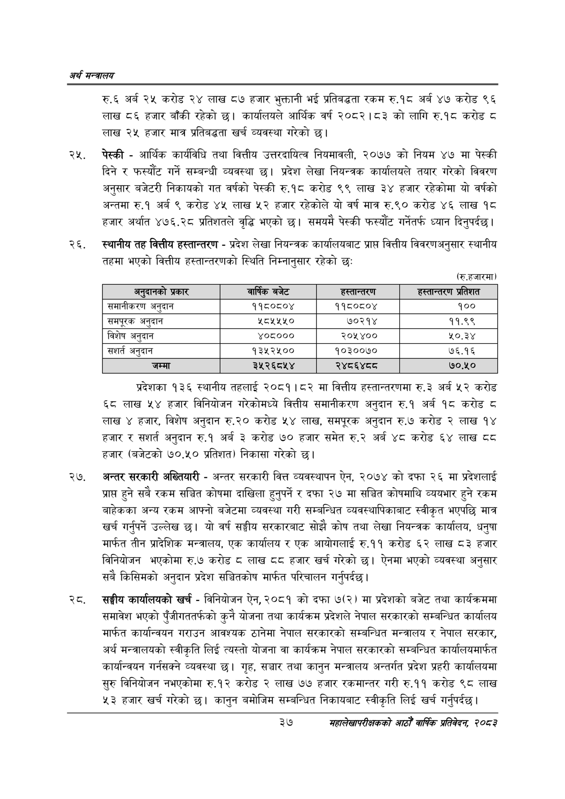

# Page 59 QA

## Rendered page


## Extracted text

```text
अर्थ सन्वबालय
रु.६ अर्ब २५ करोड २४ लाख ८७ हजार भुक्तानी भई प्रतिबद्धता रकम रु.१८ अर्ब ४७ करोड ९६ लाख ८६ हजार बाँकी रहेको छ। कार्यालयले आर्थिक वर्ष २०८२।८३ को लागि रु.१८ करोड ८ लाख २५ हजार मात्र प्रतिबद्धता खर्च व्यवस्था गरेको छ।
पेस्की -आर्थिक कार्यविधि तथा वित्तीय उत्तरदायित्व नियमावली, २०७७ को नियम ४७ मा पेस्की दिने र फस्यौट गर्ने सम्बन्धी व्यवस्था छ। प्रदेश लेखा नियन्त्रक कार्यालयले तयार गरेको विवरण अनुसार बजेटरी निकायको गत वर्षको पेस्की रु.१८ करोड ९९ लाख ३४ हजार रहेकोमा यो वर्षको अन्तमा रु.१ अर्ब ९ करोड ४५ लाख ५२ हजार रहेकोले यो वर्ष मात्र रु.९० करोड ४६ लाख १८ हजार अर्थात ४७६,.२८ प्रतिशतले वृद्धि भएको छ। समयमै पेस्की फस्यौट गर्नेतर्फ ध्यान दिनुपर्दछ |
स्थानीय तह वित्तीय हस्तान्तरण -प्रदेश लेखा नियन्त्रक कार्यालयबाट प्राप्त वित्तीय विवरणअनुसार स्थानीय तहमा भएको वित्तीय हस्तान्तरणको स्थिति निम्नानुसार रहेको छः
(रु.हजारमा)
प्रदेशका १३६ स्थानीय तहलाई २०८१।८२ मा वित्तीय हस्तान्तरणमा रु.३ अर्ब ५२ करोड ६८ लाख ५४ हजार विनियोजन गरेकोमध्ये वित्तीय समानीकरण अनुदान रु.१ अर्ब १८ करोड ८ लाख ४ हजार, विशेष अनुदान रु.२० करोड ५४ लाख, समपूरक अनुदान रु.७ करोड २ लाख १४ हजार र संशर्त अनुदान रु.१ अर्ब ३ करोड ७० हजार समेत अर्ब ४८ करोड ६४ लाख ठठ हजार (बजेटको ७०.५० प्रतिशत) निकासा गरेको |
२७, अन्तर सरकारी अख्तियारी -अन्तर सरकारी वित्त व्यवस्थापन ऐन, २०७४ को दफा २६ मा प्रदेशलाई प्राप्त हुने सबै रकम सञ्चित कोषमा दाखिला हुनुपर्ने र दफा २७ मा सञ्चित कोषमाथि व्ययभार हुने रकम बाहेकका अन्य रकम आफ्नो बजेटमा व्यवस्था गरी सम्बन्धित व्यवस्थापिकाबाट स्वीकृत भएपछि मात्र खर्च गर्नुपर्ने उल्लेख छु। यो वर्ष सङ्घीय सरकारबाट सोझै कोष तथा लेखा नियन्त्रक कार्यालय, धनुषा मार्फत तीन प्रादेशिक मन्त्रालय, एक कार्यालय र एक आयोगलाई रु.११ करोड ६२ लाख ८३ हजार विनियोजन भएकोमा रु.७ करोड ८ लाख ८ हजार खर्च गरेको छ। ऐनमा भएको व्यवस्था अनुसार सबै किसिमको अनुदान प्रदेश सञ्चितकोष मार्फत परिचालन गर्नुपर्दछ।
सङ्घीय कार्यालयको खर्च -विनियोजन ऐन, २०८१ को दफा ७(२) मा प्रदेशको बजेट तथा कार्यक्रममा समावेश भएको पुँजीगततर्फको कुनै योजना तथा कार्यक्रम प्रदेशले नेपाल सरकारको सम्बन्धित कार्यालय मार्फत कार्यान्वयन गराउन आवश्यक ठानेमा नेपाल सरकारको सम्बन्धित मन्त्रालय र नेपाल सरकार, अर्थ मन्त्रालयको स्वीकृति लिई त्यस्तो योजना वा कार्यक्रम नेपाल सरकारको सम्बन्धित कार्यालयमार्फत कार्यान्वयन गर्नसक्ने व्यवस्था छ। गृह, सञ्चार तथा कानुन मन्त्रालय अन्तर्गत प्रदेश प्रहरी कार्यालयमा सुरु विनियोजन नभएकोमा रु.१२ करोड २ लाख ७७ हजार रकमान्तर गरी रु.११ करोड ९८ लाख ३ हजार खर्च गरेको | कानुन बमोजिम सम्बन्धित निकायबाट स्वीकृति लिई खर्च गर्नुपर्दछ।
३७
महालेखापरीक्षकको आठौ वाषिकि प्रतिवेदन २०८२

| अर्‌ दानको प्रकार | चाष्कि बजेट | हस्तान्तरण | हस्तान्तरण प्रतिशत |
| --- | --- | --- | --- |
| समानीकरण अनुदान | ११८०८०४ | ११८०८०४ | १०० |
| खसनपूरक अनुदान | २८०५५४५० | ७०२१४ | ११.९९ |
| विशेष अनुदान | ४०८००० | २०५४०० | ५०.३४ |
| संशर्त अनुदान | १३५२५०० | १०३००७० | ७६.१६ |
```

## Flags
- table_page
- medium_quality_table
