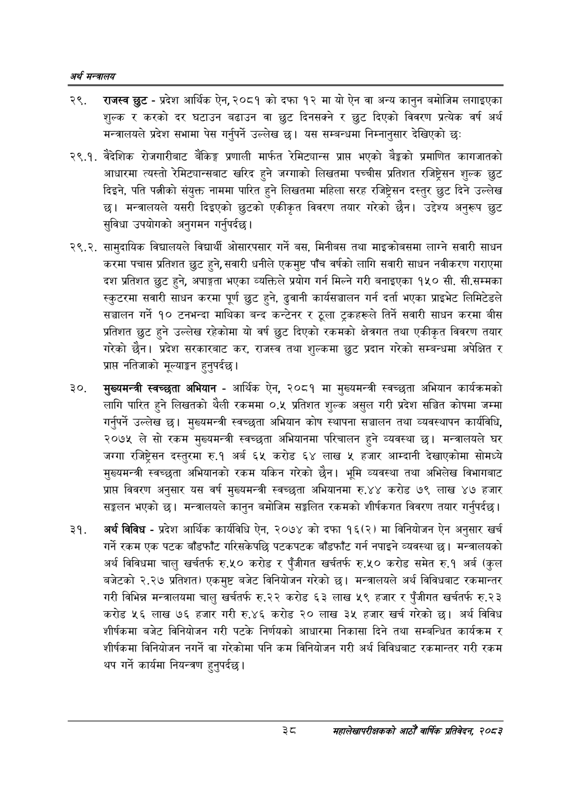

# Page 60 QA

## Rendered page


## Extracted text

```text
अर्थ सन्वबालय
राजस्व छुट -प्रदेश आर्थिक ऐन, २०८१ को दफा १२ मा यो ऐन वा अन्य कानुन बमोजिम लगाइएका शुल्क र करको दर घटाउन बढाउन वा छुट दिनसक्ने र छुट दिएको विवरण प्रत्येक वर्ष अर्थ मन्त्रालयले प्रदेश सभामा पेस गर्नुपर्ने उल्लेख छ। यस सम्बन्धमा निम्नानुसार देखिएको छः
२९.१. वैदेशिक रोजगारीबाट बैंकिङ्ग प्रणाली मार्फत रेमिट्यान्स प्रापत भएको बेङ्को प्रमाणित कागजातको आधारमा त्यस्तो रेमिट्यान्सबाट खरिद हुने जग्गाको लिखतमा पच्चीस प्रतिशत रजिष्ट्रेसन शुल्क छुट दिइने, पति पत्नीको संयुक्त नाममा पारित हुने लिखतमा महिला सरह रजिष्ट्रेसन दस्तुर छुट दिने उल्लेख छ। मन्त्रालयले यसरी दिइएको छुटको एकीकृत विवरण तयार गरेको छैन। उद्देश्य अनुरूप छुट सुविधा उपयोगको अनुगमन गर्नुपर्दछ |
२९.२. सामुदायिक विद्यालयले विद्यार्थी ओसारपसार गर्ने बस, मिनीबस तथा माइक्रोबसमा लाग्ने सवारी साधन करमा पचास प्रतिशत छुट हुने, सवारी धनीले एकमुष्ट पाँच वर्षको लागि सवारी साधन नवीकरण गराएमा दश प्रतिशत छुट हुने, अपाङ्गता भएका व्यक्तिले प्रयोग गर्न मिल्ने गरी बनाइएका १५० सी. सी.सम्मका स्कुटरमा सवारी साधन करमा पूर्ण छुट हुने, ढुवानी कार्यसञ्चालन गर्न दर्ता भएका प्राइभेट लिमिटेडले सञ्चालन गर्ने १० टनभन्दा माथिका बन्द कन्टेनर र ठूला ट्रकहरूले तिर्ने सवारी साधन करमा बीस प्रतिशत छुट हुने उल्लेख रहेकोमा यो वर्ष छुट दिएको रकमको क्षेत्रगत तथा एकीकृत विवरण तयार गरेको छैन। प्रदेश सरकारबाट कर, राजस्व तथा शुल्कमा छुट प्रदान गरेको सम्बन्धमा अपेक्षित र प्राप्त नतिजाको मूल्याङ्कन हुनुपर्दछ |
मुख्यमन्त्री स्वच्छुता अभियान -आर्थिक ऐन, २०८१ मा मुख्यमन्त्री स्वच्छुता अभियान कार्यक्रमको लागि पारित हुने लिखतको थैली रकममा ०.५ प्रतिशत शुल्क असुल गरी प्रदेश सञ्चित कोषमा जम्मा गर्नुपर्ने उल्लेख | मुख्यमन्त्री स्वचच्छुता अभियान कोष स्थापना सञ्चालन तथा व्यवस्थापन कार्यविधि, २०७५ ले सो रकम मुख्यमन्त्री स्वच्छता अभियानमा परिचालन हुने व्यवस्था छ। मन्त्रालयले घर जग्गा रजिष्ट्रेसन दस्तुरमा रु.१ अर्ब ६५ करोड ६४ लाख ५ हजार आम्दानी देखाएकोमा सोमध्ये मुख्यमन्त्री स्वच्छुता अभियानको रकम यकिन गरेको छैन। भूमि व्यवस्था तथा अभिलेख विभागबाट प्रापत विवरण अनुसार यस वर्ष मुख्यमन्त्री स्वचच्छुता अभियानमा रु.४४ करोड ७९ लाख ४७ हजार सङ्कलन भएको | मन्त्रालयले कानुन बमोजिम सङ्गलित रकमको शीर्षकगत विवरण तयार गर्नुपर्दछ।
अर्थ विविध -प्रदेश आर्थिक कार्यविधि ऐन, २०७४ को दफा १६(२) मा विनियोजन ऐन अनुसार खर्च गर्ने रकम एक पटक बाँडफाँट गरिसकेपछि पटकपटक बाँडफाँट गर्न नपाइने व्यवस्था छ। मन्त्रालयको अर्थ विविधमा चालु खर्चतर्फ रु.५० करोड र पुँजीगत खर्चतर्फ रु.५० करोड समेत रु.१ अर्ब (कुल बजेटको २.२७ प्रतिशत) एकमुष्ट बजेट विनियोजन गरेको छ। मन्त्रालयले अर्थ विविधबाट रकमान्तर गरी विभिन्न मन्त्रालयमा चालु खर्चतर्फ रु.२२ करोड ६३ लाख ५९ हजार र पुँजीगत खर्चतर्फ रु.२३ करोड ५६ लाख ७६ हजार गरी रु.४६ करोड २० लाख ३५ हजार खर्च गरेको छ। अर्थ विविध शीर्षकमा बजेट विनियोजन गरी पटके निर्णयको आधारमा निकासा दिने तथा सम्बन्धित कार्यक्रम र शीर्षकमा विनियोजन नगर्ने वा गरेकोमा पनि कम विनियोजन गरी अर्थ विविधबाट रकमान्तर गरी रकम थप गर्ने कार्यमा नियन्त्रण हुनुपर्दछ |
श्ट
महालेखापरीक्षकको आठौ वाषिकि प्रतिवेदन २०८२
```

## Flags
- None
