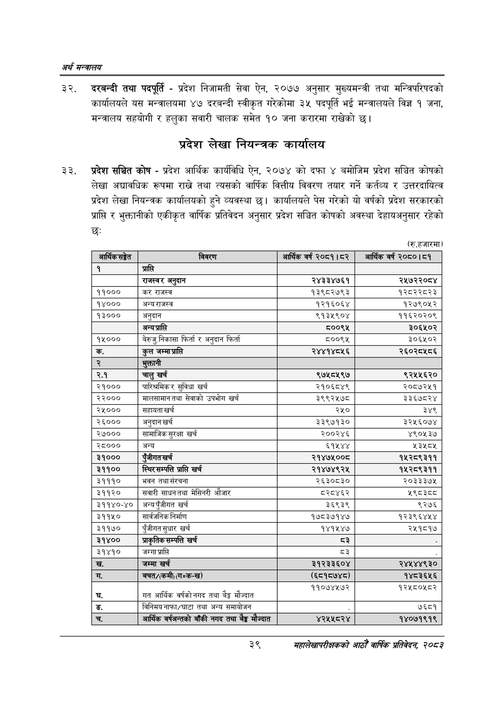

# Page 61 QA

## Rendered page


## Extracted text

```text
अर्थ सन्वबालय
दरबन्दी तथा पदपूर्ति -प्रदेश निजामती सेवा ऐन, २०७७ अनुसार मुख्यमन्त्री तथा मन्त्रिपरिषदको कार्यालयले यस मन्त्रालयमा ४७ दरबन्दी स्वीकृत गरेकोमा ३५ पदपूर्ति भई मन्त्रालयले विज्ञ १ जना, मन्त्रालय सहयोगी र हलुका सवारी चालक समेत १० जना करारमा राखेको छ।
प्रदेश लेखा नियन्त्रक कार्यालय
प्रदेश सञ्चित कोष -प्रदेश आर्थिक कार्यविधि ऐन, २०७४ को दफा ४ बमोजिम प्रदेश सञ्चित कोषको लेखा अद्यावधिक रूपमा राख्ने तथा त्यसको वार्षिक वित्तीय विवरण तयार गर्ने कर्तव्य र उत्तरदायित्व प्रदेश लेखा नियन्त्रक कार्यालयको हुने व्यवस्था छ। कार्यालयले पेस गरेको यो वर्षको प्रदेश सरकारको प्राप्ति र भुक्तानीको एकीकृत वार्षिक प्रतिवेदन अनुसार प्रदेश सञ्चित कोषको अवस्था देहायअनुसार रहेको छः
(रु.हजारमा)
३
महालेखापरीक्षकको वाषिकि प्रतिवेदन २०८२

| आर्थिक सङ्केत | विवरण | आर्थिक वर्ष २०८१।८२ | आर्थिक वर्ष २०८०।८१ |
| --- | --- | --- | --- |
| १ | प्राप्ति |  |  |
|  | 'राजस्वर अनुदान | २४३३४७६१ | २५७२२०८४ |
| ११००० | कर राजस्व | १३९८२७९३ | १२८२२८२३ |
| १४००० | अन्यराजस्व | १२१६०६४ | १२७९०५२ |
| १३००० | अनुदान | ९१३५९०४ | ११६२०२०९ |
|  | अन्य श्राति | ००९५ | ३०६५०२ |
| १५००० | बेरुजु,.निकासा फिर्ता र अनुदान फिर्ता | ८००९५ | ३०६४५०२ |
| क. | कुल | २४४१४८५६ | २६०२८४५८६ |
| र्‌ | भुक्तानी |  |  |
| २.१ | चालु खर्च | ९७५८५९७ | ९२५५६२० |
| २१००० | पारिश्रमिकर सुविधा खर्च | २१०६८४९ | २०८७२५१ |
| २२००० | मालसानानतथा सेवाको उपभोग खर्च | ३९९२५७८ | ३३६७८२४ |
| २५००० | सहायता खर्च | २५० | ३४९ |
| २६००० | अनुदान खर्च | ३३९७१३० | ३२५६०७४ |
| २७००० | सामाजिक सुरक्षा खर्च | २००२४६ | ४९०५३७ |
| २८००० | अन्य |  | २३४५८४ |
| ३१००० | चुँजोगत खर्च | २१४७५००८ | १५२८९३११ |
| ३११०० | स्वर सन्चतत प्रासि खर्च | २१४७४९२५ | १५२८९३११ |
| ३१११० | भवन तथा संरचना | २६३०८३० | २०३३३७४५ |
| ३११२० | सवारी साधनतथा मेसिनरी औजार | ८२८४६२ | ५९८३८८ |
| ३११४०-४० | अन्यपुँजीगत खर्च | ३६९३९ | ९२७६ |
| ३११५० | सार्वजनिक निर्माण | १७८३७१४७ | १२३९६४५४ |
| ३११७० | पुँजीगत सुधार खर्च | १४१५४७ | २४५१८१४ |
| ३१४०० | आकृतिक सन्पत्ति खर्च | घरे |  |
| ३१४१० | जग्गा प्राप्ति | ३ |  |
| ख. | जम्मा खर्च | २१२३३६०४ | २४४५४४९३० |
|  | 'क्चत/(कमी) (गःक-ख) | (६८१८७४८) | १४८३६५६ |
| घ. | अेङ मौज्दात गत आर्थिक वर्षको नगद तथा वैङ्क मौज्त | ११०७४५७२ | १२५८०४५८२ |
| ङ्‌. | विनिमय नाफा/घाटा तथा अन्य कमाथोजन |  | ७६८१ |
| च. | आर्थिक वर्षजन्तको बाँकी नगद तथा बैङ्क मौज्दात | ४२५५८२४ | १४०७१९१९ |
```

## Flags
- table_page
- medium_quality_table
