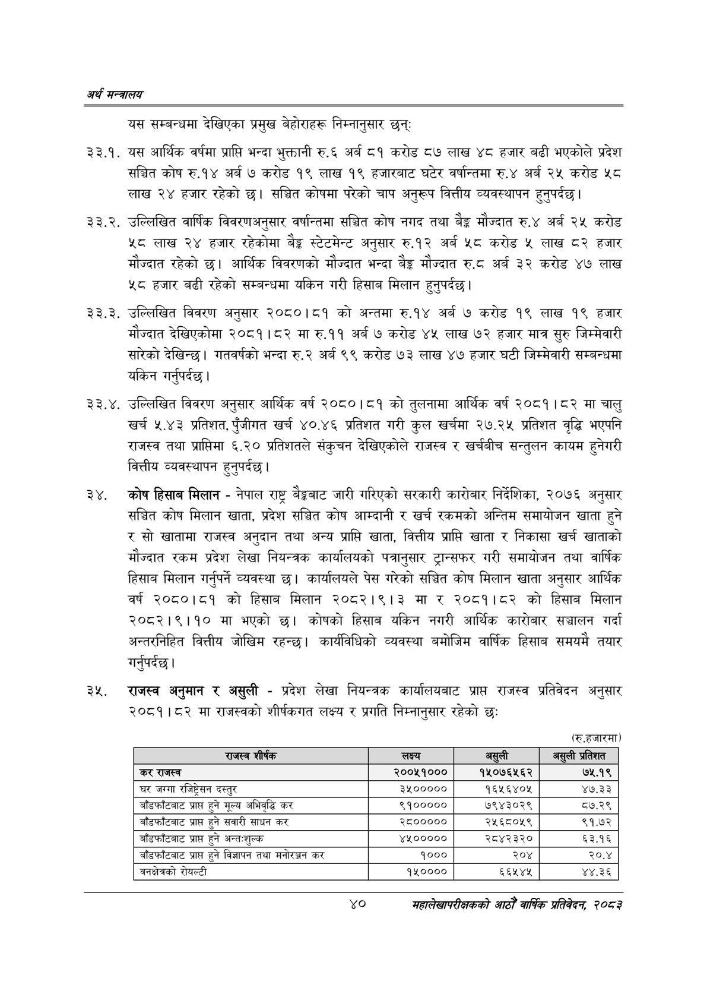

# Page 62 QA

## Rendered page


## Extracted text

```text
अर्थ सन्वबालय
यस सम्बन्धमा देखिएका प्रमुख बेहोराहरू निम्नानुसार छन्‌
३३.१. यस आर्थिक वर्षमा प्राप्ति भन्दा भुक्तानी रु.६ अर्ब ८१ करोड ८७ लाख ४८ हजार बढी भएकोले प्रदेश सञ्चित कोष रु.१४ अर्ब ७ करोड १९ लाख १९ हजारबाट घटेर वर्षान्तमा रु.४ अर्ब २५ करोड ५८ लाख २४ हजार रहेको छ। सञ्चित कोषमा परेको चाप अनुरूप वित्तीय व्यवस्थापन हुनुपर्दछ |
. उल्लिखित वार्षिक विवरणअनुसार वर्षान्तमा सञ्चित कोष नगद तथा ९३ मौज्दात रु.४ अर्ब २५ करोड ५८ लाख २४ हजार रहेकोमा बेङ्ग स्टेटमेन्ट अनुसार रु.१२ अर्ब ५८ करोड ५ लाख ८२ हजार मौज्दात रहेको छ। आर्थिक विवरणको मौज्दात भन्दा बैङ्क मौज्दात रु.८ अर्ब ३२ करोड ४७ लाख ५८ हजार बढी रहेको सम्बन्धमा यकिन गरी हिसाब मिलान हुनुपर्दछ |
. उल्लिखित विवरण अनुसार २०८०।८१ को अन्तमा रु.१४ अर्ब ७ करोड १९ लाख १९ हजार मौज्दात देखिएकोमा २०८१।८२ मा रु.११ अर्ब ७ करोड ४५ लाख ७२ हजार मात्र सुरु जिम्मेवारी सारेको देखिन्छ। गतवर्षको भन्दा रु.२ अर्ब ९९ करोड ७३ लाख ४७ हजार घटी जिम्मेवारी सम्बन्धमा यकिन गर्नुपर्दछ |
. उल्लिखित विवरण अनुसार आर्थिक वर्ष २०८०।८१ को तुलनामा आर्थिक वर्ष २०८१।८२ मा चालु खर्च ५.४३ प्रतिशत, पुँजीगत खर्च ४०.४६ प्रतिशत गरी कुल खर्चमा २७.२५ प्रतिशत वृद्धि भएपनि राजस्व तथा प्राप्तिमा ६.२० प्रतिशतले संकुचन देखिएकोले राजस्व र खर्चबीच सन्तुलन कायम हुनेगरी वित्तीय व्यवस्थापन हुनुपर्दछ |
कोष हिसाब मिलान -नेपाल राष्ट्र बैङ्कबाट जारी गरिएको सरकारी कारोबार निर्देशिका, २०७६ अनुसार सञ्चित कोष मिलान खाता, प्रदेश सञ्चित कोष आम्दानी र खर्च रकमको अन्तिम समायोजन खाता हुने र सो खातामा राजस्व अनुदान तथा अन्य प्राप्ति खाता, वित्तीय प्राप्ति खाता र निकासा खर्च खाताको मौज्दात रकम प्रदेश लेखा नियन्त्रक कार्यालयको पत्रानुसार ट्रान्सफर गरी समायोजन तथा वार्षिक हिसाब मिलान गर्नुपर्ने व्यवस्था छ। कार्यालयले पेस गरेको सञ्चित कोष मिलान खाता अनुसार आर्थिक वर्ष २०८०।८१ को हिसाब मिलान २०८२।९।३ मा र २०८१।८२ को हिसाब मिलान २०८२।९।१० मा भएको छ। कोषको हिसाब यकिन नगरी आर्थिक कारोबार सञ्चालन गर्दा अन्तरनिहित वित्तीय जोखिम रहन्छ। कार्यविधिको व्यवस्था बमोजिम वार्षिक हिसाब समयमै तयार गर्नुपर्दछ |
राजस्व अनुमान र असुली -प्रदेश लेखा नियन्त्रक कार्यालयबाट प्राप्त राजस्व प्रतिवेदन अनुसार २०८१।८२ मा राजस्वको शीर्षकगत लक्ष्य र प्रगति निम्नानुसार रहेको छः
(रु.हजारमा)
४०
महालेखापरीक्षकको आठौ वाषिकि प्रतिवेदन २०८२

| राजस्व शीर्षक | लक्ष्य | असुली | असुली प्रतिशत |
| --- | --- | --- | --- |
| 'कर राजस्व | २००४५१००० | १४५०७६५६२ | ७५.१९ |
| घर जग्गा रजिष्ट्रेसन दस्तुर | ३५००००० | १६५६४०४५ | ४७.३३ |
| बाँडफाँटबाट प्राप्त हुने मूल्य अभिवृद्धि कर | ९१००००० | ७९४३०२९ | ८७.२९ |
| बाँडफाँटबाट प्राप्त हुने सवारी साधन कर | २८००००० | २५६८०५९ | ९१.७२ |
| बाँडफाँटबाट प्राप्त हुने अन्तःशुल्क | %००००० | २८४२३२० | ६३.१६ |
| बाँडफाँटबाट प्राप्त हुने विज्ञापन तथा मनोरञ्जन कर | १००० | २०४ | २०.४ |
| बनक्षेत्रको रोयल्टी | १५०००० | ६६५४४ | ४४.३६ |
```

## Flags
- table_page
- medium_quality_table
