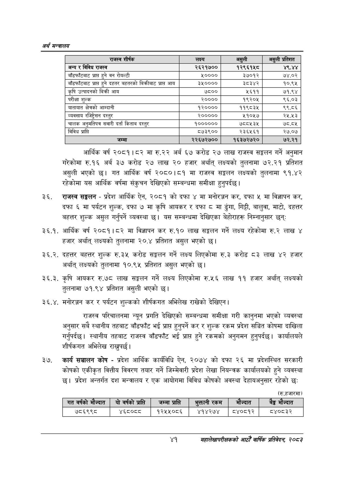

# Page 63 QA

## Rendered page


## Extracted text

```text
अर्थ सन्वबालय
आर्थिक वर्ष २०८१। ८२ मा रु.२२ अर्ब ६७ करोड २७ लाख राजस्व सङ्कलन गर्ने अनुमान गरेकोमा रु.१६ अर्ब ३७ करोड २७ लाख २० हजार अर्थात्‌ लक्ष्यको तुलनामा ७२.२१ प्रतिशत असुली भएको छ। गत आर्थिक वर्ष २०८०।८१ मा राजस्व सङ्गलन लक्ष्यको तुलनामा ९१.४२ रहेकोमा यस आर्थिक वर्षमा संकुचन देखिएको सम्बन्धमा समीक्षा हुनुपर्दछ |
राजस्व सङ्घलन -प्रदेश आर्थिक ऐन, २०८१ को दफा ४ मा मनोरञ्जन कर, दफा ४५ मा विज्ञापन कर, दफा ६ मा पर्यटन शुल्क, दफा ७ मा कृषि आयकर र दफा ८ मा ढुंगा, गिट्टी, बालुवा, माटो, दहत्तर बहत्तर शुल्क असुल गर्नुपर्ने व्यवस्था छ। यस सम्बन्धमा देखिएका बेहोराहरू निम्नानुसार छन्‌ः
३६.१. आर्थिक वर्ष २०८१।८२ मा विज्ञापन कर रु.१० लाख सङ्गलन गर्ने लक्ष्य रहेकोमा रु.२ लाख ४ हजार अर्थात्‌ लक्ष्यको तुलनामा २०.४ प्रतिशत असुल भएको छ।
३६.२. दहत्तर बहत्तर शुल्क रु.२३५ करोड सङ्कलन गर्ने लक्ष्य लिएकोमा रु.३ करोड ८३ लाख ४२ हजार अर्थात्‌ लक्ष्यको तुलनामा १०.९॥५ प्रतिशत असुल भएको छ।
३६.३. कृषि आयकर रु.७८ लाख सङ्कलन गर्ने लक्ष्य लिएकोमा रु.५६ लाख ११ हजार अर्थात्‌ लक्ष्यको तुलनामा ७१.९४ प्रतिशत असुली भएको छ।
३६.४. मनोरञ्जन कर र पर्यटन शुल्कको शीर्षकगत अभिलेख राखेको देखिएन |
राजस्व परिचालनमा न्यून प्रगति देखिएको सम्बन्धमा समीक्षा गरी कानुनमा भएको व्यवस्था अनुसार सबै स्थानीय तहबाट बाँडफाँट भई प्राप्त हुनुपर्ने कर र शुल्क रकम प्रदेश सञ्चित कोषमा दाखिला गर्नुपर्दछ। स्थानीय तहबाट राजस्व बाँडफाँट भई प्राप्त हुने रकमको अनुगमन हुनुपर्दछ। कार्यालयले शीर्षकगत अभिलेख राख्नुपर्छ |
कार्य सञ्चालन कोष -प्रदेश आर्थिक कार्यविधि ऐन, २०७४ को दफा २६ मा प्रदेशस्थित सरकारी कोषको एकीकृत वित्तीय विवरण तयार गर्ने जिम्मेवारी प्रदेश लेखा नियन्त्रक कार्यालयको हुने व्यवस्था छ। प्रदेश अन्तर्गत दश मन्त्रालय र एक आयोगमा विविध कोषको अवस्था देहायअनुसार रहेको छः
(रु.हजारमा)
४१
महालेखापरीक्षकको आठौ वाषिकि प्रतिवेदन २०८२

| राजस्व शीर्षक | लक्ष्य | असुली | असुली प्रतिशत |
| --- | --- | --- | --- |
| अन्य र विविध राजस्व | २६२१७०० | १२९६१५८ | ४९,४४ |
| बाँडफाँटबाट प्राप्त हुने वन रोयल्टी | ५०००० | ३७०१२ | ७४.०२ |
| बाँडफाँटबाट प्राप्त हुने दहतर बहतरको निक्रीबाट प्राप्त आय | ३५०००० | ३८३४२ | १०.९५ |
| कृषि उत्पादनको बिक्री आय | ७८०० | ५६११ | ७१.९४ |
| परीक्षा शुल्क | २०००० | १९२०५ | ९६.०३ |
| यातायात क्षेत्रको आम्दानी | १२०००० | ११९८३४५ | ९९.८६ |
| व्यवसाय रजिष्ट्रेसन दस्तुर | २००००० | ५१०५७ | २५.५३ |
| चालक अनुभतिषत्र सवारी दर्ता किताव दस्तुर | १०००००० | ७८८५३५ | ७८.८५ |
| विविध प्राप्ति | ८७३९०० | २३६५६१ | २७.०७ |
| जम्मा | २२६७२७०० | १६३७२७२० | ७२.२१ |

|   गत वर्षको मौज्दात |   यो वर्षको प्राप्ति |   जम्मा प्रासि |   भुक्तानी रकम | &#124; मौज्दात       |   बीङ्ग मौज्दात |
|---------------------|----------------------|----------------|----------------|----------------------|-----------------|
|              ७८६९९८ |               ४६८०८८ |        १२५५०८६ |         ४१४२७४ | &#124; ८४०८१२]&#124; |          ८४०८३२ |
```

## Flags
- table_page
- medium_quality_table
