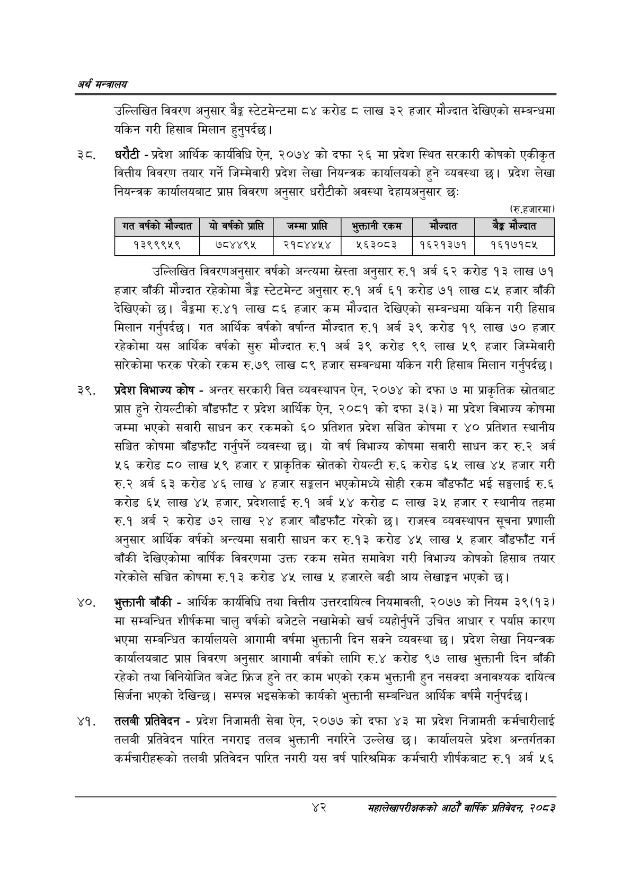

# Page 64 QA

## Rendered page


## Extracted text

```text
अर्थ सन्वबालय
उल्लिखित विवरण अनुसार बेङ्ग स्टेटमेन्टमा ८४ करोड ८ लाख ३२ हजार मौज्दात देखिएको सम्बन्धमा यकिन गरी हिसाब मिलान हुनुपर्दछ।
३. धरौटी -प्रदेश आर्थिक कार्यविधि ऐन, २०७४ को दफा २६ मा प्रदेश स्थित सरकारी कोषको एकीकृत वित्तीय विवरण तयार गर्ने जिम्मेवारी प्रदेश लेखा नियन्त्रक कार्यालयको हुने व्यवस्था छ। प्रदेश लेखा नियन्त्रक कार्यालयबाट प्राप्त विवरण अनुसार धरौटीको अवस्था देहायअनुसार छः
(रु.हजारमा)
उल्लिखित विवरणअनुसार वर्षको अन्त्यमा स्रेस्ता अनुसार रु.१ अर्ब ६२ करोड १३ लाख ७१ हजार बाँकी मौज्दात रहेकोमा बैङ्क स्टेटमेन्ट अनुसार रु.१ अर्ब ६१ करोड ७१ लाख ८५ हजार बाँकी देखिएको छ। बैङ्कमा रु४१ लाख ८६ हजार कम मौज्दात देखिएको सम्बन्धमा यकिन गरी हिसाब मिलान गर्नुपर्दछ। गत आर्थिक वर्षको वर्षान्त मौज्दात रु.१ अर्ब ३९ करोड १९ लाख ७० हजार रहेकोमा यस आर्थिक वर्षको सुरु मौज्दात रु.१ अर्ब ३९ करोड ९९ लाख ५९ हजार जिम्मेवारी सारेकोमा फरक परेको रकम रु.७९ लाख ८९ हजार सम्बन्धमा यकिन गरी हिसाब मिलान गर्नुपर्दछ।
प्रदेश विभाज्य कोष -अन्तर सरकारी वित्त व्यवस्थापन ऐन, २०७४ को दफा ७ मा प्राकृतिक स्रोतबाट प्राप्त हुने रोयल्टीको बाँडफाँट र प्रदेश आर्थिक ऐन, २०८१ को दफा ३(३) मा प्रदेश विभाज्य कोषमा जम्मा भएको सवारी साधन कर रकमको ६० प्रतिशत प्रदेश सञ्चित कोषमा र ४० प्रतिशत स्थानीय सञ्चित कोषमा बाँडफाँट गर्नुपर्ने व्यवस्था छ। यो वर्ष विभाज्य कोषमा सवारी साधन कर रु.२ अर्ब ५६ करोड ८० लाख ५९ हजार र प्राकृतिक स्रोतको रोयल्टी रु.६ करोड ६५ लाख ४५ हजार गरी अर्ब ६३ करोड ४६ लाख ४ हजार सङ्कलन भएकोमध्ये सोही रकम बाँडफाँट भई सङ्घलाई रु.६ करोड ६५ लाख ४५ हजार, प्रदेशलाई रु.१ अर्ब ५४ करोड ८ लाख ३५ हजार र स्थानीय तहमा रु.१ अर्ब २ करोड ७२ लाख २४ हजार बाँडफाँट गरेको | राजस्व व्यवस्थापन सूचना प्रणाली अनुसार आर्थिक वर्षको अन्त्यमा सवारी साधन कर रु.१३ करोड ४५ लाख ५ हजार बाँडफाँट गर्न बाँकी देखिएकोमा वार्षिक विवरणमा उक्त रकम समेत समावेश गरी विभाज्य कोषको हिसाब तयार गरेकोले सञ्चित कोषमा रु.१३ करोड ४५ लाख ५ हजारले बढी आय लेखाङ्गन भएको छ।
भुक्तानी बाँकी -आर्थिक कार्यविधि तथा वित्तीय उत्तरदायित्व नियमावली, २०७७ को नियम ३९(१३) मा सम्बन्धित शीर्षकमा चालु वर्षको बजेटले नखामेको खर्च व्यहोर्नुपर्ने उचित आधार र पर्याप्त कारण भएमा सम्बन्धित कार्यालयले आगामी वर्षमा भुक्तानी दिन सक्ने व्यवस्था छ। प्रदेश लेखा नियन्त्रक कार्यालयबाट प्राप्त विवरण अनुसार आगामी वर्षको लागि रु.४ करोड ९७ लाख भुक्तानी दिन बाँकी रहेको तथा विनियोजित बजेट फ्रिज हुने तर काम भएको रकम भुक्तानी हुन नसक्दा अनावश्यक दायित्व सिर्जना भएको देखिन्छ। सम्पन्न भइसकेको कार्यको भुक्तानी सम्बन्धित आर्थिक वर्षमै गर्नुपर्दछ |
तलबी प्रतिवेदन -प्रदेश निजामती सेवा ऐन, २०७७ को दफा ४३ मा प्रदेश निजामती कर्मचारीलाई तलबी प्रतिवेदन पारित नगराइ तलब भुक्तानी नगरिने उल्लेख छ। कार्यालयले प्रदेश अन्तर्गतका कर्मचारीहरूको तलबी प्रतिवेदन पारित नगरी यस वर्ष पारिश्रमिक कर्मचारी शीर्षकबाट रु.१ अर्ब ५६
४२
महालेखापरीक्षकको आठौ वाषिकि प्रतिवेदन २०८२

|   गत वर्षको मौज्दात |   यौ वर्षको प्राप्ति - |   जम्मा प्रालि |   भुक्तानी रकम | मौज्दात               |   बैङ्क मौज्दात |
|---------------------|------------------------|----------------|----------------|-----------------------|-----------------|
|             १३९९९५९ |                 ७८४४९५ |        २१८४४५४ |         २६३०८३ | &#124; &#124; १६२१३७१ |         १६१७१८५ |
```

## Flags
- table_page
